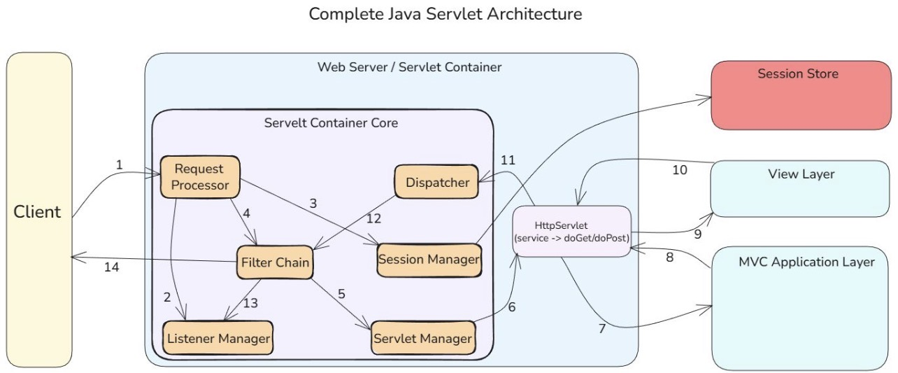

# Jakarta

### 1. What is Jakarta EE?

> Jakarta EE is the open, community-driven enterprise Java platform for building large-scale, cloud-ready applications.
> It is the successor to Java EE after the platform moved from Oracle to the Eclipse Foundation. Jakarta EE standardizes
> APIs for enterprise features such as web components, transactions, messaging, security, CDI, and persistence. Its
> focus
> is modernization: cloud-native patterns, modularity, and developer-friendly APIs.

---

### 2.What are the differences between Java EE, J2EE, EE4J, and Jakarta EE?

> They represent different eras and governance models of enterprise Java.

- **J2EE:** Early version (pre-Java 5), heavy, XML-centric, pre-annotations.
- **Java EE:** Modernized Oracle-managed successor with CDI, annotations, reduced XML, cleaner APIs.
- **EE4J:** The Eclipse Foundation project structure created to host the donated Java EE technologies (not the platform
  itself).
- **Jakarta EE:** The actual new platform name under Eclipse after renaming and namespace changes.

---

### 3.What is an Umbrella Project?

> A top-level project that coordinates many related subprojects and specifications.
> In Jakarta EE, the umbrella project organizes all individual specs—Servlet, CDI, JPA, JMS, JAX-RS, JSP, etc.—into one
> aligned platform release. It enforces compatibility, release cadence, and architectural consistency.

---

### 4.Why was the project name changed from Java EE to Jakarta EE?

> Oracle retained the “Java” trademark and prevented evolution of the `javax.*` namespace.
> When Oracle transferred Java EE to the Eclipse Foundation, it allowed the code and specs to move, but not the branding
> or package namespace.  
> Consequences:

- "Java EE" name could not be used.
- `javax.*` could not be modified or expanded.
- A new brand and namespace were required, resulting in "Jakarta EE" and the `jakarta.*` packages.

---

### 5.What’s new in Jakarta EE 10?

> Major modernization: improved core APIs, new features, and alignment with cloud-native development.
> Key highlights:

- Enhanced CDI and dependency injection model (CDI 4).
- Modernized Servlet, Security, and Faces specs.
- Concurrency improvements.
- Removal of outdated or legacy APIs.
- Improved support for modular runtimes.

> Jakarta EE 10 focused on platform cleanup after the namespace transition. It removed deprecated components, allowing
> vendors to deliver lighter, cloud-friendly runtimes.

---

### 6.What’s new in Jakarta EE 11?

> Further modernization with stronger alignment to modern Java (Java 21+), simplification, and performance improvements.
> Key highlights:

- Broad adoption of Java 21 language and JVM features.
- Updated core specs including CDI, REST, and Persistence.
- Enhanced concurrency utilities.
- Reduced legacy burden and simplified APIs.
- Continued movement toward lightweight, modular, microservice-ready runtimes.

> Jakarta EE 11 is the first version fully aligned with the new “fast innovation” goal: shorter release cycles, cleaner
> APIs, and leveraging modern Java LTS cycles.

---

### 7. What is included in the Web Specification?

> APIs that define web application behavior on the server side.
> The Web Profile includes:

- Servlet
- JSP
- EL (Expression Language)
- WebSocket
- Faces
- Security
- CDI Lite
- JSON Processing/Binding
- REST (JAX-RS)

---

### 8.What is included in the Web Service Specification?

> APIs for SOAP-based and REST-based service communication.
> Typically includes:

- JAX-RS (REST)
- JSON Processing/Binding
- JAX-WS (SOAP)
- JAXB (XML binding)
- SAAJ (SOAP message handling)
- Concurrency / Security components needed for service operations

---

### 9.What is Tomcat?

> Tomcat is a lightweight Servlet and JSP container used to run Java-based web applications.
> Tomcat implements the Servlet, JSP, WebSocket, and Expression Language specifications. It is not a full Jakarta EE
> application server; it only provides web-tier capabilities. Its simplicity and performance make it widely used for
> REST
> APIs and small-to-medium web apps.
> Tomcat’s core engine (Catalina) manages request processing via a pipeline of valves and connectors. It provides
> minimal services—no EJB, no full CDI—making it ideal for modern thin-server architectures.

---

### 10.What is a Servlet Container?

> A Servlet Container is the runtime environment that manages and executes Servlets.
> It provides lifecycle management, request/response handling, threading, security, classloading, and session
> management.
> Examples: Tomcat, Jetty, Undertow.  
> It is responsible for creating Servlet instances, mapping URLs, and invoking `service()` for each incoming HTTP
> request.

---

### 11.How do web applications work?

> Web apps receive HTTP requests, process them on the server, and return HTTP responses.
> The browser sends an HTTP request → server routes it → Servlet Container dispatches it to a Servlet → business logic
> executes → response is generated (HTML, JSON, etc.) and sent back.  
> Sessions, cookies, filters, and security constraints are handled by the container.

---

### 12.What is a Servlet?



> A Servlet is a server-side Java component that processes HTTP requests and generates responses.
> It extends the server’s capabilities by providing a programmable endpoint. Typical Servlets implement `HttpServlet`
> and override methods like `doGet()` or `doPost()` to handle REST-like interactions.

---

### 13.What is a Deployment Descriptor?

> It is the `web.xml` file describing web application configuration.
> `web.xml` defines Servlet mappings, filters, listeners, security rules, welcome pages, and other metadata. Since
> Servlet 3.0+, annotations can replace most `web.xml` usage.

---

### 14. What is the life cycle of a Servlet?

> Initialization → Request handling → Destruction.

1. **Instantiation** (container creates the Servlet)
2. **Initialization** (`init()`)
3. **Service phase** (`service()` dispatching to `doGet`, `doPost`, etc.)
4. **Destruction** (`destroy()` when the app stops)

---

### 15.How can a Servlet be created?

**Short answer:**  
By extending `HttpServlet` and overriding request-handling methods.

**Detailed explanation:**  
Example structure:

```java
public class MyServlet extends HttpServlet {
    @Override
    protected void doGet(HttpServletRequest req, HttpServletResponse resp) {
        resp.getWriter().write("OK");
    }
}
```

---

### 16. How can a Servlet be registered?

> Via annotations or web.xml

- Annotation based:

```java

@WebServlet("/hello")
public class HelloServlet extends HttpServlet {
}
```

- Deployment descriptor (web.xml):

```xml
<!--<servlet>-->
<!--    <servlet-name>Hello</servlet-name>-->
<!--    <servlet-class>com.example.HelloServlet</servlet-class>-->
<!--</servlet>-->
<!--<servlet-mapping>-->
<!--    <servlet-name>Hello</servlet-name>-->
<!--    <url-pattern>/hello</url-pattern>-->
<!--</servlet-mapping>-->

```

---

### 17. What is Jakarta Server Pages?

> Jakarta Server Pages (JSP) is a server-side technology that allows embedding Java code in HTML to generate dynamic web
> content.

> JSP is compiled into Servlets by the container. It separates presentation from business logic by allowing developers
> to write HTML with embedded Java, expressions, and tag libraries.

> The container converts JSP into a Servlet at runtime. This allows JSP to leverage the full Servlet lifecycle,
> threading, and request handling while maintaining a markup-first development model.

---

### 18.What is Jakarta Server Pages used for?

> JSP is used to generate dynamic HTML, XML, or other text-based responses in web applications.
> It handles rendering of data from backend systems, templating, and integration with Servlets and tag libraries. Common
> use cases include dynamic forms, data-driven dashboards, and view components in MVC architecture.
> JSP decouples presentation from business logic: Servlets handle request processing, JSP handles view rendering, and
> tag libraries facilitate reusable components.

---

### 19.What are the types of JSP elements?

- Scripting elements
- Directive elements
- Action elements

- **Scripting:** Insert Java code directly into the page.
- **Directives:** Control page-level settings and compilation behavior.
- **Actions:** Predefined tags that invoke server-side objects or include resources.

---

### 20.What are scripting elements?

> Java code embedded in a JSP page for execution during request processing.
> Types of scripting elements:

- **Declarations:** `<%! int x; %>` → class-level fields/methods
- **Scriptlets:** `<% /* code */ %>` → inserted into `service()`
- **Expressions:** `<%= expression %>` → evaluated and output to response

---

### 21.What are directive elements?

> Directives provide instructions to the JSP container about page compilation and behavior.
> Common directives:

- **page:** `<%@ page language="java" contentType="text/html" %>`
- **include:** `<%@ include file="header.jsp" %>` (static include)
- **taglib:** `<%@ taglib uri="..." prefix="c" %>`

---

### 22.What are action elements?

> Predefined XML-like tags that invoke server-side behavior in JSP.
> Examples:

- `<jsp:include>` → dynamic inclusion of content
- `<jsp:forward>` → forward request to another resource
- `<jsp:useBean>` → instantiate or reference beans

---

### 23.What is a scriptlet?

> A scriptlet is a `<% … %>` block of Java code embedded in a JSP page.

> Scriptlets are placed inside the `_jspService()` method of the compiled Servlet. They execute with each request,
> allowing dynamic logic or response manipulation.

---

### 24.What is JSTL?

> Jakarta Standard Tag Library (JSTL) is a collection of JSP tags for common tasks.
> JSTL provides tags for iteration, conditionals, formatting, XML, SQL, and internationalization. It reduces the need
> for Java code in JSP, promoting maintainable pages.

---

### 25.What are the types of JSTL tags?

- Core tags
- Formatting tags
- SQL tags
- XML tags
- Functions tags
- Internationalization (i18n) tags

- **Core (`c:`):** iteration, conditionals, variable handling
- **Formatting (`fmt:`):** numbers, dates, messages
- **SQL (`sql:`):** database queries (discouraged in production)
- **XML (`x:`):** XML processing
- **Functions (`fn:`):** string and collection functions
- **i18n (`fmt:`):** locale-aware formatting

---

### 26. How can one Servlet call another Servlet?

**Short answer:**  
By using a `RequestDispatcher` to forward or include requests.

```java
// RequestDispatcher rd = request.getRequestDispatcher("/otherServlet");
// rd.forward(request, response);
```

---

### 27.What is a RequestDispatcher?

> An object that allows request forwarding or inclusion between server resources.
> Obtained from ServletRequest.getRequestDispatcher(path), it supports two operations: forward() to transfer control,
> and include() to merge output.
---

### 28.What is Jakarta Expression Language and what is it used for?

> Jakarta Expression Language (EL) is a language for accessing and manipulating Java objects in JSP, JSF, and other
> Jakarta EE components.
> EL provides a concise, declarative syntax to access beans, properties, collections, and methods without embedding Java
> code directly in JSP or JSF pages.  
> Example: `${user.name}` accesses the `name` property of a `user` bean. It also supports conditional expressions,
> method
> invocation, and collection iteration.

---

### 29.What is MultipartFile?

> `MultipartFile` is a Spring interface representing a file uploaded in a multipart/form-data request.

> It provides methods to access file metadata (`getName()`, `getOriginalFilename()`, `getSize()`) and file content (
`getBytes()`, `getInputStream()`, `transferTo(File dest)`). It simplifies handling file uploads in controllers.

> Spring handles multipart requests using `MultipartResolver` implementations (CommonsMultipartResolver or
> StandardServletMultipartResolver) to parse HTTP requests and wrap uploaded files as `MultipartFile` objects.

---

### 30.In what ways can we configure MultipartFile?

> MultipartFile configuration is controlled via `MultipartResolver` settings, properties, and annotations.
> Configuration options include:

- **Max file size:** `spring.servlet.multipart.max-file-size`
- **Max request size:** `spring.servlet.multipart.max-request-size`
- **Temp storage location:** `spring.servlet.multipart.location`
- **Resolver type:** Standard (Servlet 3.0) vs CommonsMultipartResolver (Apache Commons)

---

### 31.What are initialization parameters and what are they used for?

> Initialization parameters are configuration values provided to Servlets or web applications at startup.

> They are defined in `web.xml` or via annotations (`@WebServlet(initParams = {...})`) and allow externalizing
> configuration like file paths, database URLs, or feature flags.  
> Accessed in Servlets via `getServletConfig().getInitParameter("paramName")`.

---

### 32.How can one listen to events in a servlet container?

> By implementing event listener interfaces and registering them in `web.xml` or via annotations.
> Servlets can listen to:

- **Context events:** `ServletContextListener`
- **Session events:** `HttpSessionListener`
- **Request events:** `ServletRequestListener`  
  Listeners receive callbacks when the corresponding lifecycle events occur, allowing resource initialization, cleanup,
  or logging.

---

### 33.What is a session?

> A session represents a stateful interaction between a client and a server across multiple HTTP requests.

> HTTP is stateless. Sessions allow servers to maintain user-specific state using identifiers (like `JSESSIONID`) stored
> in cookies or URL rewriting. Servlets access sessions via `HttpServletRequest.getSession()`.

---

### 34.How can a session be created?

> By calling `request.getSession()` in a Servlet.

- `request.getSession(true)` → creates a new session if none exists.
- `request.getSession(false)` → returns existing session or null.  
  The container generates a unique session ID and manages session storage.

---

### 35.How can one listen to events when a session is created or destroyed?

> By implementing `HttpSessionListener`.

- `sessionCreated(HttpSessionEvent se)` → invoked when a session is created
- `sessionDestroyed(HttpSessionEvent se)` → invoked when a session expires or is invalidated  
  Listeners must be registered via `web.xml` or `@WebListener`.

---

### 36.What is a filter?

> A filter is a reusable component that intercepts requests and responses before they reach a Servlet or JSP.
> Filters implement `javax.servlet.Filter` and can perform logging, authentication, compression, or content
> transformation. They can chain multiple filters for modular pre- and post-processing.

---

### 37.What is a web filter?

> A web filter is a server-side component configured to apply specific processing to incoming requests and outgoing
> responses in a web application.
> It is functionally identical to a Servlet filter but specifically registered for web resources. Implemented via
`Filter` interface and configured in `web.xml` or via `@WebFilter` annotation.

---

### 38.For what purposes is a filter used?

> Filters are used for logging, authentication, authorization, input validation, compression, encoding, and
> request/response transformation.
> Filters can:

- Modify headers or content
- Enforce security
- Compress responses
- Perform request auditing
- Apply cross-cutting logic without changing Servlets

---

### 39. What is a cookie and what is it used for?

> A cookie is a small piece of data stored on the client to maintain state or track information across HTTP requests.
> Cookies store session IDs, user preferences, or tracking data. In Servlets, `javax.servlet.http.Cookie` is used to
> create, send, and read cookies.

---

### 40.How can error pages in Tomcat be handled?

> By configuring error-page mappings in `web.xml`.

- Map HTTP error codes or exception types to JSP/Servlet pages:

```xml
<!--<error-page>-->
<!--    <error-code>404</error-code>-->
<!--    <location>/notfound.jsp</location>-->
<!--</error-page>-->
<!--<error-page>-->
<!--    <exception-type>java.lang.Throwable</exception-type>-->
<!--    <location>/error.jsp</location>-->
<!--</error-page>-->
```

---

### 41.What is Jakarta Bean Validation used for?

> Jakarta Bean Validation provides a standardized way to declaratively validate Java objects.
> It allows developers to annotate fields, methods, or classes with constraints such as `@NotNull`, `@Size`, `@Email`,
> and ensures that the object state conforms to these rules at runtime. Validation can occur on method parameters,
> return
> values, or entire object graphs. It is widely used in Jakarta EE, Spring, and REST APIs for input and data integrity
> enforcement.

---

### 42. What is the purpose of the ValidatorFactory class?

> `ValidatorFactory` produces `Validator` instances for performing Bean Validation.
> `ValidatorFactory` is typically obtained via `Validation.buildDefaultValidatorFactory()`. The factory manages
> configuration, constraint mappings, and instantiates thread-safe `Validator` objects to perform validation operations
> on
> beans.

---

### 43.How can a custom constraint validator be created?

> By defining a custom annotation and implementing the `ConstraintValidator` interface.
> Steps:

1. **Define annotation**:

```java

@Constraint(validatedBy = MyValidator.class)
@Target({ ElementType.FIELD, ElementType.METHOD })
@Retention(RetentionPolicy.RUNTIME)
public @interface MyConstraint {
    String message() default "Invalid value";

    Class<?>[] groups() default {};

    Class<? extends Payload>[] payload() default {};
}
```

2. **Implement validator**:

```java
public class MyValidator implements ConstraintValidator<MyConstraint, String> {
    @Override
    public boolean isValid(String value, ConstraintValidatorContext context) {
        return value != null && value.matches("[A-Z]{3}");
    }
}

```

3. **Use annotation**:

```java

@MyConstraint
private String code;
```

---

### 44.

>
---

### 45.

>
---

### 46.

>
---

### 47.

>
---

### 48.

>
---

### 49.

>
---

### 50.

>
---

### 51.

>
---

### 52.

>
---

### 53.

>
---

### 54.

>
---

### 55.

>
---

### 56.

>
---

### 57.

>
---

### 58.

>
---

### 59.

>
---

### 60.

>
---

### 61.

>
---

### 62.

>
---

### 63.

>
---

### 64.

>
---

### 65.

>
---

### 66.

>
---

### 67.

>
---

### 68.

>
---

### 69.

>
---

### 70.

>
---

### 71.

>
---

### 72.

>
---

### 73.

>
---

### 74.

>
---

### 75.

>
---

### 76.

>
---

### 77.

>
---

### 78.

>
---

### 79.

>
---

### 80.

>
---

### 81.

>
---

### 82.

>
---

### 83.

>
---

### 84.

>
---

### 85.

>
---

### 86.

>
---

### 87.

>
---

### 88.

>
---

### 89.

>
---

### 90.

>
---

### 91.

>
---

### 92.

>
---

### 93.

>
---

### 94.

>
---

### 95.

>
---

### 96.

>
---

### 97.

>
---

### 98.

>
---

### 99.

>
---

### 100.

>
---