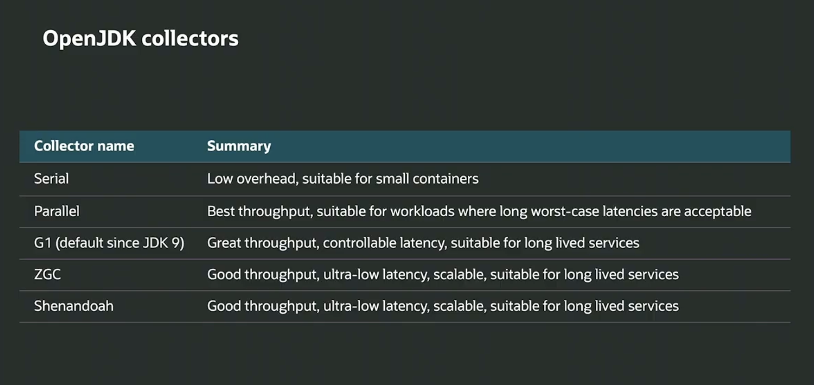

# Java

### 1.How many features does Java have?

> Key modern Java features (Java 21+) include:

1. **Platform Independent** – “Write once, run anywhere” via JVM bytecode.
2. **Object-Oriented** – Strong encapsulation, inheritance, and polymorphism.
3. **Simple and Familiar** – Minimal low-level constructs like pointers or manual memory management.
4. **Secure** – ClassLoader and bytecode verifier ensure safe runtime execution.
5. **Robust** – Strong type checking, exception handling, and memory safety.
6. **Multithreaded** – Native support for concurrency with threads, executors, and virtual threads (since Java 21).
7. **High Performance** – JIT compilation, adaptive optimizations, and GraalVM integration.
8. **Distributed** – Built-in support for RMI and networked applications.
9. **Dynamic** – Runtime class loading, reflection, and module system (JPMS).
10. **Scalable and Modern** – Features like records, pattern matching, sealed classes, and Loom’s virtual threads
    improve developer productivity and runtime efficiency.

---

### 2.What is a Compiler?

> A compiler translates Java source code into platform-independent bytecode (`.class` files).
> In Java, the **`javac` compiler** converts `.java` files into **bytecode**, an intermediate representation executed by
> the JVM. This design
> separates compilation from execution, enabling portability across operating systems.  
> Compilation includes lexical analysis, syntax checking, semantic validation, and bytecode generation optimized for JVM
> interpretation and JIT compilation.
---

### 3.What is an Interpreter?

> An interpreter in Java is the JVM component responsible for executing compiled bytecode instructions dynamically,
> line by line, by translating them into machine-level operations. This mechanism allows Java programs to be
> platform-independent —
> the same `.class` file can run unmodified across operating systems and hardware architectures.
---

### 4. What is JDK?

> The JDK includes the **JRE (Java Runtime Environment)**, the **Java compiler (javac)**, and development tools like
`javadoc`, `jar`, `javap`, `javac` `jshell` and debugging utilities.  
> It provides everything needed to build and package Java programs — from source code compilation to bytecode execution
> on
> the JVM.
---

### 5. What is JLS?

> The JLS is a **technical specification** that dictates how Java code must behave — covering type system, syntax,
> generics, memory model, and language rules.  
> It ensures all Java compilers and JVM implementations behave consistently across platforms.  
> Every Java version (e.g., JLS 21) comes with an updated JLS that reflects language changes such as records, pattern
> matching, or switch expressions.
---

### 6. What is JRE?

> It includes the **JVM**, **core class libraries**, and **runtime support files**, but **not** development tools like
> the compiler.  
> The JRE is responsible for executing compiled Java bytecode in a consistent, platform-independent way.
---

### 7. What is JVM?

> The JVM is the execution engine of the Java platform — responsible for running bytecode safely and efficiently across
> any hardware.
> It processes bytecode, the platform-independent output of Java compilation, through a layered architecture that
> includes
> class loading, memory management, and an execution engine.
> Modern JVMs combine interpreter and JIT compilation with sophisticated GC algorithms, making Java applications both
> portable and high-performance.
---

### 8. What is Bytecode?

> Bytecode is the intermediate representation of compiled Java programs — an abstract instruction set executed by the
> JVM.  
> It enables platform independence by decoupling compilation from hardware.  
> Before execution, the JVM verifies bytecode for security and translates it into optimized native code at runtime.
---

### 9. What is a Token?

> A token is the smallest meaningful unit in Java source code recognized by the compiler during lexical analysis.
---

### 10. How many types of Tokens are there in Java?

> Tokens are the smallest lexical units that make up Java source code.  
> The compiler recognizes five categories:

1. **Keywords** – Reserved words defining Java syntax (`class`, `if`, `while`, `return`, etc.).
2. **Identifiers** – User-defined names for variables, methods, classes, etc.
3. **Literals** – Fixed values like numbers, characters, strings, or booleans.
4. **Operators** – Symbols that perform operations (`+`, `-`, `*`, `/`, `=`, `==`, etc.).
5. **Separators** – Punctuation symbols used to structure code (`;`, `,`, `()`, `{}`, `[]`).

---

### 11. What is a Character Set in Java?

> A character set defines the collection of valid characters that Java source code can use.
> Java’s character set is based on Unicode, providing global language support and consistent representation across
> systems.
---

### 12. What are Identifiers and what are their rules?

> Identifiers are names given to classes, variables, methods, packages, or other elements in Java code.
> **Rules for identifiers:**

1. Must begin with a **letter**, **currency symbol ($)**, or **underscore (_)**.
2. Subsequent characters can include digits (0–9).
3. Cannot start with a digit.
4. Cannot be a **Java keyword** or **reserved literal** (`true`, `false`, `null`).
5. Are **case-sensitive** (`Count` ≠ `count`).
6. No whitespace or special symbols (like `@`, `#`, `%`).

---

### 13. How many types of comments are there in Java?

> Java supports **three types of comments** — single-line, multi-line, and documentation comments.
---

### 14. How many types of variables are there in Java?

> Java defines **three main types of variables** — **Local**, **Instance**, and **Static (Class)** variables.

- **Local Variables** – Declared within a method, constructor, or block; exist only during that execution scope.
- **Instance Variables** – Declared inside a class but outside any method; each object has its own copy.
- **Static (Class) Variables** – Declared with the static keyword; shared across all instances of the class.

---

### 15. What is the difference between Primitive and Non-Primitive (Instance) types in Java?

> - **Primitive types** are built-in data types that hold simple, immutable values such as numbers, characters, or
    booleans.  
    Examples: `int`, `boolean`, `char`, `double`, etc.  
    These are stored directly on the **stack** for fast access.

> - **Non-primitive types** (also known as **reference** or **instance** types) refer to objects or arrays created from
    classes.  
    Examples: `String`, `Integer`, `List`, `User`, etc.  
    They are stored in the **heap**, with the variable holding only a **reference** (memory address) to the object.
---

### 16. What is Variable Scope?

> Scope determines **visibility** and **lifetime** of variables.  
> A variable can only be accessed within the block or method where it is declared.  
> Outside that scope, it is undefined and cannot be referenced.
---

### 17. How many types of scopes are there in Java?

> 1. **Local Scope:**  
     Variables declared inside a method, constructor, or block.  
     They exist only during the method's execution and are destroyed when the method finishes.
> 2. **Instance Scope:**
     Variables declared inside a class but outside any method or constructor. Each object has its own copy of these
     variables.
> 3. **Static (Class) Scope:**
     Variables declared with the static keyword.
     Shared across all instances of the class and belong to the class itself.
---

### 18. How many types of data types are there in Java?

> 1. **Primitive Data Types (8 types):**  
     Built-in types representing raw values stored directly in memory (stack).  
     These are **not objects** and have fixed sizes.

- **Numeric:**
    - **Integral:** `byte`, `short`, `int`, `long`
    - **Floating-point:** `float`, `double`
- **Non-numeric:**
    - **Character:** `char`
    - **Boolean:** `boolean`

| Type    | Size (bits)       | Default Value |
   |---------|-------------------|---------------|
| byte    | 8                 | 0             |
| short   | 16                | 0             |
| int     | 32                | 0             |
| long    | 64                | 0L            |
| float   | 32                | 0.0f          |
| double  | 64                | 0.0d          |
| char    | 16                | '\u0000'      |
| boolean | 1 (JVM-dependent) | false         |

> 2. **Non-Primitive (Reference) Data Types:**  
     Represent objects or references to data in the heap.  
     They store the **memory address** of the object rather than the value itself.  
     Examples:
     - **String**
     - **Arrays**
     - **Classes**
     - **Interfaces**
     - **Enums**
     - **Records** (Java 16+)
---

### 19. What is an Operator in Java?

> An operator is a symbol that performs an operation on operands (variables or values).
---

### 20. How many types of Operators are there based on the number of operands?

> There are **three** types — **Unary**, **Binary**, and **Ternary** operators.

- **Unary:** Operates on a single operand.
- **Binary:** Operates on two operands.
- **Ternary:** Operates on three operands (only one in Java: `?:`).

---

### 21. What is a Unary Operator?

> A unary operator acts on a single operand to perform increment, decrement, negation, or logical inversion.
---

### 22. What is a Binary Operator?

> A binary operator operates on two operands to perform arithmetic, comparison, logical, or bitwise operations.
---

### 23. What is a Ternary Operator?

> It’s a conditional operator that evaluates a Boolean expression and returns one of two values.
---

### 24. What is an if statement?

> The if statement executes a block of code when a specified Boolean condition is true.
---

### 25. What is a Loop?

> A loop repeatedly executes a block of code until a condition becomes false.
---

### 26. How many types of Control Flow exist in Java?

> Java supports three main control flow types — Sequential, Selection, and Iteration (plus Jump statements).

- **Sequential** – Default top-to-bottom execution.
- **Selection** – Conditional branching (if, switch).
- **Iteration** – Repetition (for, while, do-while).
- **Jump** – Alter flow (break, continue, return).

---

### 27. What is the purpose of the Unicode system?

> Unicode provides a universal character encoding standard supporting all written languages.
---

### 28. What is the difference between a Function and a Method?

> In Java, every function must be defined inside a class — hence, it’s called a **method**.  
> A function (in general programming) can exist standalone, but Java’s object-oriented model doesn’t allow top-level
> functions
---

### 29. What is a Method Definition?

> A **method definition** provides the complete implementation of a method — including the declaration and body.
---

### 30. What is a Method Declaration (header)?

> The method declaration (or header) specifies the modifiers, return type, method’s name, and parameters — but not its
> body.
---

### 31. What is a Method Signature?

> A method signature consists of the method name and its parameter types (order and count).
---

### 32. What is a Stack?

> Each thread in Java has its own **JVM stack**, created when the thread starts.  
> It operates in a **LIFO (Last In, First Out)** manner — every method call pushes a new frame, and returning from the
> method pops that frame.  
> It is used for:

- Storing local variables and primitive values
- Tracking method call order and return addresses
- Managing function parameters

---

### 33. What is a Stack Frame?

> A **stack frame** is a memory block within the JVM stack created for each method invocation.
> Each stack frame contains:

- **Local Variable Array** – stores parameters and local variables
- **Operand Stack** – used for intermediate expression evaluation
- **Frame Data** – includes method metadata, constant pool reference, and return address

> When a method is called, a new frame is pushed; when it returns, the frame is popped.  
> The JVM uses these frames to manage method execution state efficiently.
---

### 34. What is Recursion?

> **Recursion** is the process where a method calls itself directly or indirectly until a base condition is met.
---

### 35. What is a String in Java?

> A **String** in Java is an immutable sequence of characters represented by the `java.lang.String` class.
> It supports efficient text manipulation, comparison, and storage, with immutability providing safety and
> predictability
> in multi-threaded and security-sensitive environments.
---

### 36. In how many ways can we create a String in Java?

> There are two primary ways to create a String — using string literals or the new keyword.

```java
// literal
String s1 = "Hello";

// new keyword
String s2 = new String("Hello");
```

---

### 37. Why is String immutable in Java?

> Strings are immutable for security, thread-safety, and performance (interning) reasons.

- **Security:** Prevents malicious modification of strings used in class loading, file paths, or network connections.
- **Caching & Interning:** Enables JVM to reuse common string literals safely.
- **Thread-safety:** Immutable objects can be shared without synchronization.
- **HashCode stability:** Allows strings to be cached safely in collections like HashMap and HashSet.

---

### 38. What is an Array?

> An Array in Java is a fixed-size, ordered collection of elements of the same type, stored in contiguous memory.
---

### 39. Can we change the size of an Array after it is created in Java?

> No, arrays in Java have a fixed size once created.
> This immutability allows the JVM to perform optimized bounds checking and memory layout decisions.
---

### 40. Can we assign a negative number as an Array size?

> No, using a negative number as an array size throws `NegativeArraySizeException`.
---

### 41. Can we declare an Array without specifying its size?

> You can declare an array without specifying its size, but you must define the size before using it.
---

### 42. Where is an Array stored in JVM memory?

> Arrays are stored in the heap area of JVM memory. An array’s reference lives on the stack (in the method frame),
> while its actual data structure resides on the heap.
---

### 43. What are the advantages and disadvantages of Arrays?

> Advantages:
> Constant-time access (O(1)) by index.
> Cache-friendly due to contiguous memory layout.
> Simple and low-overhead structure.
> Useful for fixed-size, performance-critical data.

> Disadvantages:
> Fixed length — cannot grow or shrink.
> Inefficient insertions/removals (require shifting elements).
> No built-in methods for search, sorting, or resizing.
> Type homogeneity limits mixed-type usage.
---

### 44. What is the String Constant Pool in Java?

> The String Constant Pool (SCP) is a special memory area in the heap
> where Java stores unique string literals to optimize memory and performance.
> The String Constant Pool is a heap-based memory optimization that ensures identical string literals are stored only
> once.
> It improves both memory efficiency and equality performance by enabling reference reuse across the JVM.
---

### 45. Why does Java use String literals?

> Java uses string literals for efficient memory management and faster runtime behavior.
> Through the String Constant Pool and immutability, literals provide safe, shared, and memory-optimized string
> instances
> reused across the JVM,
> making them fundamental to Java’s performance model and class metadata handling.
---

### 46. Is String thread-safe?

> Yes, `String` is thread-safe because it is immutable.
> Once created, a `String` object’s value cannot be changed.  
> All operations that appear to modify a string actually create a new instance, ensuring that no two threads can alter
> the
> same object’s internal state.  
> This makes it inherently safe to share across threads without synchronization.
---

### 47. What are the disadvantages of the String class?

> Strings are immutable, which can cause performance and memory overhead in certain cases.
> Each string modification (e.g., concatenation) creates a new `String` object, increasing garbage generation.  
> For heavy text manipulation, this can lead to unnecessary heap churn.  
> Additionally, `String` consumes more memory than primitive arrays due to object headers and character encoding.
---

### 48. Is String a wrapper class?

> `String` is not a wrapper class; it’s a core reference type for text handling, distinct from primitive wrappers that
> provide object representations of basic types.
---

### 49. What is the purpose of the intern() method in String?

> When called, `intern()` checks the pool for an equivalent string.  
> If present, it returns the pooled reference; otherwise, it adds the current string to the pool.  
> This improves memory efficiency and allows equality comparison using `==`.
---

### 50. What is DRY?

> **DRY** stands for *Don’t Repeat Yourself* — a software principle aimed at reducing duplication.
> In large systems, DRY reduces cognitive load and defect propagation by ensuring single sources of truth.  
> It applies not just to code but also to infrastructure, configuration, and documentation.
---

### 51. What is KISS?

> **KISS** stands for *Keep It Simple, Stupid* — a design principle promoting simplicity.
> KISS reminds engineers to prefer simple, clear, and direct solutions over overly complex ones — ensuring long-term
> maintainability and resilience.
---

### 52. What is YAGNI?

> **YAGNI** stands for *You Aren’t Gonna Need It* — a principle discouraging speculative features.
> YAGNI advises implementing only the features currently required — deferring speculative work until there is proven
> need.  
> This keeps systems lean, maintainable, and aligned with actual user value.
---

# MODULE - 2

### 53. What are Programming Paradigms and what types are there?

> A paradigm represents an approach to organizing logic and data flow in programs.  
> Each paradigm provides a distinct way to express computation — influencing design, maintainability, and concurrency
> behavior.  
> Common paradigms include:

- **Procedural Programming** — focuses on functions and procedures.
- **Object-Oriented Programming (OOP)** — models software as interacting objects.
- **Functional Programming (FP)** — emphasizes pure functions and immutability.
- **Reactive Programming** — focuses on asynchronous data streams and event propagation.
- **Declarative Programming** — describes *what* should happen, not *how*.
- **Logic Programming** — defines rules and relationships, e.g., in Prolog.

---

### 54. What is Procedural Programming?

> Procedural programming is a paradigm based on organizing code into reusable procedures or functions.
> In procedural models, the focus is on *how* to perform tasks, often with global state management.  
> Java supports this via static methods and sequential execution patterns, though OOP typically dominates Java
> applications.
---

### 55. What is OOP (Object-Oriented Programming)?

> Object-Oriented Programming organizes software around interacting objects rather than procedures.  
> By modeling real-world relationships and promoting encapsulation, OOP improves modularity, extensibility, and code
> reuse — making it Java’s primary paradigm.

---

### 56. What is Functional Programming?

> Functional programming treats computation as the evaluation of pure functions without mutable state or side effects.
> Functional programming in Java promotes declarative, side-effect-free logic.  
> By combining lambdas, immutability, and stream-based transformations, it produces concise, parallel-friendly, and
> maintainable code aligned with modern multi-core design.
---

### 57. What is Reactive Programming?

> Reactive programming is a paradigm focused on asynchronous, non-blocking, event-driven data streams.
> It models data as continuous streams that propagate changes automatically — enabling systems to react to updates in
> real time.  
> Core concepts include:

- **Observable streams** — sequences of events over time.
- **Backpressure** — controlling flow between producers and consumers.
- **Non-blocking IO** — efficient resource usage.
- **Event propagation** — automatic updates on data changes.

---

### 58. What are the concepts of OOP?

> OOP concepts define how software models real-world entities through objects and their interactions.
> The core concepts include:

- **Class** — blueprint or template for creating objects.
- **Object** — instance of a class containing state and behavior.
- **Encapsulation** — hiding internal details from external access.
- **Abstraction** — exposing only essential features.
- **Inheritance** — deriving new classes from existing ones for reuse.
- **Polymorphism** — enabling a unified interface for multiple implementations.

---

### 59. What are the main pillars of OOP?

> The four main pillars of OOP are **Encapsulation**, **Abstraction**, **Inheritance**, and **Polymorphism**.

- **Encapsulation** — protects object integrity by restricting direct access to fields.
- **Abstraction** — defines essential behavior while hiding implementation details.
- **Inheritance** — enables class hierarchies and behavior reuse.
- **Polymorphism** — allows objects of different types to be treated uniformly via interfaces or base classes.

---

### 60. What is a Class?

> A class is a blueprint that defines the structure and behavior of objects.
> It specifies fields (state) and methods (behavior) shared by all its instances.  
> Classes can also include constructors, nested types, and access modifiers to control visibility and inheritance.  
> They represent static definitions until instantiated into runtime objects.
---

### 61. What is an Object?

> An object is a runtime instance of a class containing specific data and behavior.
> Internally, each object holds a header (with hash, synchronization info, and class reference) and its data fields.  
> The `Klass` pointer links the object to its class metadata for method resolution and type checks.
> Objects are allocated on the heap and consist of:

- **State:** represented by field values.
- **Behavior:** implemented through methods.

> Each object operates independently but follows the same class definition.

---

### 62. What is a Method?

> A method defines a block of code representing a behavior or operation within a class.
> It enables logic encapsulation, reuse, and polymorphic behavior — forming the behavioral foundation of OOP systems.
---

### 63. What is a Field?

> A field is a variable defined within a class that represents the state of an object.
> In memory, instance fields are stored within the object’s heap layout, while static fields reside in the class
> metadata area.  
> The JVM ensures alignment and efficient access through field offset calculations performed during class loading.

> A field defines an object’s state within its class, stored in the heap or class area depending on its type.  
> Fields, together with methods, form the complete structural and behavioral blueprint of any Java object.
---

### 64. What is a Constructor used for?

> A constructor initializes an object’s state when it is created.
> Constructors are special methods invoked automatically during object creation using the `new` keyword.  
> They set up initial values for fields and ensure the object is in a valid state before use.  
> Constructors cannot have a return type and must share the same name as the class.
---

### 65. What types of Constructors exist?

> - **Default Constructor** – Automatically generated by the compiler when no constructors are defined.
> - **No-Arg Constructor** – Explicitly defined by the developer without parameters.
> - **Parameterized Constructor** – Accepts parameters to initialize object fields.
> - **Copy Constructor** – Creates a new object by copying another object’s state.
> - **Chaining Constructor** – Calls another constructor within the same class (`this()`) or parent class (`super()`),
    enabling reuse of initialization logic.
> - **Compact Constructor (Records only)** – Simplified constructor in Java Records used for validation or normalization
    without redefining parameters.

---

### 66. If we create a constructor manually, will the class still have a default constructor?

> Java automatically provides a no-argument constructor only when no other constructors exist.  
> If you define at least one constructor manually, the compiler does not create a default one — it must be added
> explicitly if needed.
---

### 67. When is a Constructor called?

> A constructor is called automatically when a new object is created.
> During `new` object creation, the JVM allocates memory, sets default values, and then calls the constructor to perform
> initialization.  
> Constructors are invoked only once per object lifetime and cannot be called explicitly like regular methods.
---

### 68. Can a class have multiple constructors?

> Yes, Java allows multiple constructors through overloading.
> A class can define multiple constructors with varying parameters, known as constructor overloading.  
> This pattern enhances flexibility by supporting multiple initialization paths while keeping object creation concise
> and
> maintainable.
---

### 69. What is a Default Constructor?

> A default constructor is a no-argument constructor automatically generated by the compiler when no constructors are
> explicitly defined.
---

### 70. What is a No-Arg Constructor?

> A no-arg constructor is a user-defined constructor with no parameters.  
> It allows controlled initialization while maintaining default call order to the superclass constructor.
---

### 71. What is a Parameterized Constructor?

> A parameterized constructor accepts arguments to initialize object fields with specific values.
> It allows creating objects in pre-defined states by passing parameters during instantiation.  
> This improves flexibility and clarity, ensuring required data is available at object creation time.
---

### 72. What is a Copy Constructor?

> A copy constructor creates a new object by copying the state of another object of the same class.
> by passing same type of object to constructor params.
---

### 73. What is a Chaining Constructor?

> A chaining constructor calls another constructor within the same class or its superclass to reuse initialization
> logic.
> A chaining constructor reuses initialization logic by invoking another constructor (`this()` or `super()`), ensuring
> hierarchical and maintainable object initialization across inheritance and overloaded constructors.
---

### 74. What is a Compact Constructor?

> compact constructor is a special constructor syntax used in Java records to validate or transform constructor
> arguments.
> The compiler automatically assigns constructor parameters to record fields before executing the compact constructor
> body.  
> This eliminates boilerplate while ensuring that records remain final and immutable with consistent state enforcement.
---

### 75. What is Encapsulation?

> Encapsulation is the OOP principle of bundling data (fields) and behavior (methods) into a single unit while
> restricting direct access to internal state.
> It ensures that the internal representation of an object is hidden from the outside world.  
> Objects expose controlled access through public methods instead of allowing direct modification of fields.
---

### 76. Why is it called Data Hiding?

> “Data Hiding” refers to the practice of restricting access to class fields using access modifiers like `private`.  
> External classes can only interact with the data through public methods, ensuring that the internal state cannot be
> changed arbitrarily or incorrectly.
---

### 77. How do we achieve Encapsulation?

> By making fields private and providing controlled access via public getter and setter methods.
---

### 78. What are the advantages of Encapsulation?

> Key advantages include:

- **Data protection** – prevents invalid or inconsistent state.
- **Ease of maintenance** – internal changes don’t affect external code.
- **Reusability** – encapsulated components can evolve independently.
- **Improved abstraction** – hides implementation complexity.
- **Enhanced testing** – promotes predictable and controlled behavior.

---

### 79. What is the purpose of Getter and Setter methods?

> They act as an interface between an object’s internal data and the outside world.  
> Getters retrieve field values, while setters validate or transform inputs before updating the field.  
> They preserve encapsulation while allowing flexibility for validation, logging, or transformation logic.
---

### 80. Why do we need Packages?

> Packages organize related classes and interfaces into namespaces, improving modularity, readability, and access
> control.
> They prevent naming conflicts between classes, structure large codebases logically, and control visibility using
> access modifiers (`public`, `protected`, package-private).  
> Packages also define modular boundaries for APIs, allowing selective exposure of classes while hiding internal
> implementations.
---

### 81. What are Package members?

> Package members are classes, interfaces, enums, and annotations declared within a package.
> In the JVM, each package member is a separate `.class` file under the package directory.  
> Access control is enforced during class loading, ensuring package-private types and members are visible only within
> the
> same package boundary.
---

### 82. What is Inheritance?

> Inheritance is an OOP mechanism that allows one class to acquire the properties and behaviors of another class.
> It enables code reuse and hierarchical classification by letting a subclass extend a superclass.  
> The subclass inherits accessible fields and methods, and it can override or extend them to provide specialized
> behavior.  
> This forms an “is-a” relationship between classes.
---

### 83. Why do we need Inheritance?

> To promote code reuse, consistency, and polymorphism across related classes.
> We use inheritance to reuse logic, maintain consistent interfaces across hierarchies, and enable polymorphism — key
> for extensible and maintainable system architectures.
---

### 84. What are the types of Inheritance?

> Java supports single, multilevel, hierarchical, and hybrid inheritance (via interfaces).

1. **Single Inheritance** – One class extends another (`class B extends A`).
2. **Multilevel Inheritance** – A class extends a subclass of another class (`C extends B extends A`).
3. **Hierarchical Inheritance** – Multiple classes share a common parent (`B extends A`, `C extends A`).
4. **Hybrid Inheritance** – Combination of multiple inheritance types achieved using interfaces.

---

### 85. Can we use multiple inheritance in Java?

> No, Java does not support multiple inheritance with classes — only through interfaces.
> To avoid the **diamond problem**, where ambiguity arises from inheriting the same method from multiple parents, Java
> restricts classes to single inheritance.  
> Interfaces provide a safe alternative, allowing multiple inheritance of type but not state.
---

### 86. What are Superclass and Subclass?

> A **Superclass** is a parent class whose properties and behaviors are inherited by other classes.

> A **Subclass** is a child class that extends the superclass and can override or add new functionality.
---

### 87. What does a Subclass inherit from a Superclass?

> A subclass inherits all accessible fields, methods, and nested types from its superclass except private members and
> constructors.
> The subclass gains:

- **Public and protected fields/methods** – directly accessible.
- **Package-private members** – accessible only if in the same package.
- **Inherited behavior** – can be overridden to provide custom logic.
-

> What it **does not inherit**:

- Private members.
- Constructors.
- Static initializers and blocks (executed per class).

---

### 88. What is a Cosmic class?

> The **Cosmic class** refers to `java.lang.Object`, the root class of all classes in Java.
> Every class in Java implicitly extends `Object` (directly or indirectly).  
> It provides the base behavior and structure common to all Java objects.  
> This makes `Object` the ancestor of all reference types in the JVM, ensuring uniform operations like comparison,
> synchronization, and identity.
---

### 89. What methods does the Cosmic class (Object) have?

- **`public final Class<?> getClass()`** – returns the runtime class of the object.
- **`public int hashCode()`** – returns the object’s hash value.
- **`public boolean equals(Object obj)`** – compares object equality.
- **`protected Object clone()`** – creates a shallow copy (if `Cloneable`).
- **`public String toString()`** – returns a string representation.
- **`protected void finalize()`** *(deprecated)* – called before GC (no longer recommended).
- **`public final void wait()` / `wait(long)` / `wait(long, int)`** – thread synchronization methods.
- **`public final void notify()` / `notifyAll()`** – notifies waiting threads.

---

### 90. Why do we need Access Modifiers?

> Access modifiers define the visibility and accessibility of classes, methods, and fields in Java.
> They control how program components interact, enforcing encapsulation and modularity.  
> By restricting access, developers can protect internal logic, prevent misuse, and design clean, maintainable APIs.  
> Access modifiers are essential for secure and predictable object-oriented design.
---

### 91. What are the types of Access Modifiers? Define each.

1. **public** – Accessible from anywhere in the application.
2. **protected** – Accessible within the same package and by subclasses (even in different packages).
3. **default (package-private)** – Accessible only within the same package; no keyword used.
4. **private** – Accessible only within the same class.

---

### 92. Can we create a Private Constructor? What is its purpose?

> Yes, a class can have a private constructor to restrict direct instantiation.
> Private constructors are commonly used in:

- **Singleton patterns** – to prevent multiple object creation.
- **Static utility classes** – to prevent instantiation.
- **Factory methods** – when object creation is controlled externally.

> They enforce controlled object creation and encapsulate instantiation logic.

---

### 93. Which Access Modifiers can be used with classes?

> Only **public** and **default (package-private)** modifiers are allowed for top-level classes.
> - **public** – The class is visible from any package.
> - **default (no modifier)** – The class is visible only within the same package.  
    Nested (inner) classes, however, can use **private** and **protected** as well, since they exist within another
    class’s scope.

---

### 94. Where is the Private Modifier used, and what does it allow access to?

> `private` is used to restrict access to members within the same class only.
> Private members (fields, methods, constructors, or inner classes) are inaccessible outside their defining class.  
> This ensures strict encapsulation and prevents unintended external modifications.  
> It is fundamental for maintaining object integrity and secure internal behavior.
---

### 95. What types of relationships exist between Classes?

> Classes in Java can have three main relationships: **Is-A**, **Has-A**, and **Uses-A**.


- **Is-A (Inheritance)** – defines a superclass–subclass relationship.
- **Has-A (Composition/Aggregation)** – defines ownership or containment.
- **Uses-A (Dependency)** – defines a temporary or functional relationship where one class depends on another.

> These relationships represent different levels of coupling.  
> Inheritance creates strong coupling via the class hierarchy, while composition and dependency promote looser coupling,
> improving maintainability and testability.

---

### 96. Where is the “Uses-A” relationship used?

> The **Uses-A** relationship is used when one class depends on another to perform a specific task.
> It typically appears as a **method-level dependency**, where a class creates, receives, or calls methods of another
> class temporarily without storing it as a field.  
> This is common in utility, service, or helper class interactions.
---

### 97. Where is the “Has-A” relationship used?

> A **Has-A** relationship is used when one class contains or owns another class as a field.
> It represents a **whole–part** relationship, typically modeled via fields (instance variables).  
> For example, a `Car` has an `Engine`.  
> This enables modular and reusable designs, supporting both **composition** and **aggregation** forms.

---

### 98. Where is the “Is-A” relationship used?

> The **Is-A** relationship is used to model inheritance or type hierarchy.
> It expresses that a subclass is a specialized form of its superclass (e.g., `Dog is a Animal`).  
> This allows polymorphism — objects of the subclass can be treated as instances of the superclass type.
> The JVM represents Is-A relationships through class metadata and vtable inheritance.  
> Type checks (`instanceof`, method dispatch) rely on the Is-A hierarchy for runtime behavior consistency.
---

### 99. Which keywords are used to achieve the “Is-A” relationship?

- **`extends`** – used for class inheritance (one class inherits another).
- **`implements`** – used for interface inheritance (class implements interface).

> Both create Is-A relationships, enabling polymorphic behavior and type substitution.

---

### 100. What are the types of “Has-A” relationships?

- **Composition** – strong ownership; the contained object’s lifecycle depends on the container.
- **Aggregation** – weak ownership; the contained object exists independently of the container.

> Both represent structural containment but differ in lifecycle dependency.

---

### 101. What are the differences between Composition, Aggregation, and Association?

> All are object relationships, but differ in ownership and lifecycle control.

| Relationship    | Ownership        | Lifecycle Dependency | Example                     |
 |-----------------|------------------|----------------------|-----------------------------|
| **Association** | No ownership     | Independent          | A teacher works in a school |
| **Aggregation** | Weak ownership   | Independent          | A department has professors |
| **Composition** | Strong ownership | Dependent            | A car has an engine         |

- **Association** – general connection without ownership.
- **Aggregation** – has-a relationship with shared object lifecycle.
- **Composition** – has-a relationship with dependent object lifecycle.

---

### 102. What is Polymorphism?

> Polymorphism is the ability of an object to take multiple forms and behave differently based on its runtime type.
> It allows methods with the same name to perform different behaviors depending on the object invoking them.  
> Polymorphism promotes flexibility and extensibility in software design.
---

### 103. What are the types of Polymorphism?

> Java supports two main types of polymorphism: **Static (Compile-time)** and **Dynamic (Runtime)**.

- **Static Polymorphism** – achieved through **method overloading**, resolved by the compiler.
- **Dynamic Polymorphism** – achieved through **method overriding**, resolved by the JVM at runtime.

---

### 104. What is Static Polymorphism? (Overload, Compile-time)

> Static polymorphism occurs when multiple methods share the same name but differ in parameters (method overloading).
> The compiler determines which method to call based on parameter types, order, and count.  
> It’s resolved during compilation, making it faster and type-safe.
---

### 105. What is Dynamic Polymorphism? (Override, Runtime)

> Dynamic polymorphism occurs when a subclass overrides a superclass method, and the method call is resolved at runtime.
> When a superclass reference points to a subclass object, the subclass’s overridden method is executed, enabling
> runtime behavior flexibility.
---

### 106. What is the difference between Polymorphism and Inheritance?

> Inheritance defines relationships between classes; polymorphism defines behavior based on those relationships.

- **Inheritance** – allows one class to derive from another, reusing attributes and methods.
- **Polymorphism** – allows objects of different subclasses to be treated as instances of a common superclass, executing
  behavior specific to their type.

> Inheritance is structural (class hierarchy), while polymorphism is behavioral (method resolution).  
> The JVM implements inheritance through metadata linkage, while polymorphism leverages dynamic dispatch mechanisms.

---

### 107. What are the advantages of Polymorphism?

- Enables **runtime flexibility** through method overriding.
- Reduces **code duplication** via shared interfaces and abstractions.
- Improves **maintainability** by decoupling code behavior from specific implementations.
- Supports **open/closed principle** — open for extension, closed for modification.
- Simplifies **testing** and **mocking** through interface-based design.

---

### 108. What is Overloading?

> Overloading allows multiple methods in the same class to share the same name but differ in parameter lists.
> Method overloading is a form of **compile-time polymorphism** that improves readability and flexibility.  
> The compiler determines which version to invoke based on the number, type, and order of parameters provided during the
> call.
---

### 109. What are the rules for Method Overloading?

1. Parameter list must differ — this is the only valid differentiator.
2. Return type does **not** affect method overloading.
3. Access modifiers may differ.
4. Static, final, or abstract modifiers don’t affect overload validity.
5. Overloading can occur in the same class or between a superclass and subclass.

---

### 110. Can we overload Static methods?

> Yes, static methods can be overloaded.
> Overloading depends on method signatures, not binding or inheritance.  
> Static methods follow the same rules as instance methods when overloaded.  
> Each version is resolved at compile time based on its parameter list.
---

### 111. Can we create methods with the same signature but different return types?

> No, Java does not allow methods with the same signature but different return types.
> The compiler identifies methods by **name and parameter list** — return type is not part of the method signature.  
> Hence, two methods differing only by return type cause a compile-time error.
---

### 112. Can Overloading be an example of Dynamic Binding?

> No, overloading is **static binding**.
> In overloading, the method call is resolved during compilation based on parameter types — not at runtime.  
> Only overriding supports dynamic binding through runtime dispatch based on the actual object type.
---

### 113. What is Overriding?

> Overriding occurs when a subclass provides a specific implementation of a method already defined in its superclass.
> It allows subclass objects to redefine inherited behavior, enabling **runtime polymorphism**.  
> The method signature (name, parameters, and order) must be identical to the superclass method.  
> The overriding method executes based on the **object’s runtime type**, not the reference type.
---

### 114. What are the rules for Method Overriding?

1. **Same method name and parameters** — identical signature required.
2. **Return type** — must be the same or a subtype (**covariant return**).
3. **Access level** — cannot be more restrictive (e.g., public → protected is invalid).
4. **Static methods** — cannot be overridden; only hidden.
5. **Final methods** — cannot be overridden.
6. **Constructors** — cannot be overridden.
7. **Exception rules** — overriding method cannot throw broader checked exceptions.

---

### 115. Can we change the signature of an overridden method?

> No, changing the method signature creates **overloading**, not overriding.
> Overriding demands an identical signature — if parameters differ in type, number, or order, the compiler treats it as
> a new overloaded method instead of an override.  
> Thus, the superclass version remains unaffected.
---

### 116. Can class fields be overridden?

> No, fields cannot be overridden — they are **hidden**, not overridden.
> If a subclass declares a field with the same name as a superclass field, both exist independently.  
> Access is determined by the **reference type**, not the object type, meaning it’s resolved at compile time.
---

### 117. What is Binding?

> Binding is the process of linking a method call to its actual method implementation.
> Binding determines when and how method calls are resolved — either at **compile time (static binding)** or **runtime (
dynamic binding)**.  
> This mechanism defines whether the JVM must determine the target method before or during execution.
---

### 118. What is Static Binding?

> Static binding occurs when method resolution happens at compile time.
> It applies to **static**, **final**, and **private** methods — the compiler knows exactly which method to call.  
> Static binding ensures faster invocation since no runtime lookup is required.
---

### 119. What is Dynamic Binding?

> Dynamic binding occurs when method resolution happens at runtime based on the actual object type.
> It applies to **overridden instance methods**.  
> When a superclass reference points to a subclass object, the subclass method executes.  
> This mechanism enables **runtime polymorphism**.

---

### 120. Can we override Static methods?

> No, static methods cannot be overridden — they can only be **hidden**.
> Static methods belong to the **class**, not to an instance.  
> When a subclass defines a static method with the same signature, it hides the superclass method instead of overriding
> it.  
> The method to execute is determined by the **reference type**, not the object type.

---

### 121. Can we override Final methods?

> No, final methods cannot be overridden.
> A `final` method is declared to prevent modification by subclasses, preserving consistent behavior across inheritance
> hierarchies.  
> Attempting to override it causes a **compile-time error**.

---

### 122. Can we override Private methods?

> No, private methods cannot be overridden.
> Private methods are **not inherited** by subclasses; thus, they are invisible outside their defining class.  
> If a subclass defines a method with the same name and parameters, it is treated as a **new, independent method**, not
> an
> override.

---

### 123. Can we override a Protected method with a different Access Modifier?

> Yes, but only if the new access level is **equal or more permissive**.
> An overriding method can widen access but not restrict it.  
> For example, a `protected` method can be overridden as `public`, but not as `private` or package-private.  
> This rule ensures consistent visibility for overridden methods across inheritance hierarchies.
---

### 124. What is Abstraction?

> Abstraction is the process of hiding implementation details and exposing only the essential functionality to the user.
> It focuses on **what** an object does rather than **how** it does it.  
> Abstraction helps design cleaner interfaces, reduces complexity, and allows changes in implementation without
> affecting
> the higher-level code.
---

### 125. How do we achieve Abstraction?

- **Abstract classes** define partial implementations and shared state.
- **Interfaces** define complete abstraction via method contracts only.

> Both approaches enable design by contract and polymorphism through common types.
---

### 126. What is a Concrete Class?

> A concrete class is a fully implemented class that can be directly instantiated.
> It provides complete method implementations and defines actual object behavior.  
> Unlike abstract classes, it cannot contain unimplemented (abstract) methods.
---

### 127. What are the differences between a Concrete Class and an Abstract Class?

> A concrete class is fully implemented; an abstract class may contain unimplemented methods.

| Feature        | Abstract Class                         | Concrete Class                    |
|----------------|----------------------------------------|-----------------------------------|
| Instantiation  | Cannot be instantiated                 | Can be instantiated               |
| Implementation | May have abstract and concrete methods | Must have full implementation     |
| Purpose        | Serves as a base or template           | Represents actual object behavior |
| Constructor    | Can have constructors for subclass use | Has constructors for direct use   |

---

### 128. What are the rules of an Abstract Class?

> Abstract classes define partial implementations and cannot be instantiated.

1. Declared using the `abstract` keyword.
2. May contain both abstract and non-abstract methods.
3. Can have constructors, fields, and static methods.
4. Cannot be `final` or `private`.
5. Must be extended by a subclass to provide complete functionality.

---

### 129. What are the rules of an Abstract Method?

> Abstract methods declare a contract without providing an implementation.

1. Declared with the `abstract` keyword and no body.
2. Must be inside an abstract class or interface.
3. Cannot be `static`, `final`, or `private`.
4. Must be implemented by the first concrete subclass.

---

### 130. What are the advantages of Abstraction?

> Abstraction simplifies complex systems and enhances flexibility.

- Reduces code complexity by hiding low-level details.
- Promotes modular design and loose coupling.
- Enables easier maintenance and scalability.
- Supports interface-based polymorphism.
- Improves testability through mockable contracts.

---

### 131. Can Abstract methods be static?

> No, abstract methods cannot be static.
> Static methods belong to the class, not an instance.  
> Since abstract methods require overriding through subclass instances, static context violates the abstraction
> principle.

---

### 132. Can we create an object from an Abstract Class?

> No, abstract classes cannot be instantiated directly.
> Since abstract classes may contain incomplete methods, they cannot produce a valid object on their own.  
> They must be subclassed by a concrete class providing full implementations.
---

### 133. Does an Abstract Class have a constructor?

> Yes, abstract classes can have constructors.
> Constructors in abstract classes are used to initialize fields and state common to subclasses.  
> They are invoked when a concrete subclass object is created, forming part of the object’s construction chain.

---

### 134. What is an Interface?

> An interface is a fully abstract type in Java that defines a contract (set of methods) a class must implement.
> Interfaces specify *what* operations a type can perform, not *how* they are performed.  
> They are used to define common behavior across unrelated classes.
---

### 135. Why do we need an Interface?

> Interfaces enable abstraction, polymorphism, and multiple inheritance of behavior.

- Decouple code from concrete implementations.
- Support dependency injection and testing.
- Allow multiple classes to share common contracts.
- Enable flexible and extensible system design.

---

### 136. What are the characteristics of an Interface?

> Interfaces are abstract, behavioral contracts that define methods and constants.

1. Methods are implicitly **public** and **abstract** (unless default or static).
2. Fields are implicitly **public**, **static**, and **final**.
3. Interfaces cannot have constructors.
4. A class can implement multiple interfaces.
5. From Java 8+, interfaces can have **default** and **static** methods.
6. From Java 9+, they can also have **private** methods.

---

### 137. What are the rules of an Interface?

> Interfaces define abstract contracts that implementing classes must follow.

1. Declared using the `interface` keyword.
2. Cannot be instantiated directly.
3. Can extend multiple interfaces (multiple inheritance).
4. Cannot extend a class.
5. All fields are `public static final`.
6. Methods are `public abstract` by default (except default, static, private).
7. Implementing classes must define all abstract methods.

---

### 138. Which Access Modifiers can be used in Interface methods?

| Method Type        | Allowed Modifiers     | Description                                 |
|--------------------|-----------------------|---------------------------------------------|
| Abstract (default) | `public` (implicitly) | Must be implemented by implementing classes |
| Default method     | `public`              | Provides a default implementation           |
| Static method      | `public` or `private` | Belongs to interface itself                 |
| Private method     | `private`             | Used internally by other default methods    |

---

### 139. Can we create objects of an Interface?

> Interfaces don’t have constructors or complete implementations.  
> You can only create an object of a class that implements the interface.
---

### 140. Can we define static methods inside an Interface?

> Yes, from Java 8 onward.
> Static methods in interfaces belong to the interface itself and cannot be overridden or inherited by implementing
> classes.
---

### 141. Does an Interface support multiple inheritance?

> Yes, interfaces support multiple inheritance of type.
> A single interface can extend multiple other interfaces, and a class can implement multiple interfaces.
---

### 142. What are the differences between an Abstract Class and an Interface?

| Aspect           | Abstract Class                               | Interface                                          |
|------------------|----------------------------------------------|----------------------------------------------------|
| Purpose          | Provides base functionality and common state | Defines a behavioral contract                      |
| Methods          | Can have abstract and concrete methods       | Only abstract, default, static, or private methods |
| Fields           | Can have instance fields                     | Only `public static final` constants               |
| Inheritance      | Single inheritance                           | Multiple inheritance allowed                       |
| Constructors     | Can have constructors                        | Cannot have constructors                           |
| Access Modifiers | Supports all modifiers                       | Methods are `public` by default                    |
| Use Case         | When classes share behavior or state         | When classes share common abilities                |

---

### 143. What is a Marker Interface?

> A marker interface is an empty interface used to signal metadata or behavior to the JVM or frameworks.
> It doesn’t contain any methods or fields — it marks a class to indicate special processing or capability.

---

### 144. Give examples of Marker Interfaces.

- `java.io.Serializable`
- `java.lang.Cloneable`
- `java.util.RandomAccess`
- `java.rmi.Remote`

---

### 145. If a Marker Interface is empty, why is it needed?

> Because it provides **compile-time type checking** and **runtime metadata**.

- The JVM or framework can recognize and handle marked objects differently.
- Prevents accidental misuse (e.g., serializing non-`Serializable` objects).
- Enables metadata tagging without external configuration or annotations.

---

### 146. What are Wrapper Classes?

> Wrapper classes are object representations of primitive data types.
> They allow primitives (like `int`, `char`, `boolean`) to be used as objects in collections, generics, or APIs that
> require objects.

---

### 147. Why do we need Wrapper Classes?

> Because Java collections and generic types work only with objects, not primitives.

1. To use primitives in data structures like `List<Integer>`.
2. To perform conversions and parsing (e.g., `Integer.parseInt()`).
3. To handle `null` values (primitives cannot).
4. To use utility methods like `Double.compare()` or `Character.isDigit()`.

---

### 148. What types of Wrapper Classes exist?

> Each primitive type has a corresponding wrapper class.

| Primitive Type | Wrapper Class |
|----------------|---------------|
| `byte`         | `Byte`        |
| `short`        | `Short`       |
| `int`          | `Integer`     |
| `long`         | `Long`        |
| `float`        | `Float`       |
| `double`       | `Double`      |
| `char`         | `Character`   |
| `boolean`      | `Boolean`     |

---

### 149. What kind of classes are Wrapper Classes?

> Wrapper classes are **immutable**, **final**, and **object representations** of primitives.

- Declared `final` to ensure immutability.
- Provide caching mechanisms for small values (`Integer`, `Long`, `Short`, `Byte`, `Character`).
- Extend `Number` (except `Character`, `Boolean`).
- Stored in the heap as objects.

---

### 150. Which classes are subclasses of the Number class?

`Number` subclasses are numeric wrappers that support conversion and arithmetic operations.

**List:**

- `Byte`
- `Short`
- `Integer`
- `Long`
- `Float`
- `Double`
- `BigInteger` (indirectly related via Number hierarchy)
- `BigDecimal` (same as above)

---

### 151. What types of Big Numbers are there?

> Java provides two classes for handling very large or precise numbers: **BigInteger** and **BigDecimal**.

- **BigInteger** is used for arbitrary-precision integer arithmetic.
- **BigDecimal** is used for arbitrary-precision decimal arithmetic, suitable for financial and scientific calculations.

---

### 152. What is the BigDecimal class?

> `BigDecimal` represents immutable, arbitrary-precision decimal numbers.
> It stores numbers as an unscaled value and a scale (decimal position).  
> Used in financial, monetary, or scientific contexts where floating-point rounding errors are unacceptable.
---

### 153. What is the BigInteger class?

> `BigInteger` represents immutable integers of arbitrary size.
> It supports all standard arithmetic, bitwise, and modular operations without overflow.  
> Useful for cryptography, combinatorics, and large numerical computations.
---

### 154. Can we use arithmetic operators (+, −, *, /) with these classes?

> No, arithmetic operators cannot be used with `BigInteger` or `BigDecimal`.
> They are objects, not primitives.  
> Instead of operators, they provide methods such as `add()`, `subtract()`, `multiply()`, and `divide()`.
---

### 155. Why do we need AutoBoxing and UnBoxing?

> To seamlessly convert between primitives and their wrapper classes.
> Java collections and generics work only with objects.  
> AutoBoxing and UnBoxing eliminate the need for manual conversion when storing or retrieving primitives from
> object-based
> structures.
---

### 156. What is AutoBoxing?

> Automatic conversion of a primitive type to its corresponding wrapper class.
> Occurs implicitly when a primitive is assigned to an object reference (e.g., `int` → `Integer`).  
> The compiler inserts `valueOf()` calls behind the scenes.
---

### 157. What is UnBoxing?

> Automatic conversion of a wrapper object to its primitive value.
> Occurs when a wrapper is used in a primitive context (e.g., arithmetic operations or comparisons).  
> The compiler adds `xxxValue()` calls automatically (e.g., `intValue()`).
---

### 158. What are Narrowing and Widening?

> They are two types of type conversions between primitive data types.

- **Widening** (implicit): Converting a smaller type to a larger one (e.g., `int` → `long` → `double`). Safe and
  automatic.
- **Narrowing** (explicit): Converting a larger type to a smaller one (e.g., `double` → `int`). Requires casting and may
  cause data loss.

---

### 159. What is an Inner Class?

> An Inner Class is a class defined within another class.
> It allows logically grouping classes that are used only in one place, improving encapsulation and readability.  
> Inner classes have access to the members (including private ones) of the outer class.

---

### 160. What are the advantages of using Inner Classes?

1. **Encapsulation** – Inner classes can access private members of the outer class, enabling cohesive design.
2. **Namespace Control** – Reduces namespace pollution by keeping helper classes hidden.
3. **Logical Grouping** – Ties related functionality together within the same context.
4. **Event Handling** – Commonly used in frameworks and GUI code (e.g., listeners in Swing or Android).
5. **Improved Maintainability** – Easier to manage and modify internal logic.

---

### 161. What types of Inner Classes exist?

> There are four main types of inner classes in Java.

1. **Non-static Inner Class (Member Inner Class)** – Associated with an instance of the outer class.
2. **Static Nested Class** – Declared static; cannot access non-static members of the outer class directly.
3. **Local Inner Class** – Defined inside a method or block, visible only within that scope.
4. **Anonymous Inner Class** – A class without a name, defined and instantiated simultaneously, usually to override
   methods.

---

### 162. Can a Static Inner Class access non-static fields of the Outer Class?

> No, a static inner class cannot access non-static members of the outer class.
> Because static nested classes do not hold a reference to an instance of the outer class, they can only access static
> fields and methods.  
> To access non-static members, they require an explicit reference to an outer class instance.

---

### 163. Can Local Inner Classes be declared with access modifiers?

> No, local inner classes cannot have access modifiers.
> They are declared within methods or blocks, where access modifiers (`public`, `private`, `protected`) are not
> allowed.  
> Their visibility is inherently limited to the enclosing block.
---

### 164. What is Memory Management?

> Memory management is the process of efficiently allocating, using, and freeing memory resources in a program.
> In Java, memory management is primarily handled by the **JVM**, which automatically allocates memory for objects and
> reclaims unused memory through **Garbage Collection (GC)**.  
> It ensures stable performance, prevents memory leaks, and optimizes runtime efficiency.
---

### 165. What are the types of memory?

1. **Heap Memory** – Stores all Java objects and arrays. Managed by the Garbage Collector.
2. **Stack Memory** – Stores method call frames, local variables, and references. Each thread has its own stack.
3. **Metaspace (replaced PermGen in JDK 8+)** – Stores class metadata, method information, and runtime constants. Static
   variables are stored in the heap, not Metaspace.
4. **PC Register** – Each thread has its own program counter that stores the address of the next JVM instruction to
   execute.
5. **Native Method Stack / Native Memory** – Used for executing native code (JNI calls) and JVM internal operations
   outside the managed heap.


> Each memory area serves distinct roles — Stack for execution, Heap for object lifecycle, and Metaspace for type
> metadata.  
> Garbage Collection primarily targets the Heap.


---

### 166. Which ones are considered primary memory?

> Heap and Stack memory are considered primary runtime memory areas.
> They store dynamic objects and execution data essential for program operation.

- **Heap** holds objects and class instances.
- **Stack** holds method calls and references to those objects.

---

### 167. What type of memory is Stack Memory?

> Stack memory is a **thread-specific, linear memory area** used for method execution and local variable storage.
> Each thread has its own stack that stores **Stack Frames** for active methods.  
> When a method is called, a frame is pushed; when it completes, the frame is popped.
> Stack memory operates at the thread level and is managed automatically by the JVM.  
> Its size is fixed per thread and crucial for recursion and method call depth.
> Stack memory is a per-thread linear memory area managed by the JVM to store method execution data and maintain the
> call
> stack lifecycle.
---

### 168. What is a Stack Frame?

> It contains local variables, method parameters, return addresses, and references to objects on the heap.  
> When a method is invoked, the JVM creates a new frame; when it completes, the frame is destroyed.
> A Stack Frame is a method execution context holding variables, operands, and control data, created and removed
> dynamically as methods are invoked and completed.
> Each frame holds:

- **Local Variable Array**
- **Operand Stack**
- **Frame Data** (return info, references)

> Stack frames are crucial for JVM bytecode execution and control flow.

---

### 169. What are the advantages of Stack Memory?

> Stack memory is fast, efficient, and thread-safe.

> Stack memory is efficient and self-managed, offering fast access and automatic cleanup per thread without involving
> the garbage collector.

1. **Speed** – Simple LIFO structure enables quick push/pop operations.
2. **Thread Safety** – Each thread has its own isolated stack.
3. **Automatic Management** – Memory is reclaimed immediately after method completion.
4. **Low Overhead** – No need for garbage collection.

---

### 170. What is LIFO?

> LIFO stands for **Last In, First Out**.
> It’s a data handling principle where the most recently added element is the first to be removed — exactly how the call
> stack operates.  
> The last method called is the first to complete and pop from the stack.
> The JVM enforces LIFO order in method invocation and return mechanisms, ensuring predictable and efficient call flow
> management.
> LIFO (Last In, First Out) defines the execution order of stack operations, ensuring structured method call and return
> sequencing in the JVM.
---

### 171. When does a StackOverflow occur?

> A StackOverflowError occurs when the thread’s stack memory limit is exceeded.
> It typically happens due to **deep or infinite recursion** or **excessive local variable allocation** that consumes
> all
> available stack space.
> The JVM allocates a fixed stack size per thread. When frame allocation exceeds this limit, it throws
`java.lang.StackOverflowError`.  
> Each recursive call consumes a new frame until stack exhaustion.
---

### 172. What are the parts of the Heap?

> Heap memory is divided into **Young Generation** and **Old Generation (Tenured Space)**.

1. **Young Generation** – Where new objects are created.

- Includes **Eden Space** and **Survivor Spaces (S0, S1)**.

2. **Old Generation (Tenured Space)** – Where long-lived objects are stored after surviving multiple garbage
   collections.

> The division improves GC efficiency by focusing frequent collections on short-lived objects in the Young Generation.  
> Modern GCs (like G1, ZGC, Shenandoah) optimize this layout dynamically
---

### 173. What is the Nursery Space?

> Nursery Space is the part of the Heap where **newly created objects** are initially allocated.
> It is located inside the **Young Generation** and consists of:

- **Eden Space** – where new objects are created.
- **Survivor Spaces (S0, S1)** – temporary regions for objects that survive minor garbage collections.

---

### 174. What are the key points about Nursery Space?

> Nursery Space manages short-lived objects and supports fast GC cycles.

- Most objects are created and destroyed here.
- Minor GC occurs frequently in this region.
- Objects surviving several GCs are moved to the Tenured Space.
- It minimizes full GC frequency by reclaiming memory early.
- Performance tuning often focuses on Eden and Survivor sizes.

---

### 175. What is the Tenured Space?

> Tenured Space (Old Generation) stores **long-lived objects** that have survived several Minor GCs.
> After an object remains alive through multiple GC cycles in the Young Generation, it is **promoted** to the Old
> Generation.  
> Garbage collection here is called a **Major GC** or **Full GC** and is less frequent but more expensive.
> The Tenured Space represents stable application data, such as cached objects or session data, which persist longer in
> memory.  
> Efficient tuning reduces the frequency and duration of Full GCs.
---

### 176. What is the Permanent Generation?

> Permanent Generation (PermGen) was the JVM memory area that stored **class metadata**, **method information**, and *
*interned strings** before Java 8.

> It contained data describing loaded classes, method definitions, and static fields.  
> However, it was **removed in Java 8** due to frequent memory issues and replaced by **Metaspace**.

> PermGen was part of the Heap and required manual size tuning (`-XX:PermSize`, `-XX:MaxPermSize`), leading to
`OutOfMemoryError: PermGen space` in large applications.

---

### 177. What is the Metaspace?

> Metaspace is the **native memory region** introduced in Java 8 to replace PermGen.
> It stores **class metadata**, **method information**, and **annotations**, but unlike PermGen, it uses **native memory
** (outside the Java heap).  
> Its size grows dynamically unless limited by `-XX:MaxMetaspaceSize`.
> Metaspace eliminates the fixed-size limitation of PermGen, reducing memory errors for applications with many
> dynamically
> loaded classes (e.g., web apps or frameworks like Spring).
---

### 178. What is the Method Area?

> The Method Area is a **logical JVM memory region** that stores class-level information and metadata.

- Class definitions and constant pools
- Method code and field metadata
- Static variables and runtime constant data

> Although conceptually part of the JVM specification, its physical implementation depends on the JVM version:

- **PermGen** in Java 7 and below
- **Metaspace** in Java 8 and above

---

### 179. What are the types of Method Parameters?

> Java supports two main types of parameters — **Actual Parameters** and **Formal Parameters**.

- **Actual Parameters:** The real values or arguments passed to a method when it is called.
- **Formal Parameters:** The variables defined in the method declaration that receive the values of actual parameters.

---

### 180. What is Passing by Value?

> Passing by Value means that a **copy of the variable’s value** is sent to the method.
> The method operates on a copy, not the original variable.  
> Any changes made inside the method **do not affect** the original data in the caller.
> In Java, both primitives and object references are passed by value:

- For **primitives**, the value itself is copied.
- For **objects**, the reference (memory address) is copied, not the object itself.

---

### 181. What is Passing by Reference?

> Passing by Reference means passing the **actual memory address** of a variable to a method.
> In true pass-by-reference systems, the called method can directly modify the caller’s variable since both share the
> same
> memory reference.
> This concept does **not apply** in Java.  
> Even though object references are passed, Java still passes a **copy of the reference**, not the reference itself.
---

### 182. Does Java support Passing by Reference?

> No, Java does **not** support pass-by-reference — it is always **pass-by-value**.
> When an object is passed to a method, a **copy of the reference** (not the object) is passed.  
> Hence, the method can modify the object’s internal state but cannot make the reference point to a new object.

---

### 183. What are Variable Arguments?

> Variable Arguments (varargs) allow a method to accept **a variable number of arguments** of the same type.
> Varargs are represented by an ellipsis (`...`) after the parameter type.  
> Inside the method, varargs are treated as an **array**, allowing iteration over all arguments.
> They simplify method calls where the number of parameters can vary (e.g., logging or formatting).  
> Rules:

- Only **one varargs parameter** is allowed per method.
- It must be the **last** parameter in the method declaration.

---

### 184. What is the Garbage Collector and what is its purpose?

> The Garbage Collector (GC) is a JVM mechanism that **automatically manages memory** by reclaiming space from objects
> no longer reachable by any references.
> GC identifies and removes unused objects from the Heap to prevent memory leaks and optimize application performance.  
> It operates transparently in the background, freeing developers from manual memory management and ensuring safe,
> efficient memory reuse.

> The Garbage Collector automatically reclaims memory occupied by unreachable objects, maintaining Heap health and
> preventing OutOfMemoryError.  
> It relies on reachability analysis from GC Roots and operates through a combination of marking, sweeping, and
> compacting
> phases to ensure efficient memory utilization.
---

### 185. Types of Garbage Collectors (all)

> Modern JVMs support several Garbage Collectors, each optimized for different workloads and latency requirements.



1. **Serial GC (`-XX:+UseSerialGC`)**
    - Single-threaded, simple, and best for small applications or single-core systems.
    - Uses stop-the-world pauses for all GC operations.

2. **Parallel GC (`-XX:+UseParallelGC`)**
    - Multi-threaded GC for both young and old generations.
    - Focuses on throughput; suitable for batch or CPU-bound applications.

3. **CMS (Concurrent Mark-Sweep) GC (`-XX:+UseConcMarkSweepGC`)** *(Deprecated since Java 9)*
    - Performs most GC work concurrently with the application.
    - Reduces pause times but causes fragmentation.

4. **G1 (Garbage-First) GC (`-XX:+UseG1GC`)** *(Default since Java 9)*
    - Region-based collector balancing throughput and low latency.
    - Performs concurrent marking and incremental compaction.

5. **ZGC (`-XX:+UseZGC`)**
    - Ultra-low pause GC (<10ms) using colored pointers and load barriers.
    - Suitable for very large heaps (multi-terabyte).

6. **Shenandoah GC (`-XX:+UseShenandoahGC`)**
    - Low-pause concurrent collector developed by Red Hat.
    - Compacts the heap concurrently to avoid long pauses.

---

### 186. What are the stages of the JVM Garbage Collector?

> GC operates in three primary stages — **Mark**, **Sweep**, and **Compact**.

1. **Mark:**
    - Identify all live objects reachable from GC Roots.
    - Unreachable objects are marked as garbage.

2. **Sweep:**
    - Reclaim memory occupied by unreachable (dead) objects.
    - Marks free regions available for future allocations.

3. **Compact (optional):**
    - Rearranges live objects to eliminate memory fragmentation.
    - Updates object references after relocation.

---

### 187. What are the types of Sweeping?

1. **Normal (Non-Compacting) Sweep:**
    - Frees memory of unreachable objects without rearranging live objects.
    - May cause **heap fragmentation** over time.

2. **Compacting Sweep:**
    - Frees memory and **moves live objects together** to form a contiguous space.
    - Eliminates fragmentation but requires **updating references**.

---

### 188. What are the types of Non-Access Modifiers?

> Non-access modifiers define **behavioral or structural properties** of classes, methods, and variables, rather than
> visibility.

- **final** — prevents modification (class inheritance, method overriding, or variable reassignment).
- **static** — associates members with the class rather than instances.
- **abstract** — defines incomplete classes or methods meant to be implemented by subclasses.
- **synchronized** — ensures thread-safe access to methods or code blocks.
- **volatile** — ensures visibility of variable changes across threads.
- **transient** — excludes variables from serialization.
- **native** — marks methods implemented in non-Java code (e.g., C via JNI).
- **strictfp** — enforces consistent floating-point behavior across platforms.

---

### 189. Where is each Non-Access Modifier used?

| Modifier       | Used With              | Purpose                                          |
|----------------|------------------------|--------------------------------------------------|
| `final`        | Classes, methods, vars | Prevents extension, overriding, or reassignment  |
| `static`       | Vars, methods, blocks  | Class-level association; shared across instances |
| `abstract`     | Classes, methods       | Defines incomplete contracts for subclassing     |
| `synchronized` | Methods, blocks        | Thread-safety via intrinsic locking              |
| `volatile`     | Variables              | Guarantees visibility of variable changes        |
| `transient`    | Variables              | Excludes from serialization                      |
| `native`       | Methods                | Implemented in non-Java language (JNI)           |
| `strictfp`     | Classes, methods       | Consistent FP computations across JVMs           |

---

### 190. What are Record Classes?

> A Record Class is a **special type of class** in Java used for immutable data carriers with automatic field,
> constructor, and method generation.
> Introduced in Java 16, records are final, immutable, and implicitly extend `java.lang.Record`.  
> They automatically generate:

- private final fields,
- canonical constructor,
- `equals()`, `hashCode()`, and `toString()` methods.

---

### 191. What types of constructors does a Record Class have?

1. **Canonical Constructor** — Matches all record components in order; auto-generated if not declared.
2. **Compact Constructor** — Declared without parameters to validate or normalize fields before assignment.
3. **Custom Constructor** — Overloaded constructor with different parameters, calling the canonical one explicitly.

---

### 192. What are Sealed Classes?

> Sealed classes restrict which other classes can extend or implement them.
> Introduced in Java 17, a sealed class uses the `permits` keyword to declare permitted subclasses explicitly.  
> Each subclass must declare itself as `final`, `sealed`, or `non-sealed`.
---

### 193. Why are Sealed Classes used?

> To **control inheritance** and enforce **restricted extensibility**.
> They prevent unwanted subclassing, maintaining predictable behavior and enabling exhaustive pattern matching in switch
> expressions.  
> Common in domain modeling where only known variants should exist.

> Sealed Classes ensure controlled, predictable, and secure inheritance hierarchies — useful in closed-domain systems,
> compiler checks, and exhaustive type handling.
---

### 194. Why is an Instance Initializer Block used?

> An Instance Initializer Block (IIB) initializes instance variables when constructors cannot handle all initialization
> logic.
> It runs **every time** an object is created, before the constructor executes.  
> Used to share common initialization code across multiple constructors.
---

### 195. When does an Instance Initializer Block execute?

> It executes **before the constructor**, every time a new object is created.

Execution order:

1. Memory allocation.
2. Default field initialization.
3. Explicit field initializers.
4. Instance Initializer Block.
5. Constructor body.

---

### 196. When does a Static Block execute?

> Static Blocks execute **once when the class is first loaded** by the JVM.
> They initialize static variables or perform one-time setup operations like loading configurations or establishing
> static resources.
---

### 197. What are the differences between Static and Instance Initializer Blocks?

> Static Blocks run once per class; Instance Blocks run for every new object.

| Feature        | Static Block           | Instance Initializer Block                  |
|----------------|------------------------|---------------------------------------------|
| Execution Time | Once, when class loads | Before every constructor call               |
| Access         | Only static members    | Can access both instance and static members |
| Purpose        | Class-level setup      | Object-level setup                          |
| Frequency      | Executes once          | Executes per instance                       |

---

### 198. What is Variable Shadowing?

> Variable shadowing occurs when a **local variable or parameter** has the same name as a **field** in the enclosing
> scope, temporarily hiding the outer variable.
> Within the inner scope (like a method or block), the local variable takes precedence, making the outer variable
> inaccessible directly.  
> The outer variable can still be accessed using the `this` keyword (for instance fields) or `ClassName.` (for static
> fields).

---

### 199. What is Variable Hiding?

> Variable hiding occurs when a **subclass defines a field with the same name** as one in its superclass.
> The subclass field hides the superclass field but does not override it.  
> Accessing the variable depends on the **reference type**, not the actual object type.
---

### 200. What is Type Inference?

> Type inference is the JVM compiler’s ability to **automatically determine variable or expression types** from context.
> Introduced with Java 10’s `var` keyword, it allows the compiler to infer a local variable’s type at compile time based
> on the assigned value.  
> The type remains **static and final** — inference happens only once and is not dynamic.
---

### 201. When can we use the `var` keyword, and when can’t we use it?

> `var` can be used for **local variables with an initializer**, but not for fields, method parameters, or uninitialized
> declarations.

**Allowed:**

- Local variables inside methods, loops, and try-with-resources.
- When the type can be inferred from the initializer expression.

**Not allowed:**

- For class fields or parameters.
- When no initializer is provided.
- With `null` assignments (type inference impossible).
- In lambda parameter declarations.

---

### 202. What are Enum Classes?

> Enum Classes represent **fixed sets of constants** — special types in Java that extend `java.lang.Enum`.
> Each constant in an enum is a **singleton instance** of the enum type.  
> Enums can have fields, constructors, and methods, and can even implement interfaces.  
> They provide type safety and prevent invalid values at compile time.
---

### 203. Can we create objects from an Enum Class?

> No, enum objects **cannot be created manually**.
> All enum constants are instantiated automatically by the JVM when the enum class is loaded.  
> The constructor of an enum is implicitly `private` to prevent external instantiation.
---

### 204. What are the advantages of Enum Classes?

> Enums provide **type safety**, **readability**, and **immutability** for predefined constant sets.

- Ensure compile-time safety (no invalid constants).
- Replace unstructured `int` or `String` constants.
- Can contain logic, methods, and interfaces.
- Are thread-safe singletons by design.
- Support iteration, comparison, and switch expressions.

---

### 205. Can Enum Classes implement interfaces?

> Yes, Enums can implement interfaces.
> This allows each enum constant to provide its own behavior for the implemented methods, enabling polymorphic behavior
> within a fixed constant set.
---

### 206. Can we define a constructor in an Enum Class?

> Yes, but it must be **private or package-private**.
> Enum constructors initialize constant-specific fields or behaviors and are called **once per constant** during class
> loading.  
> They cannot be invoked explicitly.
---

### 207. What kind of class is the `Objects` class?

> `java.util.Objects` is a **final utility class** that provides **static helper methods** for operating on objects.
> It cannot be instantiated or extended.  
> Its methods simplify common operations like equality checks, null handling, and hash code generation.

---

### 208. What methods does the `Objects` class have?

> The `Objects` class provides **null-safe static methods** for equality, hashing, comparison, and validation.

**Key methods:**

- `equals(Object a, Object b)` – Null-safe equality check.
- `deepEquals(Object a, Object b)` – Deep comparison for arrays.
- `hash(Object... values)` – Generates combined hash codes.
- `hashCode(Object o)` – Returns object hash code safely.
- `compare(T a, T b, Comparator<? super T> c)` – Compares using a comparator.
- `requireNonNull(T obj)` – Ensures a reference is not null, otherwise throws `NullPointerException`.
- `isNull(Object obj)` / `nonNull(Object obj)` – Null check predicates.
- `toString(Object o)` / `toString(Object o, String nullDefault)` – Null-safe string conversion.

---

### 209. What is JavaDoc?

> JavaDoc is a **documentation generation tool** included with the JDK.
> It extracts specially formatted comments (`/** ... */`) from source code and converts them into structured HTML
> documentation.
---

### 210. Why is JavaDoc used?

> To create **standardized, readable API documentation** directly from source code.
> It ensures consistency between code and documentation, helps developers understand class contracts, and enables IDE
> tooltips and online API references.
---

### 211. What is a UUID?

> A UUID (Universally Unique Identifier) is a 128-bit value used to uniquely identify information across systems.
> Represented as 32 hexadecimal digits (commonly in 8-4-4-4-12 format), it ensures global uniqueness without requiring a
> central authority.
---

### 212. Why is a UUID used?

> To generate unique identifiers across systems, databases, or services without coordination.
> UUIDs are used for:
> Unique database keys
> Distributed systems (no central ID generator)
> Object or entity identification
> Session or transaction tracking
---

### 213. What do M and N represent in a UUID?

> M and N indicate the version and variant of the UUID.

> M → Version (defines how the UUID was generated):

- 1 → Time-based
- 3 → Name-based (MD5)
- 4 → Random
- 5 → Name-based (SHA-1)
- 7 → Unix time & randomness (newer standard)

> N → Variant (defines the UUID layout and encoding scheme):
> 8, 9, A, or B → RFC 4122 (standard format)
---

### 214. What is an Exception?

> An Exception is an **unexpected event** that occurs during program execution and disrupts the normal flow of
> instructions.
> It represents abnormal conditions like invalid input, resource unavailability, or arithmetic errors that the program
> can
> handle at runtime.
---

### 215. What causes Exceptions to occur?

- Invalid user input
- Accessing null references
- Dividing by zero
- Array index out of bounds
- File or network issues
- Resource unavailability

---

### 216. Why is it important to handle Exceptions?

> Exception handling prevents program crashes and ensures graceful recovery from errors.
> It allows developers to define alternative execution paths, log errors, release resources, and maintain system
> stability.


---

### 217. What is the superclass (parent) of all Exceptions and Errors?

- `java.lang.Throwable`

> `Throwable` is the root class for both:

- `Exception` – recoverable conditions
- `Error` – serious, unrecoverable conditions

---

### 218. What is an Error, and when does it occur?

> An Error represents **serious system-level issues** that occur outside the program’s control.
> Errors indicate problems like memory exhaustion or JVM malfunction that applications usually cannot recover from.
---

### 219. What is the difference between an Exception and an Error?

- **Exception:** Recoverable, handled by the program.
- **Error:** Unrecoverable, indicates system failure.

| Aspect               | Exception                         | Error                                |
|----------------------|-----------------------------------|--------------------------------------|
| Recoverable          | Yes                               | No                                   |
| Handled by developer | Yes                               | Rarely                               |
| Examples             | IOException, NullPointerException | OutOfMemoryError, StackOverflowError |
| Package              | java.lang.Exception               | java.lang.Error                      |

---

### 220. How many types of Exceptions are there?

1. **Checked Exceptions**
2. **Unchecked Exceptions**

- **Checked Exceptions:** Checked at compile time; must be declared or handled (e.g., `IOException`, `SQLException`).
- **Unchecked Exceptions:** Occur at runtime; not required to handle explicitly (e.g., `NullPointerException`,
  `ArithmeticException`).

---

### 221. Why do we need to create custom Exception classes?

> To represent **application-specific error conditions** clearly.
> Custom exceptions improve code readability and error handling by expressing domain-specific problems (e.g.,
`InsufficientBalanceException`).
> Extend `Exception` for checked or `RuntimeException` for unchecked behavior.

---

### 222. What is Exception Propagation?

> Exception propagation is the **process by which an exception is passed up the call stack** until it’s handled.
> If a method does not catch an exception, it is automatically thrown to its caller, continuing up until caught or the
> program terminates.
---

### 223. What does “catching an Exception” mean?

> Catching an exception means **intercepting** a thrown exception and handling it to prevent program termination.
> When an exception occurs, the JVM searches for a matching `catch` block in the call stack. If found, it executes the
> handler; otherwise, the program terminates.
---

### 224. How are Exceptions caught?

> Exceptions are caught using a `try-catch` block.
> Code that might throw an exception is placed inside the `try` block.  
> When an exception occurs, control is transferred to the matching `catch` block, which handles the specific exception
> type.

---

### 225. Why do we need to catch Exceptions?

> To prevent program termination and recover from runtime errors.
> Catching exceptions allows resource cleanup, error logging, user notifications, and recovery from abnormal situations.

---

### 226. How are multiple Exceptions caught?

> By using multiple `catch` blocks or a **multi-catch** block.
> Each `catch` block can handle a different exception type.  
> Since Java 7, multiple exception types can be caught in a single block using the `|` operator to reduce redundancy.

---

### 227. What changes were introduced to try-catch in Java 7?

> Java 7 introduced **multi-catch** and **try-with-resources** features.

- Multi-catch: allows handling multiple exception types in a single catch block.
- Try-with-resources: automatically closes resources implementing `AutoCloseable`, eliminating the need for explicit
  finally blocks.

---

### 228. What is Try-with-Resources, and what are its advantages?

> It’s a feature that automatically closes resources after use.
> Introduced in Java 7, the try-with-resources statement automatically calls `close()` on all resources that implement
`AutoCloseable`, even if exceptions occur.

**Advantages:**

- No need for explicit `finally` blocks
- Prevents resource leaks
- Cleaner, safer code

---

### 229. Which interface must our classes implement to be used in Try-with-Resources?

- **AutoClosable**

---

### 230. What are the advantages of using Exceptions?

> They separate error handling from business logic and improve code reliability.

- Clean separation of normal and error logic
- Centralized error management
- Better debugging and logging
- Improved fault tolerance

---

### 231. What are the types of Exceptions?

1. **Checked Exceptions**
2. **Unchecked Exceptions**

> Checked exceptions are validated at compile-time and must be declared or handled.  
> Unchecked exceptions occur at runtime and are not mandatory to handle.
---

### 232. What is the difference between Checked and Unchecked Exceptions?

- **Checked:** Must be declared or handled.
- **Unchecked:** Not required to be declared or handled.

| Aspect         | Checked                   | Unchecked                                 |
|----------------|---------------------------|-------------------------------------------|
| Checked at     | Compile-time              | Runtime                                   |
| Must declare   | Yes                       | No                                        |
| Common classes | IOException, SQLException | NullPointerException, ArithmeticException |
| Package        | java.lang.Exception       | java.lang.RuntimeException                |

---

### 233. What are the best practices or tips for using Exceptions?

1. **Use exceptions for exceptional conditions only** – not for control flow.
2. **Prefer specific exceptions** over generic ones.
3. **Do not ignore exceptions** (avoid empty catch blocks).
4. **Wrap low-level exceptions** in meaningful, domain-specific exceptions.
5. **Clean up resources** using try-with-resources.
6. **Never swallow or suppress exceptions** unless absolutely required.
7. **Include contextual information** in exception messages.
8. **Avoid checked exceptions for recoverable runtime operations** unless business rules demand it.
9. **Log exceptions once**, not multiple times.
10. **Propagate wisely** — don’t overuse `throws` clauses.

---

# MODULE 3 (Collection)

### 234. What are Generics?

> Generics enable **type-safe, reusable code** by allowing classes, methods, and interfaces to operate on *
*parameterized types**.
> They provide compile-time type checking and eliminate the need for manual casting.  
> Generics introduce type parameters (e.g., `<T>`) that are replaced with actual types at compile time, ensuring
> stronger
> type safety without runtime overhead.

---

### 235. What are the advantages of using Generics?

> Type safety, reusability, and cleaner code.

- **Compile-time type checking** prevents `ClassCastException`.
- **Code reusability** through generic algorithms and collections.
- **Elimination of explicit casting** improves readability.
- **Improved maintainability** and **self-documenting APIs**.

---

### 236. Where can we declare Generics?

> Generics can be declared in **classes**, **interfaces**, **methods**, and **constructors**.

- **Class-level:** For generic data structures like `List<T>`.
- **Interface-level:** For abstract type-safe contracts.
- **Method-level:** For independent type parameters (`<T> void process(T item)`).
- **Constructor-level:** For type-safe instantiation logic.

---

### 237. What is a Single Bound?

> A Single Bound restricts a generic type parameter to **one upper type**.
> Defined using the `extends` keyword (for classes or interfaces), it allows only the specified type or its
> subclasses/implementations.  
> Example: `<T extends Number>` means `T` can be `Integer`, `Double`, etc.

---

### 238. Why do we use Bounded Types?

> To **limit generic type parameters** to specific hierarchies or capabilities.
> Bounded types let you restrict operations to types that meet certain contracts — for example, allowing only numeric
> types or comparable types for sorting.  
> This enables **safer and more meaningful** operations inside generic code.

---

### 239. What types of Bounds are there?

> There are **three** types of bounds in Generics.

1. **Upper Bound (`extends`)** – allows type and its subtypes (`<T extends Number>`).
2. **Lower Bound (`super`)** – allows type and its supertypes (`<? super Integer>`).
3. **Unbounded (`?`)** – allows any type but limits available operations.

---

### 240. What is a Multiple Bound?

> A Multiple Bound restricts a type parameter with **multiple constraints**.
> Defined as `<T extends ClassA & InterfaceB & InterfaceC>`, where a type can extend one class and implement multiple
> interfaces.  
> The **class must come first**, followed by interfaces.

---

### 241. What is Type Erasure?

> Type Erasure is the process by which **generic type information is removed at compile time**.
> During compilation, the compiler replaces all generic type parameters with their upper bounds (or `Object` if none).  
> This ensures backward compatibility with pre-Java 5 code that lacks generics.  
> At runtime, the JVM sees only raw types — meaning generic type parameters do not exist.

---

### 242. Does Type Erasure occur in methods as well?

> Yes, Type Erasure applies to methods too.
> Generic methods lose their type parameter information after compilation.  
> The compiler replaces type parameters in method signatures and bodies with their erasure (upper bound or `Object`).  
> If two methods differ only by their generic parameters, they cause **erasure conflicts** because both will have
> identical bytecode signatures after erasure.

---

### 243. What is a Raw Type?

> A Raw Type is a **generic class or interface used without specifying type parameters**.
> For example, using `List` instead of `List<String>`.  
> This disables generic type checking, causing the compiler to treat it as a legacy (non-generic) type, allowing unsafe
> operations.

---

### 244. What are Warnings?

> Compiler warnings indicate **potentially unsafe or non-generic operations**.
> When using raw types or unchecked casts, the compiler issues warnings like *“unchecked conversion”*.  
> They highlight areas where type safety cannot be verified at compile time.
---

### 245. Why should we avoid using Raw Types?

> Because they **disable type safety** and can lead to `ClassCastException` at runtime.
> Raw types bypass compile-time checks, allowing insertion of incompatible objects into collections or generic
> structures.  
> They compromise the primary purpose of generics — type-safe, reusable code.

---

### 246. What restrictions exist when using Generics?

1. Cannot create instances of type parameters (`new T()` not allowed).
2. Cannot declare static fields of type parameters.
3. Cannot use primitive types as type arguments (`List<int>` invalid).
4. Cannot use `instanceof` or reflection with parameterized types (`instanceof List<String>` invalid).
5. Cannot create arrays of parameterized types (`new List<String>[10]` invalid).

---

### 247. What are the rules for inheritance when working with Generics?

> Generics are **invariant**, meaning subtype relationships do not automatically apply to parameterized types.
> For example, `List<Integer>` is **not** a subtype of `List<Number>`, even though `Integer` extends `Number`.  
> To handle polymorphism safely, use **wildcards** like `List<? extends Number>` or `List<? super Integer>`.

---

### 248. Can we assign a subclass array to a superclass array declared with Generics?

> No, because **arrays are covariant**, but **generics are invariant**.
> You can assign a `String[]` to an `Object[]`, but you cannot assign a `List<String>` to a `List<Object>`.  
> This is because arrays are reified (runtime type checked), while generics rely on type erasure and do not preserve
> type
> information at runtime.
---

### 249. What problems exist with regular Arrays?

> Regular arrays in Java are **fixed-size and type-restricted**, which limits flexibility.

1. **Fixed Length:**  
   Once created, the array size cannot be changed. To add more elements, a new array must be created and copied
   manually.

2. **Manual Management:**  
   Developers must handle resizing, insertion, deletion, and shifting elements manually.

3. **Limited Functionality:**  
   Arrays do not provide built-in operations like search, sort, or dynamic resizing (unlike `ArrayList`).

4. **Potential Wasted Memory:**  
   If over-allocated to anticipate growth, unused slots waste memory.

5. **Type Inflexibility:**  
   Arrays can only hold elements of a single type (though generics or `Object[]` can store different types, that breaks
   type safety).

---

### 250. What are the advantages of Dynamic Arrays?

> Dynamic arrays automatically resize and provide convenient, high-level operations.

1. **Automatic Resizing:**  
   The array expands automatically when more elements are added (e.g., `ArrayList` doubles capacity internally).

2. **Simplified Management:**  
   Insertion, deletion, and access operations are handled internally without manual index or copy logic.

3. **Type Safety (with Generics):**  
   Dynamic arrays like `ArrayList<T>` ensure compile-time type checking.

4. **Rich API:**  
   Methods such as `add()`, `remove()`, `contains()`, and `sort()` simplify manipulation.

5. **Efficient Memory Handling:**  
   Automatically manages resizing strategy for optimal performance and minimal memory waste.

---

### 251. What is the Collections Framework?

> The **Java Collections Framework (JCF)** is a unified architecture that provides a set of interfaces, classes, and
> algorithms to store, manage, and manipulate groups of objects efficiently.


---

### 252. What are the advantages of the Collections Framework?

1. **Reusability:** Standardized data structures can be reused across applications.
2. **Performance:** Optimized implementations (e.g., HashMap, ArrayList).
3. **Consistency:** Unified API and hierarchy across all collection types.
4. **Interoperability:** Easily interchangeable implementations (e.g., List to Set).
5. **Reduced Development Time:** Prebuilt algorithms and utilities (`Collections`, `Arrays`).
6. **Type Safety:** Generics prevent runtime `ClassCastException`.

---

### 253. What are the types of Collections?

1. **List** – Ordered collection, allows duplicates (e.g., `ArrayList`, `LinkedList`).
2. **Set** – Unordered collection, no duplicates (e.g., `HashSet`, `TreeSet`).
3. **Queue / Deque** – Ordered by insertion or priority (e.g., `ArrayDeque`, `PriorityQueue`).
4. **Map** – Key-value pairs (e.g., `HashMap`, `TreeMap`) — not part of `Collection` but part of the framework.

---

### 254. Does Map belong to the Collection hierarchy?

> No. `Map` is **not a subinterface of Collection** because it stores **key-value pairs**, not individual elements.  
> However, it is part of the **Collections Framework**.

---

### 255. Can we use primitive types in Collections?

> No.  
> Collections can only store **objects**, not primitives.  
> To store primitive values, we must use **Wrapper Classes** (e.g., `Integer`, `Double`).
---

### 256. Why do we need Collections?

- To replace **arrays** with **dynamic, resizable, and flexible** data structures.
- To provide **standardized data manipulation algorithms** (sorting, searching, filtering).
- To enable **generic, reusable, and efficient** data management in applications.

---

### 257. In which package is the Collections Framework located?

> All core Collection classes and interfaces are in the **`java.util`** package.
---

### 258. Name the main interfaces of the Collections Framework.

1. `Collection<E>`
2. `List<E>`
3. `Set<E>`
4. `Queue<E>`
5. `Deque<E>`
6. `Map<K, V>`
7. `SortedSet<E>`
8. `SortedMap<K, V>`
9. `NavigableSet<E>`
10. `NavigableMap<K, V>`

---

### 259. Which main interfaces are used for sorting in the Collections Framework?

1. **`Comparable<T>`** – Defines **natural ordering** via `compareTo()`.
2. **`Comparator<T>`** – Defines **custom ordering** via `compare()`.
3. Classes like `TreeSet` and `TreeMap` use these interfaces for sorting elements or keys.

---

### 260. What is the List interface?

> The **List** interface in Java is a subinterface of `Collection` that represents an **ordered collection** of
> elements.  
> It allows **duplicate elements** and provides **positional access** (by index) to elements.

---

### 261. What are the main characteristics of the List interface?

1. **Ordered Collection:** Elements are stored and retrieved in a defined sequence (based on insertion order).
2. **Index-Based Access:** Each element has an index (starting from 0).
3. **Allows Duplicates:** Same element can appear multiple times.
4. **Allows Null Values:** Most implementations allow storing `null`.
5. **Supports Iteration:** Provides `Iterator` and `ListIterator` for traversal in both directions.
6. **Supports CRUD Operations:** Methods like `add()`, `remove()`, `get()`, `set()` enable modification.

---

### 262. What are the advantages of the List interface?

1. **Dynamic Size:** Automatically resizes when elements are added or removed.
2. **Random Access (depending on implementation):** Efficient element retrieval by index (e.g., `ArrayList`).
3. **Insertion Order Maintained:** Useful when the order of elements matters.
4. **Versatile Implementations:** Choice between performance characteristics (e.g., `ArrayList` vs. `LinkedList`).
5. **Enhanced Iteration:** `ListIterator` allows bidirectional traversal and element modification.

---

### 263. Which classes implement the List interface?

1. **`ArrayList`** – Dynamic array, fast random access, slower insertion/removal in middle.
2. **`LinkedList`** – Doubly linked list, efficient insertions/removals, slower random access.
3. **`Vector`** – Legacy synchronized dynamic array.
4. **`Stack`** – Legacy subclass of `Vector`, implements LIFO (Last-In-First-Out) behavior.
5. **`CopyOnWriteArrayList`** – Thread-safe version of `ArrayList` (from `java.util.concurrent`).

---

### 264. What is an ArrayList?

> `ArrayList` is a **resizable array implementation** of the `List` interface in Java.  
> It provides **dynamic memory allocation**, **fast random access**, and **automatic resizing** when elements are added
> or
> removed.
---

### 265. Which interface does ArrayList implement?

> `ArrayList` implements the **`List`**, **`RandomAccess`**, **`Cloneable`**, and **`Serializable`** interfaces.
---

### 266.Which marker interfaces does ArrayList implement?

1. **`Serializable`** — Enables serialization (object persistence).
2. **`Cloneable`** — Allows cloning via the `clone()` method.
3. **`RandomAccess`** — Indicates that `get(index)` has constant-time complexity (O(1)).

---

### 267. What are the main characteristics of ArrayList?

1. **Dynamic Resizing:** Automatically grows when capacity is exceeded.
2. **Ordered Collection:** Maintains insertion order.
3. **Allows Duplicates and Nulls:** Supports multiple identical elements and `null` values.
4. **Fast Random Access:** Direct access by index (O(1)).
5. **Slower Insertions/Deletions:** Inserting/removing in the middle shifts elements (O(n)).
6. **Not Thread-Safe:** Must be synchronized manually for concurrent access.

---

### 268.Does ArrayList allow duplicate elements?

> **Yes**, `ArrayList` allows duplicate elements because it preserves insertion order and does not enforce uniqueness.

---

### 269. Can we add null values to an ArrayList?

> **Yes**, `ArrayList` allows multiple `null` elements.
---

### 270. How does ArrayList store elements in memory?

> Internally, `ArrayList` uses a **dynamic Object array (`Object[] elementData`)**.  
> When capacity is full, it creates a **new larger array** (usually 1.5× bigger) and copies old elements to the new one.

---

### 271.What is the difference between ArrayList and Array?

| Feature     | Array                            | ArrayList                              |
|-------------|----------------------------------|----------------------------------------|
| Size        | Fixed                            | Dynamic                                |
| Type        | Can store primitives and objects | Stores only objects                    |
| Memory      | Static allocation                | Dynamic allocation                     |
| Performance | Faster for primitive types       | More flexible, slower for resizing     |
| Features    | No built-in methods              | Rich API (add, remove, contains, etc.) |

---

### 272.What are the disadvantages of ArrayList?

1. **Slower Insertions and Deletions** (O(n)) due to element shifting.
2. **Memory Overhead** due to dynamic resizing.
3. **Not Thread-Safe** (requires synchronization for concurrent access).
4. **Boxing/Unboxing Overhead** when storing primitive types.
5. **Possible Memory Waste** when capacity is larger than actual size.

---

### 273. What is the load factor (capacity growth ratio) of ArrayList?

> When capacity is exceeded, **new capacity = old capacity × 1.5** (i.e., 50% increase).
---

### 274.How many ways are there to retrieve elements from an ArrayList?

1. **Using for loop** with index access (`get(index)`).
2. **Using enhanced for-each loop.**
3. **Using Iterator.**
4. **Using ListIterator.**
5. **Using Streams (Java 8+).**
6. **Using forEach() method with lambda expression.**

---

### 275.What is a LinkedList?

> `LinkedList` is a **doubly linked list implementation** of the `List` and `Deque` interfaces.  
> Each element (node) contains **data** and **links to the previous and next nodes**, enabling efficient insertion and
> deletion operations.

---

### 276.How does LinkedList store elements in memory?

> Unlike `ArrayList`, which uses a contiguous array, `LinkedList` stores elements as **individual nodes** in the heap.  
> Each node holds:

- A reference to the **previous** node.
- A reference to the **next** node.
- The **element value** itself.

> Nodes are linked together via these references, forming a bidirectional chain.

---

### 277. What types of LinkedLists are there?

1. **Singly Linked List** – Each node has a reference to the next node only.
2. **Doubly Linked List** – Each node references both previous and next nodes (used by Java’s `LinkedList`).
3. **Circular Linked List** – The last node points back to the first node.

---

### 278.What advantages does LinkedList have over ArrayList?

1. **Fast Insertions and Deletions** (O(1)) at head or tail — no shifting elements.
2. **Efficient for Queues/Stacks** — implements `Deque`, making it ideal for FIFO/LIFO structures.
3. **Predictable Performance** for frequent add/remove operations at ends.
4. **No capacity resizing** — dynamically grows as elements are added.

---

### 279.What are the disadvantages of LinkedList?

1. **Slow Random Access** — Accessing by index requires traversal (O(n)).
2. **Higher Memory Usage** — Each node stores two extra references.
3. **Poor Cache Locality** — Non-contiguous memory allocation reduces CPU cache efficiency.
4. **Slower Traversal** — Pointer chasing adds overhead.
5. **Not Thread-Safe** — Must be synchronized externally.

---

### 280.What are the differences between LinkedList and ArrayList?

| Feature                | ArrayList          | LinkedList               |
|------------------------|--------------------|--------------------------|
| Internal Structure     | Dynamic array      | Doubly linked list       |
| Memory Layout          | Contiguous         | Non-contiguous           |
| Access Time            | O(1) random access | O(n) traversal           |
| Insert/Delete (middle) | O(n)               | O(1) if node known       |
| Insert/Delete (end)    | O(1) amortized     | O(1)                     |
| Memory Overhead        | Low                | High (extra references)  |
| Use Case               | Frequent reads     | Frequent inserts/deletes |
| Implements             | `List`             | `List`, `Deque`, `Queue` |

---

### 281.Why is the initial capacity of LinkedList zero?

> `LinkedList` has **no predefined capacity** because it does not use an internal array.  
> Elements are stored in **independent nodes**, each dynamically allocated in heap memory.  
> Thus, it grows and shrinks **on demand**, and its initial size is effectively **zero** until elements are added.
---

### 282.What is a Node?

> A **Node** is a fundamental unit of the `LinkedList` data structure.  
> Each node contains:

- The **data (element)** itself.
- A **reference to the previous node**.
- A **reference to the next node**.

> Together, these nodes form a **bidirectional chain**, enabling traversal in both directions.

---

### 283. Which data structure does LinkedList use internally?

> Internally, `LinkedList` uses a **doubly linked list** data structure — implemented as a sequence of interconnected
`Node` objects.  
> Each node maintains two references: one to its predecessor and one to its successor.

---

### 284.What is the load factor (growth ratio) of LinkedList?

> Unlike `ArrayList`, `LinkedList` **does not have a load factor or capacity growth ratio** because it does not rely on
> array resizing.  
> Each insertion dynamically creates a new node; therefore, its size increases **node by node**.

---

### 285.What is the superclass of LinkedList?

> `LinkedList` extends the **`AbstractSequentialList`** class, which provides a skeletal implementation of
> sequential-access lists.  
> This superclass ensures consistent list behavior while delegating storage mechanics to subclasses.

---

### 286.Why is retrieving an element from LinkedList slower?

> Accessing an element by index requires **traversing nodes sequentially** from either the head or tail until the target
> index is reached.  
> This traversal is **O(n)** time complexity, unlike `ArrayList`, which offers **O(1)** access using direct indexing in
> a
> contiguous array.  
> Additionally, pointer dereferencing (poor cache locality) further slows down access compared to array-based
> structures.

---

### 287.What is a Vector?

> `Vector` is a **legacy synchronized dynamic array** class in Java that implements the `List` interface.  
> It was introduced before the Collections Framework and provides **thread-safe operations** by synchronizing all public
> methods.

---

### 288.Why has the Vector class been considered deprecated since JDK 5?

> Although not formally marked as `@Deprecated`, `Vector` is considered **obsolete** because:

- It relies on **coarse-grained synchronization**, causing performance bottlenecks.
- It lacks support for **modern concurrency mechanisms** (e.g., `ConcurrentHashMap`, `CopyOnWriteArrayList`).
- The **Collections Framework** provides more efficient and flexible alternatives like `ArrayList` and
  `Collections.synchronizedList()`.

---

### 289.What is the initial capacity of a Vector?

> By default, the **initial capacity** of a `Vector` is **10 elements**.  
> When exceeded, the capacity increases either by **doubling (100%)** or by a **user-defined increment** if specified in
> the constructor.

---

### 290.What are the differences between Vector and ArrayList?

| Feature         | Vector                     | ArrayList                           |
|-----------------|----------------------------|-------------------------------------|
| Synchronization | Synchronized (thread-safe) | Not synchronized (faster)           |
| Growth Factor   | Doubles capacity (2×)      | Increases by 50%                    |
| Introduced      | JDK 1.0                    | JDK 1.2                             |
| Performance     | Slower due to locking      | Faster for single-threaded use      |
| Thread Safety   | Yes                        | No (can wrap with synchronizedList) |
| Legacy          | Yes                        | Modern alternative                  |
| Iterators       | Fail-fast                  | Fail-fast                           |

---

### 291.Why is Vector slower than ArrayList?

> Every public method in `Vector` is **synchronized**, meaning only one thread can access it at a time.  
> This **lock contention** introduces overhead even in single-threaded contexts.  
> In contrast, `ArrayList` operates without synchronization, offering faster access and iteration.

---

### 292. Is Vector thread-safe? If yes, why?

> `Vector` is thread-safe because **all its methods are synchronized**.  
> However, this synchronization occurs at the method level, which reduces throughput under concurrent access due to
> global
> locking.

---

### 293.What happens if we modify a Vector while iterating through it?

- **Iterator / for-each loop:** Throws a **`ConcurrentModificationException`** (fail-fast behavior).
- **Enumeration:** Does **not** throw this exception because it is **not fail-fast**, but it does not detect concurrent
  structural changes, which may cause inconsistent reads.

---

### 294. What is a Set?

> A **Set** is a collection that **does not allow duplicate elements** and **does not guarantee positional access**.  
> It models the mathematical concept of a set — unique, unordered elements.
---

### 295. What are the main characteristics of a Set?

1. **Uniqueness:** No duplicate elements are allowed.
2. **Unordered:** Does not maintain index-based order (depends on implementation).
3. **Null Handling:** Allows at most one `null` element (except in certain implementations).
4. **No positional access:** Elements are accessed via iteration, not by index.
5. **Performance:** Lookup, add, and remove operations typically have **O(1)** time complexity in hash-based
   implementations.

---

### 296.Name the subclasses (implementations) of the Set interface.

1. **`HashSet`** – Unordered, hash-based implementation.
2. **`LinkedHashSet`** – Maintains insertion order using a linked list internally.
3. **`TreeSet`** – Maintains sorted order (based on natural ordering or a `Comparator`).
4. **`CopyOnWriteArraySet`** – Thread-safe version using copy-on-write semantics.
5. **`EnumSet`** – Optimized for enumerated types.

---

### 297.What is a HashSet?

> `HashSet` is a **hash table–based implementation** of the `Set` interface.  
> It stores elements in a **`HashMap`** internally and ensures uniqueness by using **hashing** to detect duplicates.  
`HashSet` provides **constant-time** performance for basic operations (`add`, `remove`, `contains`).

---

### 298.What internal structure does HashSet use to store elements?

Internally, `HashSet` uses a **`HashMap`** instance where:

- Each element of the set is stored as a **key** in the map.
- The corresponding **value** is a constant dummy object (usually `PRESENT`).  
  This allows `HashSet` to reuse the efficient hash-based lookup logic of `HashMap`.

---

### 299. Is HashSet thread-safe?

> **No.**  
`HashSet` is **not synchronized**.  
> If multiple threads modify it concurrently, it must be wrapped using `Collections.synchronizedSet()` or replaced with
> a
> concurrent alternative like `ConcurrentHashMap.newKeySet()`.

---

### 300. Does HashSet maintain insertion order?

> **No.**  
`HashSet` does **not guarantee order** of elements — the iteration order depends on the hash codes and internal bucket
> structure.  
> If insertion order is required, use **`LinkedHashSet`** instead.
---

### 301. Explain how the add() method of HashSet works.

1. When `add(element)` is called, `HashSet` delegates to the **`put()`** method of its internal `HashMap`.
2. The element’s **hash code** is computed to determine the storage bucket.
3. If no existing key with the same hash and `equals()` result exists, the element is stored as a new key.
4. If an equivalent element already exists, it is **not added** (ensuring uniqueness).
5. The method returns `true` if the element was added, or `false` if it already existed.

---

### 302. Why can’t HashSet store duplicate elements?

> Because `HashSet` uses a **hash-based comparison mechanism** —  
> when inserting an element, it checks:
> If another element with the **same hash code** and **equal content** already exists in the set.  
> If yes, the new element is **rejected**.  
> This behavior relies on the **`hashCode()`** and **`equals()`** contract to enforce uniqueness.

---

### 303. What is a LinkedHashSet?

> `LinkedHashSet` is an **ordered implementation** of the `Set` interface that maintains **insertion order**.  
> It extends `HashSet` and internally uses a **combination of a hash table and a doubly linked list** to store
> elements.  
> This allows it to preserve the order in which elements were inserted while still preventing duplicates.

---

### 304.What is the difference between LinkedHashSet and HashSet?

| Feature            | HashSet                          | LinkedHashSet                                |
|--------------------|----------------------------------|----------------------------------------------|
| Order              | Unordered                        | Maintains insertion order                    |
| Internal Structure | Hash table (`HashMap`)           | Hash table + Doubly linked list              |
| Performance        | Slightly faster for pure hashing | Slightly slower due to link maintenance      |
| Memory Usage       | Lower                            | Higher (extra pointers for links)            |
| Use Case           | When order is irrelevant         | When predictable iteration order is required |

---

### 305. Is LinkedHashSet thread-safe?

> **No.**  
> `LinkedHashSet` is **not synchronized**.  
> If multiple threads access it concurrently and at least one modifies it, synchronization is required.  
> Use `Collections.synchronizedSet(new LinkedHashSet<>())` or a concurrent set alternative for thread safety.

---

### 306.For which operations is LinkedHashSet efficient?

> `LinkedHashSet` offers **O(1)** time complexity for:

- **Insertion** (`add()`),
- **Removal** (`remove()`), and
- **Lookup** (`contains()`),

> while maintaining **predictable iteration order**.  
> It’s especially efficient when both **fast access** and **ordered traversal** are required, such as caching (e.g., LRU
> cache implementations).

---

### 307.What is a Comparator?

> `Comparator` is a **functional interface** in `java.util` used to define **custom comparison logic** for sorting
> objects.  
> It allows sorting objects that do **not implement Comparable**, or sorting them in **multiple different ways**.

- Package: `java.util`
- Key method: `int compare(T o1, T o2)`
- Since: **Java 1.2**
- It can also use **lambda expressions** or **method references** (Java 8+).

---

### 308.What is a Comparable?

> Comparable is an interface in java.lang that defines the natural ordering of objects.
> Classes implementing it define a single comparison logic used by default when sorting.
---

### 309.What is the difference between Comparator and Comparable interfaces?

| Feature               | Comparable                                                   | Comparator                                                    |
|-----------------------|--------------------------------------------------------------|---------------------------------------------------------------|
| Package               | `java.lang`                                                  | `java.util`                                                   |
| Purpose               | Defines the **natural ordering** of objects.                 | Defines a **custom ordering** of objects.                     |
| Method                | `int compareTo(T o)`                                         | `int compare(T o1, T o2)`                                     |
| Affects Class         | Implemented **inside the class** whose objects are compared. | Implemented **outside the class** (separate class or lambda). |
| Modifies Source Code  | Requires modifying the class.                                | Does not require modifying the class.                         |
| Number of Sort Orders | Only **one** natural order.                                  | Can define **multiple** custom orders.                        |
| Example Use Case      | Sorting by `id` in the entity itself.                        | Sorting by `name`, `date`, or other attributes externally.    |

---

### 310.When should we use each of these two interfaces?

> **Use `Comparable`**  
> When the class has a **default or natural ordering** that makes sense in all contexts.  
> Example: sorting integers, strings, or domain objects by their unique identifier.

> **Use `Comparator`**  
> When you need **custom or multiple sorting strategies** without altering the class definition.  
> Example: sorting employees by `salary`, `name`, or `hireDate` dynamically in different contexts.

---

### 311.What is a TreeSet?

> `TreeSet` is a class in `java.util` that implements the `NavigableSet` interface.  
> It stores elements in **sorted (ascending) order** according to their **natural order** or a **custom Comparator**.  
> It does **not allow duplicate elements** and ensures **logarithmic-time performance** for basic operations.

---

### 312.Does TreeSet allow duplicate elements?

> No.  
> `TreeSet` does **not allow duplicate elements**.  
> If an element that compares as *equal* (using `compareTo()` or `compare()`) is added, it is ignored.

---

### 313.Is TreeSet thread-safe?

> No.  
> `TreeSet` is **not synchronized**.  
> If multiple threads access it concurrently and at least one modifies it, external synchronization (e.g., via
`Collections.synchronizedSortedSet()`) is required.

---

### 314.What is the difference between TreeSet and HashSet?

| Feature                             | TreeSet                          | HashSet                |
|-------------------------------------|----------------------------------|------------------------|
| Ordering                            | Sorted (natural or custom order) | Unordered              |
| Internal Structure                  | Balanced Tree (`TreeMap`)        | Hash Table (`HashMap`) |
| Performance (add, remove, contains) | O(log n)                         | O(1) average           |
| Null Elements                       | Not allowed                      | One `null` allowed     |
| Comparator Support                  | Yes                              | No                     |
| Thread Safety                       | Not thread-safe                  | Not thread-safe        |

---

### 315.What internal data structure does TreeSet use to store elements?

> `TreeSet` internally uses a **`TreeMap`** (specifically a **Red-Black Tree**) to store its elements.  
> The elements are stored as **keys** in the `TreeMap`, with dummy values.
---

### 316.What happens if we modify a TreeSet while iterating through it?

If the `TreeSet` is **structurally modified** (add/remove) during iteration (except via the iterator’s own
`remove()`),  
a **`ConcurrentModificationException`** is thrown.  
This behavior ensures **fail-fast** iteration.
---

### 317. What is a Queue?

> A `Queue` in Java is a linear data structure that orders elements in a **First-In, First-Out (FIFO)** manner.
> The `Queue` interface (in `java.util`) models a collection designed for holding elements before processing.  
> It is commonly used in concurrent processing, task scheduling, and message buffering scenarios.  
> Unlike stacks (LIFO), queues process elements in the order they were inserted.  
`Queue` extends the `Collection` interface and defines operations for insertion, retrieval, and removal consistent with
> FIFO ordering.

---

### 318. What is FIFO?

> FIFO stands for **First In, First Out** — the element inserted first is removed first.
> In a FIFO structure, insertion happens at the **rear (tail)** and removal at the **front (head)**.  
> This model ensures processing order fairness, typical in producer-consumer systems, task queues, and network buffers.

---

### 319. What are the methods of the Queue interface?

| Method      | Behavior       | Throws Exception on Failure    | Returns Special Value |
|-------------|----------------|--------------------------------|-----------------------|
| `add(e)`    | Insert element | Yes (`IllegalStateException`)  | —                     |
| `offer(e)`  | Insert element | No                             | `false` if full       |
| `remove()`  | Remove head    | Yes (`NoSuchElementException`) | —                     |
| `poll()`    | Remove head    | No                             | `null` if empty       |
| `element()` | Inspect head   | Yes (`NoSuchElementException`) | —                     |
| `peek()`    | Inspect head   | No                             | `null` if empty       |

---

### 320. How many types of Queues are there?

1. **Non-blocking queues** — e.g., `PriorityQueue`, `ConcurrentLinkedQueue`.
2. **Blocking queues** — e.g., `ArrayBlockingQueue`, `LinkedBlockingQueue`, `PriorityBlockingQueue`, `DelayQueue`.
3. **Double-ended queues (Deque)** — e.g., `ArrayDeque`, `LinkedList`.

---

### 321. What are the main characteristics of a Queue?

> - FIFO ordering

- No random access
- Supports safe insertion/removal from ends
- Often used for producer-consumer workflows

> Queues ensure fair ordering and controlled access.  
> Depending on implementation, they can:

- Be **bounded** or **unbounded**
- Support **thread-safety** (`BlockingQueue`, `ConcurrentLinkedQueue`)
- Be **priority-based** (using comparators)
- Reject `null` elements (modern implementations)

---

### 322. Can we add null elements to a Queue?

> No, most modern `Queue` implementations **do not permit null elements**.

Allowing `null` breaks the API contract where `poll()` and `peek()` use `null` to signal “empty”.  
Hence, adding `null` leads to ambiguity.  
All `BlockingQueue` and concurrent queue implementations explicitly forbid `null`.
---

### 323.: Can we add duplicate elements to a Queue?

> Yes, duplicates are generally allowed unless explicitly restricted (e.g., by `Set` semantics).
> The `Queue` interface does not enforce uniqueness.  
> So, `PriorityQueue` and most `BlockingQueue` types allow duplicates, maintaining them in insertion or priority order.

---

### 324. What are the sub-interfaces of the Queue interface?

> A **Queue** in Java is an ordered collection that processes elements in **FIFO** order — the first inserted is the
> first removed.  
> The `Queue` interface defines core methods (`add`, `offer`, `remove`, `poll`, `element`, `peek`) for safe insertion,
> retrieval, and removal.  
> It supports multiple implementations:

- **Standard queues** (`PriorityQueue`, `ArrayDeque`)
- **Concurrent queues** (`ConcurrentLinkedQueue`, `BlockingQueue`)
- **Specialized forms** (`DelayQueue`, `SynchronousQueue`)

---

### 325. What is a PriorityQueue?

> `PriorityQueue` is an unbounded, ordered queue that arranges elements according to their **natural order** or a
> provided **Comparator**, rather than FIFO.
`PriorityQueue<E>` (in `java.util`) ensures that the element with the **highest priority** (lowest value in natural
> order) is always at the head.  
> Insertion (`offer`) and removal (`poll`) operations take **O(log n)** time, using a **binary heap** internally.  
> It does not guarantee order among elements of the same priority, and iteration does not return elements in sorted
> order.  
> Typically used for scheduling tasks, event simulation, and algorithms like Dijkstra’s shortest path.
---

### 326. Can we add null elements to a PriorityQueue?

> No, `PriorityQueue` **does not allow null elements**.
> Null is reserved to signal the absence of elements in methods like `peek()` or `poll()`.  
> Adding null would violate its internal comparison contract and cause `NullPointerException` during ordering
> comparisons.

---

### 327. What are the main characteristics of a PriorityQueue?

- Ordered by natural order or custom `Comparator`
- Non-thread-safe
- Disallows `null`
- Allows duplicates
- Backed by a binary heap

1. **Ordering:** Elements are arranged by priority, not by insertion order.
2. **Performance:** Insertion/removal are `O(log n)`; peek is `O(1)`.
3. **Duplicates:** Allowed, but order among equals is unspecified.
4. **Capacity:** Unbounded, though internally array-backed.
5. **Thread-safety:** Must be externally synchronized if used concurrently.

---

### 328. Is PriorityQueue thread-safe?

> No, `PriorityQueue` is **not thread-safe**.
> Concurrent access without external synchronization can cause race conditions or heap corruption.  
> For concurrent use, Java provides `PriorityBlockingQueue`, which offers thread-safe and blocking semantics while
> maintaining priority ordering.
---

### 329. What is a Deque?

> `Deque` (Double-Ended Queue) is a linear collection that allows insertion and removal of elements from **both ends**.
`Deque<E>` extends `Queue<E>` and supports both **FIFO** (queue) and **LIFO** (stack) operations.  
> Common implementations:

- `ArrayDeque` — resizable array-based, fast and non-blocking
- `LinkedList` — node-based, supports nulls (not recommended in practice)  
  `Deque` serves as a unified abstraction for stacks and queues, offering methods like `addFirst()`, `addLast()`,
  `removeFirst()`, and `removeLast()`.

---

### 330. What are the main characteristics of a Deque?

- Supports insertion/removal at both ends
- Can function as both **FIFO** and **LIFO**
- Usually non-thread-safe (`ArrayDeque`)
- No nulls (in most implementations)
- High performance for stack and queue operations

- `Deque` is versatile — it can serve as:
- **Queue** → `offerLast()` + `pollFirst()`
- **Stack** → `push()` + `pop()`  
  Operations at both ends are **O(1)** in array- or linked-based implementations.  
  Most Deques are **faster than Stack** and **safer** since `Stack` (based on `Vector`) is synchronized and legacy.

---

### 331. What is LIFO?

> LIFO stands for **Last In, First Out** — the last inserted element is removed first.

> Used in **stack** data structures where push/pop operations occur at the same end.  
> In Java, `Deque` replaces the legacy `Stack` class as the modern LIFO implementation via methods `push()`, `pop()`,
> and
`peek()`.

---

### 332. What is a Map?

> A `Map` is an object that stores **key–value pairs**, where each key is unique and maps to exactly one value.
> The `Map<K, V>` interface (in `java.util`) represents a data structure that associates keys with values.  
> Unlike `Collection`, a `Map` does not extend `Collection` because it models a different abstraction — mapping rather
> than linear storage.  
> It provides efficient retrieval, update, and deletion based on keys, commonly used for caching, indexing, and lookup
> tables.

---

### 333. What are the subclasses (or implementations) of the Map interface?

| Implementation      | Ordering                   | Thread-safe              | Null keys/values | Backed by                       |
|---------------------|----------------------------|--------------------------|------------------|---------------------------------|
| `HashMap`           | No                         | No                       | Yes (1 null key) | Hash table                      |
| `LinkedHashMap`     | Insertion or access order  | No                       | Yes              | Hash table + doubly linked list |
| `TreeMap`           | Sorted by key              | No                       | No               | Red-Black tree                  |
| `Hashtable`         | No                         | Yes                      | No               | Hash table                      |
| `ConcurrentHashMap` | No                         | Yes (lock-free segments) | No               | Concurrent hash table           |
| `WeakHashMap`       | No                         | No                       | Yes              | Weak references                 |
| `IdentityHashMap`   | No                         | No                       | Yes              | Reference equality              |
| `EnumMap`           | Natural order of enum keys | No                       | No null keys     | Array-based                     |

---

### 334. What are the main characteristics of a Map?

- Stores unique keys with associated values
- Provides constant-time average access (`O(1)`) for hash-based implementations
- May or may not maintain ordering depending on the implementation
- Allows `null` keys/values (implementation-dependent)

> Maps are optimized for **fast lookups** and **associative data access**.  
> They allow replacement of values for existing keys and efficient existence checks (`containsKey`, `containsValue`).  
> Order and thread-safety vary among implementations, allowing flexibility for different use cases such as caching,
> synchronization, and LRU maps.

---

### 335. Why does Map use the hashCode() method from the Object class?

> Because hash-based maps (like `HashMap`) use `hashCode()` to determine **bucket placement** for keys.


> When you insert a key, its `hashCode()` is computed to find the correct **bucket index** in the internal array.  
> Then `equals()` ensures key uniqueness within that bucket.  
> To guarantee correct behavior, keys must obey the **hashCode–equals contract**:

- Equal objects must produce the same hash code.
- Unequal objects may produce different or same hash codes (collisions handled internally).

> In `HashMap`, the key’s `hashCode()` is XORed and shifted for uniform distribution (`(h >>> 16) ^ h`).  
> Collisions are resolved using linked lists or balanced trees (since Java 8), ensuring O(log n) lookup under
> collision-heavy loads.

---

### 336.For which operations should we use a Map?

> Use a `Map` when you need **fast key-based access, association, or counting**.

Typical operations:

- **Caching or memoization:** `Map<CacheKey, Result>`
- **Frequency counting:** `Map<String, Integer>`
- **Lookup tables:** configuration or routing tables
- **De-duplication and grouping:** based on unique identifiers  
  Hash-based maps (e.g., `HashMap`, `ConcurrentHashMap`) are ideal for O(1) average lookups.

---

### 337. What happens if we assign a null value to a Map key?

> The key remains valid; the value is simply `null`.

> In maps that allow `null` values (e.g., `HashMap`, `LinkedHashMap`), storing a `null` value does not remove the
> entry.  
`map.get(key)` will return `null`, which could mean either the key is absent or its value is null — ambiguity developers
> must handle explicitly using `containsKey(key)`.
> In contrast, `ConcurrentHashMap`, `TreeMap`, and `Hashtable` **disallow nulls**, throwing `NullPointerException`.

---

### 338. What happens if we modify a Map while iterating over it?

> It throws a `ConcurrentModificationException` for fail-fast implementations.
> Most non-concurrent maps (`HashMap`, `LinkedHashMap`, `TreeMap`) are **fail-fast** — they detect structural
> modification
> during iteration via an internal `modCount`.  
> If modification occurs outside the iterator (`put`, `remove`), the iterator becomes invalid.  
> This prevents undefined behavior.

> Concurrent maps (`ConcurrentHashMap`, `ConcurrentSkipListMap`) are **fail-safe**, using weakly consistent iterators
> that
> tolerate concurrent modifications without exceptions, though they may not reflect all updates in real-time.

---

### 339. What is a HashMap?

> `HashMap` is a hash-based implementation of the `Map` interface that stores key–value pairs and allows constant-time
> performance for basic operations.
> `HashMap<K, V>` uses a **hash table** to store entries.  
> It computes a key’s `hashCode()` to determine its **bucket index**, where the key–value pair (entry) is stored.  
> It allows one `null` key and multiple `null` values and provides **O(1)** average-time complexity for `get()` and
`put()` operations.  
> It is **not thread-safe** and **does not maintain insertion order** (use `LinkedHashMap` if ordering is required).

---

### 340.What are the main characteristics of a HashMap?

- Key–value based data structure
- Unordered
- Allows one null key and multiple null values
- Not thread-safe
- Average O(1) time complexity
- Backed by hash table + optional tree bins (post–Java 8)

> `HashMap` ensures fast access through hashing.  
> It expands dynamically when entries exceed `capacity × loadFactor`, rehashing all existing entries.  
> It uses **open addressing with chaining**, meaning multiple keys that map to the same bucket are linked (or
> treeified).

---

### 341.What is the difference between HashMap and HashSet?

> `HashSet` is internally backed by a `HashMap` and stores **only unique elements**, whereas `HashMap` stores *
*key–value pairs**.

| Feature     | HashMap                               | HashSet                |
|-------------|---------------------------------------|------------------------|
| Data stored | Key–Value pairs                       | Only keys              |
| Backed by   | Hash table (array of nodes)           | HashMap (dummy values) |
| Duplicates  | Unique keys, duplicate values allowed | No duplicates          |
| Nulls       | One null key, multiple null values    | One null element       |
| Use case    | Key-based lookup                      | Uniqueness check       |

> `HashSet` internally uses a `HashMap` where each added element becomes a key, and all values point to a dummy
> constant (`PRESENT`).

---

### 342. Does HashMap store elements in a specific order?

> No, `HashMap` **does not guarantee any ordering** of its entries. The internal order depends on the hash codes of the
> keys and the resizing process.  
> Iteration order can appear arbitrary and may change when rehashing occurs.  
> If predictable iteration order is needed, use `LinkedHashMap` (insertion/access order) or `TreeMap` (sorted order).
---

### 343.Can we store duplicate keys in a HashMap?

> No, keys in a `HashMap` must be unique.
> If a duplicate key is inserted, the new value **replaces** the existing one.  
> This behavior follows the `Map` contract — each key maps to exactly one value.  
> Duplicate values, however, are permitted.
---

### 344. What are the initial capacity and load factor of a HashMap?

- **Default initial capacity:** 16
- **Default load factor:** 0.75

- **Initial capacity** → number of buckets at creation.
- **Load factor** → threshold for resizing: when `size > capacity × loadFactor`, the map’s capacity doubles.  
  This balance (0.75) offers optimal space–time tradeoff between performance and memory.

---

### 345.Which is faster — HashMap or HashSet?

> Performance is nearly identical.
> Both rely on the same hashing mechanism.  
> Since `HashSet` internally uses a `HashMap`, their time complexities for `add`, `remove`, and `contains` are the
> same —
> O(1) average.  
> Any slight performance difference is implementation-level, not conceptual.

---

### 346.In how many ways can we retrieve elements from a HashMap?

> There are **three primary ways**:

1. `keySet()` — retrieve all keys
2. `values()` — retrieve all values
3. `entrySet()` — retrieve key–value pairs

---

### 347. Internally, where are the elements of a HashMap stored?

> Elements are stored in an array of Node (bucket) objects, indexed by hash code.
> Each array index (bucket) holds either a linked list or a red–black tree of nodes.
> When multiple keys map to the same index (collision), entries are chained via next.
> When the chain exceeds 8 nodes, it is treeified for performance stability.

```java
static class Node<K, V> implements Map.Entry<K, V> {
    final int hash;
    final K key;
    V value;
    Node<K, V> next;
}
```

---

### 348. What is a LinkedHashMap?

> `LinkedHashMap` is a hash table–based implementation of the `Map` interface that maintains a **predictable iteration
order** — either insertion order or access order.
`LinkedHashMap<K, V>` extends `HashMap<K, V>` and adds a **doubly linked list** that connects all entries in the map.  
> This linked list defines the iteration order — insertion order by default, or access order if the map is constructed
> with `accessOrder = true`.  
> It provides all the functionality of `HashMap` while maintaining order consistency, making it useful for caching, LRU
> implementations, and predictable traversal.

---

### 349.What is the difference between LinkedHashMap and HashMap?

> `LinkedHashMap` maintains order using a linked list, while `HashMap` does not guarantee any ordering.

| Feature     | HashMap                                  | LinkedHashMap                           |
|-------------|------------------------------------------|-----------------------------------------|
| Ordering    | Unordered                                | Maintains insertion or access order     |
| Performance | Slightly faster (no linkage maintenance) | Slightly slower due to link maintenance |
| Structure   | Hash table                               | Hash table + doubly linked list         |
| Use case    | Fast lookups                             | Ordered iteration, LRU cache            |
| Nulls       | One null key, multiple null values       | Same                                    |

---

### 350. Is LinkedHashMap thread-safe?

> No, LinkedHashMap is not thread-safe.
> Concurrent modifications by multiple threads can corrupt the internal structure.
> For thread-safe access, it must be externally synchronized using this: or replaced with ConcurrentHashMap if ordering
> is not required.

```java
Map<K, V> safeMap = Collections.synchronizedMap(new LinkedHashMap<>());
```

---

### 351.What are the initial capacity and load factor of a LinkedHashMap?

- Initial capacity: 16
- Load factor: 0.75 (default)

> These defaults are identical to HashMap because LinkedHashMap inherits its resizing and hashing mechanisms.
> When the number of entries exceeds capacity × loadFactor, the capacity doubles automatically.
---

### 352. In what order does LinkedHashMap store its elements?

> By default, insertion order; optionally access order if configured.

- Insertion order (default): Entries appear in the order they were added.
- Access order: If constructed with new LinkedHashMap<>(initialCapacity, loadFactor, true), the most recently accessed
  entry moves to the end.
  This mode is often used for LRU caches.

---

### 353.Is LinkedHashMap synchronized?

> No, it is not synchronized. All LinkedHashMap operations are unsynchronized, just like HashMap.
> For concurrent access, wrap it with Collections.synchronizedMap() or use ConcurrentLinkedHashMap (available in
> external
> libraries like Caffeine for production-grade LRU caches).
---

### 354.How many null keys can we add to a LinkedHashMap?

> Only one null key is allowed.
> LinkedHashMap inherits this behavior from HashMap.
> Internally, the null key always maps to bucket index 0, and inserting another null key replaces the previous entry.
---

### 355.What is a TreeMap?

> `TreeMap` is a **sorted, navigable map** implementation in Java that stores key-value pairs in **ascending order of
keys** using a **Red-Black Tree** data structure.
> `TreeMap<K, V>` implements the `NavigableMap<K, V>` interface and guarantees that the keys are sorted according to
> their **natural ordering** (if keys implement `Comparable`) or by a **custom Comparator** (if provided at map
> creation).  
> It provides log(n) time complexity for insertion, deletion, and search operations.

---

### 356.Should elements stored in a TreeMap implement the Comparator interface?

> Not necessarily — but they must be **comparable in some way**.

- If **no Comparator** is provided at construction time, then all keys **must implement the `Comparable` interface**,
  defining a natural ordering via `compareTo()`.
- If a **Comparator** is provided, the keys need not be comparable — the ordering logic comes from the supplied
  Comparator.

---

### 357.What is the difference between TreeMap and HashMap?

| Feature             | HashMap                | TreeMap                              |
|---------------------|------------------------|--------------------------------------|
| **Ordering**        | Unordered              | Sorted (by natural/comparator order) |
| **Data structure**  | Hash table             | Red-Black Tree                       |
| **Time complexity** | O(1) for get/put       | O(log n) for get/put                 |
| **Null keys**       | Allows one null key    | Does not allow null key              |
| **Null values**     | Allowed                | Allowed                              |
| **Thread-safety**   | Not thread-safe        | Not thread-safe                      |
| **Performance**     | Faster (constant time) | Slower (tree balancing overhead)     |
| **Use case**        | Fast lookup            | Ordered traversal, range queries     |

> TreeMap is typically used when sorted order or range-based operations are needed, whereas HashMap is preferred for
> constant-time lookups.
---

### 358. Which data structure does TreeMap use internally?

> TreeMap uses a Red-Black Tree, a type of self-balancing binary search tree.
> Each node in the Red-Black Tree contains:
> A key-value pair
> Links to left and right child nodes
> A color bit (red or black)
> This structure guarantees O(log n) lookup and balanced tree height even after multiple insertions or deletions.

```java
static final class Entry<K, V> implements Map.Entry<K, V> {
    K key;
    V value;
    Entry<K, V> left;
    Entry<K, V> right;
    Entry<K, V> parent;
    boolean color; // true = RED, false = BLACK
}
```

---

### 359. Explain how TreeMap works.

> TreeMap maintains entries in a sorted order using a **Red-Black Tree
** and performs balancing after each insert or delete.
> When a new key-value pair is inserted, the key is compared using `compareTo()` (natural ordering) or
`Comparator.compare()` (custom ordering).

- The key is positioned in the tree according to the comparison result.
- After insertion or deletion, the **Red-Black Tree** adjusts node colors and rotates nodes to maintain balance.

> The map remains sorted by keys, enabling efficient operations such as:

- `firstKey()`: Retrieves the smallest key.
- `lastKey()`: Retrieves the largest key.
- `higherKey(K key)`: Finds the smallest key greater than the given key.
- `subMap(K fromKey, K toKey)`: Returns a portion of the map within a specified range.

---

### 360.Can we add a null key to a TreeMap?

> No, TreeMap does not allow null keys.
> If no Comparator is used (natural ordering), inserting a null key throws a NullPointerException, because compareTo()
> cannot be called on a null reference.
> Even with a Comparator, adding a null key is unsafe and will typically result in a NullPointerException.
> However, null values are allowed.
---

### 361.Is TreeMap asynchronous?

> No, TreeMap is not asynchronous or thread-safe.
---

### 362.What is a WeakHashMap?

> `WeakHashMap` is a `Map` implementation where **keys are stored using weak references**, allowing their entries to be
> automatically removed by the Garbage Collector when keys are no longer strongly reachable.

> Unlike `HashMap`, which holds strong references to its keys, a `WeakHashMap` uses `WeakReference` objects
> internally.  
> When the only reference to a key exists inside the `WeakHashMap`, the JVM’s garbage collector can reclaim that key (
> and
> its corresponding entry) automatically.  
> This makes `WeakHashMap` useful for **caching** or **metadata storage**, where entries should disappear when the key
> object is no longer in active use.

---

### 363.What is a WeakReference?

> A WeakReference allows an object to be garbage collected even if it’s still referenced, as long as the reference is
> weak.
> WeakReference<T> is part of java.lang.ref. It holds a non-strong reference to an object.
> When the GC detects that an object is only weakly reachable, it clears the reference and may reclaim memory.
---

### 364.Is WeakHashMap synchronized?

> No, WeakHashMap is not synchronized.
> Like most collection implementations in java.util, it’s not thread-safe.
---

### 365.What is the difference between WeakHashMap and HashMap?

| Feature                | HashMap                                 | WeakHashMap                                    |
|------------------------|-----------------------------------------|------------------------------------------------|
| **Key reference type** | Strong                                  | Weak                                           |
| **GC behavior**        | Entries remain until explicitly removed | Entries removed automatically when key is GC’d |
| **Thread-safety**      | Not synchronized                        | Not synchronized                               |
| **Order**              | Unordered                               | Unordered                                      |
| **Null keys**          | One allowed                             | One allowed                                    |
| **Use case**           | General-purpose data storage            | Caching, temporary associations                |
| **Memory retention**   | Keys prevent GC                         | Keys do not prevent GC                         |

---

### 366.What is a Shallow Copy?

> A **shallow copy** creates a new object but **copies only references** to the original object’s fields, not the actual
> objects they point to.

In a shallow copy, primitive fields are duplicated, but reference fields still point to the same memory objects as the
original.  
Thus, modifying the referenced objects affects both copies.

Example:

````java
class User implements Cloneable {
    String name;
    Address address;

    public User clone() throws CloneNotSupportedException {
        return (User) super.clone(); // shallow copy
    }
}
````

---

### 367.What is a Deep Copy?

> A deep copy duplicates the object and all the objects it references, recursively.
> In a deep copy, both the object and its nested objects are cloned, ensuring complete independence between copies.
> Changes in one do not affect the other.

```java
class User implements Cloneable {
    String name;
    Address address;

    public User clone() throws CloneNotSupportedException {
        User copy = (User) super.clone();
        copy.address = address.clone(); // deep copy
        return copy;
    }
}

``` 

---

### 368. # What is the difference between Deep Copy and Shallow Copy?

| Aspect                 | Shallow Copy              | Deep Copy           |
|------------------------|---------------------------|---------------------|
| **Object duplication** | Only top-level object     | Entire object graph |
| **Reference fields**   | Shared                    | Duplicated          |
| **Independence**       | Not independent           | Fully independent   |
| **Memory usage**       | Lower                     | Higher              |
| **Performance**        | Faster                    | Slower              |
| **Risk**               | Shared-state side effects | None                |

---

### 369.What is an Iterator?

> An Iterator is an interface for traversing elements of a collection sequentially without exposing its internal
> representation.

````java
class Example {
    public static void main(String[] args) {
        Iterator<String> it = list.iterator();
        while (it.hasNext()) {
            System.out.println(it.next());
        }
    }
}
````

---

### 370.How many types of Iterators are there in Java?

> Two main types:
> Fail-Fast Iterator (used in most collections like ArrayList, HashSet)
> Fail-Safe Iterator (used in concurrent collections like CopyOnWriteArrayList, ConcurrentHashMap)
---

### 371.What is a ListIterator?

> A ListIterator is a bidirectional iterator specifically for List types, enabling traversal in both directions and
> element modification.
> ListIterator extends Iterator and adds methods like:

- boolean hasPrevious()
- E previous()
- void add(E e)
- void set(E e)
- int nextIndex(), int previousIndex()

---

### 372.What is the difference between ListIterator and Iterator?

| Feature           | Iterator             | ListIterator                 |
|-------------------|----------------------|------------------------------|
| **Direction**     | Forward only         | Forward and backward         |
| **Applicable to** | All collections      | Only Lists                   |
| **Modification**  | `remove()` only      | `add()`, `set()`, `remove()` |
| **Index info**    | Not available        | Available                    |
| **Interface**     | `java.util.Iterator` | `java.util.ListIterator`     |

---

### 373.What are Fail-Safe Iterators?

> Fail-Safe iterators operate on a clone or snapshot of the collection, so they don’t throw exceptions when the
> collection is modified during iteration.
> Used in concurrent collections (ConcurrentHashMap, CopyOnWriteArrayList).
> They do not reflect modifications made during iteration.

```java
class Example {
    public static void main(String[] args) {
        for (String s : new CopyOnWriteArrayList<>(list)) {
            list.add("new"); // no ConcurrentModificationException
        }
    }
}

```

---

### 374.What are Fail-Fast Iterators?

> Fail-Fast iterators detect structural modifications to the collection during iteration and throw a
> ConcurrentModificationException.
> Used in standard collections like ArrayList, HashSet.
> They track modifications via a modCount field and validate it before each operation.

```java
class Example {
    public static void main(String[] args) {
        for (String s : list) {
            list.add("X"); // throws ConcurrentModificationException
        }
    }
}
```

---

### 375.What is the difference between Fail-Fast and Fail-Safe Iterators?

| Aspect                       | Fail-Fast                                | Fail-Safe                          |
|------------------------------|------------------------------------------|------------------------------------|
| **Source**                   | Standard collections                     | Concurrent collections             |
| **Behavior on modification** | Throws `ConcurrentModificationException` | Does not throw exception           |
| **Mechanism**                | Tracks `modCount`                        | Works on a snapshot                |
| **Consistency**              | Reflects real-time data                  | May miss concurrent updates        |
| **Performance**              | Faster                                   | Slightly slower (copying/snapshot) |

---

### 376.What is Collections?

> `Collections` is a **utility class** in `java.util` that provides **static methods** to operate on or return
> collections — such as sorting, searching, synchronization, and creating immutable or empty collections.
> Unlike `Collection` (the interface), `Collections` is a **helper class** containing reusable algorithms and factory
> methods that work with `List`, `Set`, and `Map`.  
> Examples include sorting, reversing, shuffling, and creating synchronized or unmodifiable wrappers.

---

### 377.What does the sort() method of the Collections class do?

> Collections.sort() arranges the elements of a list in natural order or according to a provided
---

### 378.What does the shuffle() method of the Collections class do?

> Collections.shuffle() randomly reorders the elements in a list.
---

### 379. For what purposes do we use the methods of the Collections class?

- **Sorting**:
    - `sort()`: Sorts a list in natural order.
    - `reverseOrder()`: Provides a comparator for reverse sorting.

- **Randomization**:
    - `shuffle()`: Randomly permutes the elements in a list.

- **Searching**:
    - `binarySearch()`: Performs a binary search on a sorted list.

- **Synchronization**:
    - `synchronizedList()`, `synchronizedMap()`: Wraps collections to make them thread-safe.

- **Immutability**:
    - `unmodifiableList()`, `unmodifiableMap()`: Creates unmodifiable views of collections.

- **Bulk Operations**:
    - `fill()`: Replaces all elements in a list with a specified value.
    - `copy()`: Copies elements from one list to another.
    - `reverse()`: Reverses the order of elements in a list.

- **Min/Max Retrieval**:
    - `min()`, `max()`: Finds the smallest or largest element in a collection.

- **Singleton/Empty Collections**:
    - `singletonList()`: Creates an immutable list containing only one element.
    - `emptyList()`: Returns an immutable empty list.

---

### 380.### Question: What is Optional?

> `Optional<T>` is a **container object** introduced to represent a value that may or may not be present, providing a *
*type-safe alternative to null**.
`Optional` is part of `java.util` and wraps an object reference. It either contains a **non-null value** (
`Optional.of(value)`) or is **empty** (`Optional.empty()`).  
> It’s primarily used to prevent `NullPointerException` and make the absence of a value **explicit** in the API.

---

### 381.Why do we need the isPresent() method of Optional?

> isPresent() checks whether the Optional contains a non-null value.
> However, using isPresent() + get() is generally discouraged in favor of functional methods like ifPresent(), orElse(),
> orElseGet(), and orElseThrow(), which are more declarative and avoid null-style checks.
---

### 382.In which version of Java was Optional introduced?

> Optional was introduced in Java 8.
> It was added alongside Streams and Lambda expressions as part of Java’s move toward functional programming and
> null-safety improvements.
---

### 383.Why sometimes do we return Optional as a method return type?

> We return `Optional<T>` as a **method return type** when the method result **might be absent**, and we want to **avoid
returning null**. This improves **API clarity** and **null-safety**, eliminating hidden `null` contracts.

> Returning `Optional` explicitly tells callers: “This method may or may not return a value — handle it safely.”


---

### 384.What is Properties?

> `Properties` is a subclass of `Hashtable<Object, Object>` that is used to manage configuration data as **key-value
pairs**, where both keys and values are of type `String`.  
> It is commonly used to store **application configuration, environment settings, or localization data**.

---

### 385.Why do we use Properties?

We use `Properties` to:

- Store and retrieve **configuration values** in key–value format.
- **Load configuration** from external files (e.g., `.properties`) instead of hardcoding values.
- **Easily persist** and **reload** configuration between application runs.

---

### 386.From which files can we read and write Properties?

> Properties can read and write from:

- .properties files (text-based key=value format).
- XML files (via loadFromXML() and storeToXML()).

---

### 387.What is a Hashtable?

> Hashtable is a legacy key–value-based data structure that stores elements in hash buckets using the hash code of the
> key.
> It is synchronized and thread-safe, but slower than modern alternatives like HashMap.
---

### 388.When do we use a Hashtable?

> Use Hashtable only when you:
> Need a thread-safe map and cannot use ConcurrentHashMap (legacy compatibility).
> Are maintaining older Java applications that rely on Hashtable.
> In modern Java, prefer ConcurrentHashMap for thread safety and HashMap for single-threaded contexts.
---

### 389.Is Hashtable thread-safe?

> Yes — all methods in Hashtable are synchronized, making it thread-safe.
> However, this also introduces contention and lower performance in multi-threaded environments.
> Modern alternative: ConcurrentHashMap.
---

### 390.When using a Hashtable, do we need to maintain the hashCode() and equals() contracts?

> Yes — Hashtable relies on both hashCode() and equals() to:
> Compute bucket indices for keys.
> Resolve collisions and ensure correct key lookup.
> If these contracts are violated, data retrieval may fail or lead to duplicate entries.
---

### 391.What is a Stack?

> `Stack` is a legacy class in Java that represents a **Last-In-First-Out (LIFO)** data structure, where the last
> element pushed is the first one popped.  
> It extends `Vector` and provides methods such as `push()`, `pop()`, and `peek()`.

> `Stack` is used to manage objects that follow LIFO order — common in recursion tracking, expression evaluation, and
> undo/redo operations.  
> Internally, it stores elements in a dynamic array (inherited from `Vector`).

---

### 392.Is Stack synchronized?

> Yes — Stack inherits synchronization from Vector.
> However, this reduces performance due to coarse-grained locking.
> For concurrency, prefer ConcurrentLinkedDeque or other non-blocking structures.
---

### 393.What is the difference between Deque and Stack?

| Feature            | Stack                       | Deque                                             |
|--------------------|-----------------------------|---------------------------------------------------|
| **Type**           | Legacy class                | Modern interface (Java 6+)                        |
| **Backed by**      | Vector                      | Implementations like `ArrayDeque` or `LinkedList` |
| **Thread-safety**  | Synchronized (slow)         | Non-synchronized (faster)                         |
| **Recommendation** | Deprecated for new use      | Preferred replacement for stack behavior          |
| **Methods**        | `push()`, `pop()`, `peek()` | `addFirst()`, `removeFirst()`, `peekFirst()`      |

> **Note**: `ArrayDeque` should be used instead of `Stack` in modern Java.
---

### 394. What is a Wildcard Type?

> Wildcard types appear in generic type arguments as `?`, `? extends T`, or `? super T`.  
> They enable **type variance** — allowing code to work safely with a range of parameterized types without losing type
> safety.

- `? extends T` → *Upper bounded wildcard*: accepts T or its subtypes. Used when you **only read** from a structure.
- `? super T` → *Lower bounded wildcard*: accepts T or its supertypes. Used when you **only write** into a structure.
- `?` (unbounded) → means any type; used for read-only operations where type details don’t matter.
  nable type variance — allowing code to work safely with a range of parameterized types without losing type safety.

**When to use Wildcard Types:**

- Use `? extends T` when a method **only reads** data (covariant access).
- Use `? super T` when a method **only writes** data (contravariant access).
- Use unbounded `?` when you neither read nor write — only inspect or clear.
- Never use wildcards in class declarations — only in **method signatures** or **fields** for flexible polymorphism.

---

### 395.What is i18n (internationalization)?

> *i18n* (internationalization) is the process of designing and preparing software so it can be easily adapted (
> localized) to different languages, regions, and cultural conventions without changing the codebase.
> The term *i18n* stands for *internationalization* (first letter “i”, last letter “n”, and 18 letters in between).  
> It separates **translatable content** (like messages, labels, currencies, dates) from **application logic**, enabling
> reuse across locales.
> In Java, internationalization is supported through:

- `Locale` — represents a specific geographical, political, or cultural region.
- `ResourceBundle` — provides localized resources (strings, objects) for a given locale.
- Formatting APIs — `NumberFormat`, `DateFormat`, `MessageFormat`, which adapt automatically to locale rules.

---

### 396. What is a ResourceBundle?

> A `ResourceBundle` is a Java class that loads and manages localized resources (text, objects) for a specific locale,
> typically from `.properties` or `.class` files.
`ResourceBundle` provides locale-specific values to an application.  
> Each bundle contains key-value pairs, and Java automatically selects the correct bundle based on the user’s `Locale`.

> At runtime, Java uses the `ResourceBundle.Control` mechanism to determine which bundle to load and caches bundles for
> performance.  
> Bundles are located using the current thread’s `ContextClassLoader`.  
> This caching is locale-sensitive and avoids repeated disk I/O for repeated lookups.

---

### 397. In which situations do we use ResourceBundle?

> Typical use cases:

- Displaying localized UI elements (menu titles, buttons, messages).
- Providing locale-specific configurations (e.g., date formats or number formats).
- Managing translations in multi-language web or desktop applications.
- Integrating with frameworks that support i18n (e.g., Spring’s `MessageSource`, JavaFX, Jakarta EE).

> In enterprise systems, `ResourceBundle` often backs translation services or message resolvers, externalized from code
> for dynamic updates.

---

# MODULE 4 (Multithreading, Asynchronous, Thread, Lock)

### 398.What is Multitasking?
---

> Multitasking is the ability of an operating system to execute multiple tasks (processes) seemingly at the same time by
> rapidly switching between them.
> In multitasking, the CPU divides its time among multiple independent processes. Each process gets a **time slice** for
> execution, managed by the OS scheduler.  
> It creates the illusion of parallelism even on single-core CPUs via context switching.  
> On multi-core CPUs, multitasking can achieve real parallel execution, with multiple processes running simultaneously
> on
> different cores.

> Context switching involves saving and restoring process state (registers, stack, program counter).  
> This operation is expensive compared to thread switching, as each process has its own **address space**, **memory
> layout
**, and **system resources**.  
> Modern systems use **preemptive multitasking** — the scheduler interrupts running processes to maintain fairness and
> responsiveness.

---

### 399.What is the Difference Between Multitasking and Multithreading?

> Multitasking involves running multiple processes concurrently, while multithreading involves running multiple threads
> within a single process concurrently.

- **Multitasking:** Multiple independent processes, each with its own memory and resources.
- **Multithreading:** Multiple threads within one process share the same memory and resources but execute independently.

> Multithreading is lighter and faster since threads share memory and avoid the heavy overhead of inter-process
> communication.

- Running Chrome, IntelliJ, and a terminal → multitasking (multiple processes).
- Chrome having multiple tabs rendering pages simultaneously → multithreading (threads within one process).

> Threads within a process share heap and static memory but have separate stacks.  
> Because of this shared memory model, multithreading enables efficient communication but requires synchronization to
> prevent data races.  
> Multitasking isolates memory per process, providing better fault tolerance but higher context-switch cost.

---

### 400.What is Concurrency?

> Concurrency is the ability to deal with multiple tasks or operations **in progress** at the same time — not
> necessarily executed simultaneously.

> Concurrency means structuring programs so that multiple units of work overlap in execution.  
> This includes both **true parallelism** (on multiple cores) and **interleaved execution** (on a single core).  
> It focuses on *composition* — managing independent tasks efficiently, rather than raw CPU-level parallel execution.
> Concurrency ≠ parallelism.

- **Concurrency** is about *structure and coordination*.
- **Parallelism** is about *execution at the same time*.

> In Java, concurrency is managed via thread pools, the ForkJoin framework, and the `java.util.concurrent` package — all
> backed by JVM-managed threads mapped to native OS threads.

---

### 401.What is a Thread?

> A thread is the smallest unit of execution within a process, sharing the process’s memory and resources but running
> independently on the CPU.
> Each thread has its own **stack**, **program counter**, and **execution context** but shares the process’s **heap**, *
*class metadata**, and **open files**.  
> Threads enable parallel or asynchronous execution of tasks within one process.

> The JVM maps Java threads to **native OS threads** (1:1 model).  
> Thread scheduling is delegated to the OS scheduler.  
> Each thread switch involves saving register context but no memory isolation, making thread creation and switching
> faster
> than process-level equivalents.

---

### 402.Question: What is a Process?

> A process is an independent program in execution with its own memory space, system resources, and at least one thread.

> Each process runs in its own virtual address space, managed by the OS.  
> Processes don’t share memory — they communicate via inter-process communication (IPC) mechanisms such as sockets,
> shared
> files, or pipes.  
> Examples: JVM, browser, database server — each runs as a separate process.

> A process encapsulates:

- Code segment
- Heap (global memory)
- Stack (for each thread)
- System resources (handles, file descriptors, sockets)

---

### 403.What is the Difference Between a Thread and a Process?

> A process is a self-contained execution environment with its own memory and resources.  
> A thread is a lightweight execution unit within a process that shares its parent’s memory and resources.

| Aspect         | Process           | Thread                       |
|----------------|-------------------|------------------------------|
| Memory         | Own address space | Shared with other threads    |
| Communication  | IPC (expensive)   | Shared memory (fast)         |
| Creation cost  | High              | Low                          |
| Isolation      | Strong            | Weak                         |
| Failure impact | Isolated          | Can crash the entire process |

> Threads are designed for concurrency within a single application, while processes are for isolation and parallel
> execution across applications.
> Thread switching requires saving minimal context (registers, stack pointer), while process switching requires full
> context including memory mapping.  
> Because of this, thread-based concurrency is faster but more error-prone due to shared-state complexity.  
> Modern JVMs leverage multi-threaded concurrency heavily, using thread pools and the ForkJoinPool to efficiently
> utilize
> CPU cores.

---

### 404.In how many ways can we create a thread in Java?

> A thread can be created in two main ways:

1. By extending the `Thread` class.
2. By implementing the `Runnable` interface (or `Callable` for return values).

> Creating threads directly is low-level.  
> In production, prefer `ExecutorService`, which manages thread pooling, lifecycle, and resource reuse, preventing
> thread
> explosion.


---

### 405.What is Runnable?

> `Runnable` is a functional interface representing a task intended to be executed by a thread, containing a single
`run()` method.
> `Runnable` defines:

```java

@FunctionalInterface
public interface Runnable {
    void run();
}
```

> It represents a unit of work without a return value or checked exceptions.  
> It is commonly passed to `Thread` or thread pools for execution.
> Since Java 8, `Runnable` can be used with lambdas, reducing verbosity.  
`Callable` extends this idea by returning a result and throwing checked exceptions.

---

### 406.Is it better to create a thread using Runnable or by extending the Thread class?

> Implementing `Runnable` is better than extending `Thread`.
> Reasons:

- Java supports single inheritance — extending `Thread` restricts class hierarchy.
- `Runnable` separates **task** from **execution**, improving reusability.
- Thread pools (`ExecutorService`) require `Runnable` or `Callable`, not subclasses of `Thread`.

> The `Thread` class is a wrapper around `Runnable`. Internally, when you call `start()`, it invokes the `Runnable`’s
`run()` method.  
> Subclassing `Thread` couples logic with thread management — an anti-pattern for maintainable concurrency.


---

### 407.What is the purpose of the join() method in the Thread class?

> `join()` causes the current thread to wait until the target thread completes its execution.

Example:

```java
class Main {
    static void main(String[] args) {
        Thread t = new Thread(() -> System.out.println("Task done"));
        t.start();
        t.join(); // main thread waits until t finishes
    }
}
```

> It ensures sequential execution when threads depend on each other’s results.
> `join()` internally uses `wait()` and thread state monitoring.  
> It prevents premature termination or inconsistent state when dependent threads need synchronization without locks.

---

### 408.What is the purpose of the stop() method in the Thread class?

> `stop()` forcibly terminates a thread — it is deprecated and unsafe.

> It kills a thread immediately, releasing all locks it holds, potentially leaving shared data in an inconsistent state.


> `stop()` throws `ThreadDeath` asynchronously, bypassing normal control flow.  
> This violates atomicity and visibility guarantees, breaking synchronized blocks.

---

### 409.What is the purpose of the getState() method in the Thread class?

> `getState()` returns the current execution state of a thread.
> Pssible states (enum `Thread.State`):

- `NEW`
- `RUNNABLE`
- `BLOCKED`
- `WAITING`
- `TIMED_WAITING`
- `TERMINATED`

> The JVM updates state transitions via thread lifecycle events in native code.  
> This is primarily for monitoring or debugging — not for synchronization control.

---

### 410.What does the yield() method in the Thread class do?

> `yield()` hints to the thread scheduler that the current thread is willing to pause to let other threads execute.

> It moves the thread from **RUNNING** to **RUNNABLE**, allowing the scheduler to pick another thread of equal
> priority.  
> Behavior is platform-dependent and not guaranteed.

> `yield()` does not release locks or guarantee CPU relinquishing.  
> On most modern systems, it’s treated as a weak scheduling hint — often ignored by the JVM or OS.

---

### 411.How can two threads share data in Java?

> Threads share data by accessing the same objects in shared memory.
> Shared objects must be **thread-safe** — either immutable or properly synchronized.

- `volatile` fields for visibility.
- Concurrent collections (`ConcurrentHashMap`, `CopyOnWriteArrayList`).
- Higher-level abstractions (`AtomicInteger`, `BlockingQueue`, `CompletableFuture`).

> Java Memory Model ensures visibility and atomicity via *happens-before* relationships.  
> Synchronization, `volatile`, and concurrent APIs establish memory barriers to prevent stale reads and data races.

---

### 412.Explain the life cycle of a thread.

> A thread in Java goes through several well-defined states managed by the JVM.

> The lifecycle consists of:  
> **NEW** → when the thread is created but not yet started.  
> **RUNNABLE** → when the thread is ready or running on the CPU.  
> **BLOCKED** → when waiting to acquire a monitor lock.  
> **WAITING** → when waiting indefinitely for another thread’s action (`wait()`, `join()`, etc.).  
> **TIMED_WAITING** → when waiting with a timeout (`sleep()`, `wait(timeout)`, etc.).  
> **TERMINATED** → when the thread completes execution or ends due to an exception.

> Internally, transitions are managed by native thread scheduling in the JVM.  
> For example, `start()` moves a thread from **NEW → RUNNABLE**, and once `run()` completes, it transitions to *
*TERMINATED**.

---

### 413.What is the difference between sleep() and wait() methods?

> `sleep()` pauses the current thread for a specific time without releasing any locks.  
> `wait()` pauses the thread until it’s notified and **releases the monitor lock**.

> `sleep()` is a static method of `Thread` and affects only the current thread.  
> `wait()` is an instance method of `Object` and must be called within a synchronized block.

> `sleep()` does not depend on object monitors.  
> `wait()` relies on intrinsic locks and coordination between threads through `notify()` or `notifyAll()`.

> `sleep()` is used for time-based pauses, while `wait()` is for inter-thread communication, releasing locks to allow
> other threads to proceed.

---

### 414.When does a thread’s state change to RUNNABLE?

> A thread enters **RUNNABLE** when it’s eligible to run but not necessarily executing on the CPU.
> Calling `start()` on a thread object transitions it from **NEW → RUNNABLE**.  
> The OS scheduler then decides when to allocate CPU time to it.
---

### 415.When does a thread’s state change to DEAD?

> A thread becomes **TERMINATED (DEAD)** after its `run()` method finishes or when an uncaught exception occurs inside
> it.
> Once in the **TERMINATED** state, the thread cannot be restarted — calling `start()` again will throw
`IllegalThreadStateException`.
> Threads also die if forcibly stopped (deprecated `stop()`), or if the JVM shuts down.

---

### 416.Can we stop or delete a thread? If yes, how?

> Threads cannot be forcibly deleted or safely stopped once started.
> The `stop()` method was deprecated because it terminated threads abruptly, releasing locks and corrupting shared
> data.  
> The correct approach is to use **cooperative interruption**.
> Cooperative stopping is achieved with `interrupt()` and an interruption flag:

```java
class Task implements Runnable {
    public void run() {
        while (!Thread.currentThread().isInterrupted()) {
            // perform work
        }
    }
}
```

> A thread checks its interrupt status and exits gracefully.  
> For blocking operations, use interruptible APIs (like `sleep()`, `wait()`, `join()`), which throw
`InterruptedException`.

---

### 417.What is the purpose of the currentThread() method in the Thread class?

> `Thread.currentThread()` returns a reference to the **currently executing thread**.
> It’s a static method used to access the running thread object from anywhere in the code, especially useful when
> working within static contexts or utility methods.
> It allows you to inspect or modify properties of the active thread (e.g., name, priority, daemon status).  
> Useful for logging, debugging, or handling thread-local data.

---

### 418. What is a daemon thread?

> A **daemon thread** is a background service thread that runs to support user threads.
> It does not prevent the JVM from exiting — when all user (non-daemon) threads finish, the JVM terminates all daemon
> threads automatically.

> Examples include:
> - Garbage Collector (GC)
> - Finalizer thread
> - Background log flusher
> - Thread pool maintenance workers

---

### 419.When should we use a daemon thread?

> Use daemon threads for **background or maintenance tasks** that should not block JVM shutdown.
> Ideal scenarios:
> - Caching or cleanup processes
> - Monitoring or logging services
> - Periodic maintenance jobs
> - Heartbeat or health-check loops

> Avoid daemon threads for tasks that must complete or persist results, since they may be killed abruptly when JVM
> exits.

---

### 420.What is thread priority?

> Thread priority determines the **relative importance** of threads when competing for CPU time.
> Each thread has a priority value from **1 (MIN_PRIORITY)** to **10 (MAX_PRIORITY)**, with default being **5 (
NORM_PRIORITY)**.

---

### 421. What is the difference between threads with high and low priority?

> A high-priority thread gets **preferential access** to CPU scheduling, while a low-priority thread may be delayed when
> CPU resources are limited.

> However, thread priorities are **advisory**, not strict.  
> The OS scheduler may ignore them, especially on modern systems with preemptive multitasking.

> Use priorities only when necessary — for example, to favor real-time or time-sensitive tasks — and never rely on them
> for synchronization or correctness.

---

### 422.What is a race condition?

> A **race condition** occurs when multiple threads access and modify shared data simultaneously, causing unpredictable
> or inconsistent results.
> It happens when thread scheduling interleaves operations in ways the program does not anticipate.
> Multiple threads calling `increment()` may lose updates since read–modify–write is not atomic.

---

### 423.How can we prevent a race condition?

> By ensuring **mutual exclusion** — only one thread accesses shared data at a time.
> Common mechanisms:
> - `synchronized` blocks or methods
> - `ReentrantLock`
> - Atomic variables (`AtomicInteger`, `AtomicReference`, etc.)
> - Thread confinement (no sharing)
> - Immutable objects

> Choose the mechanism based on contention level, fairness requirements, and performance sensitivity.

---

### 424.What is a Lock?

> A `Lock` is a concurrency control mechanism that provides **explicit** locking operations (`lock()` / `unlock()`)
> unlike implicit synchronization.
> Defined in `java.util.concurrent.locks.Lock`, it allows more flexible and non-blocking patterns.
> Always release the lock in a `finally` block to avoid deadlocks.

> Locks support:
> - Try-lock with timeout
> - Interruptible locking
> - Fairness policies
> - Multiple condition variables per lock

---

### 425.What kind of class is ReentrantLock?

> `ReentrantLock` is a **concrete implementation** of the `Lock` interface that mimics the behavior of intrinsic locks (
`synchronized`) but adds advanced capabilities.
> “Reentrant” means the same thread can acquire the lock multiple times without blocking itself.

> Example:

```java
class Main {
    public static void main(String[] args) {
        Lock lock = new ReentrantLock();
        lock.lock();
        try {
            // critical section
        } finally {
            lock.unlock();
        }
    }
}
```

---

### 426.What is the difference between ReentrantLock and the synchronized keyword?

> `synchronized` is **implicit**, simpler, and handled by the JVM — it automatically acquires/releases the monitor
> lock.  
> `ReentrantLock` is **explicit**, giving finer control over locking and unlocking.

> Key differences:
> - **Lock control:** manual with `ReentrantLock`, automatic with `synchronized`
> - **Interruptibility:** `lockInterruptibly()` supports interruption
> - **Try-locking:** non-blocking attempt possible with `tryLock()`
> - **Fairness:** optional FIFO fairness with constructor
> - **Condition support:** multiple `Condition` objects possible
> - **Performance:** lower contention overhead under high concurrency

---

### 427.What are the advantages of ReentrantLock over the synchronized keyword?

> - **Interruptible locking** (`lockInterruptibly()`)
> - **Try-lock capability** to avoid deadlock risk
> - **Multiple conditions** for complex synchronization
> - **Fair ordering** option
> - **Better performance** under high contention

---

### 428. What is a Condition?

> A `Condition` provides thread coordination similar to `wait()` / `notify()`, but tied to a specific `Lock` instance
> instead of an intrinsic monitor.
> It enables threads to **await** certain conditions and be **signaled** when ready.

---

### 429.Explain the purpose of the Condition interface.

> The `Condition` interface provides finer control over thread signaling and waiting, decoupling it from intrinsic
> monitor methods.
> Each `Condition` instance is bound to a specific `Lock`, ensuring consistent synchronization semantics.

> Benefits:
> - Multiple independent wait-sets per lock
> - Explicit control over signal timing (`signal()` / `signalAll()`)
> - More readable concurrent designs compared to `wait()` / `notify()`

---

### 430.What is synchronized?

> `synchronized` is a Java keyword used to achieve **mutual exclusion** and **visibility** in multithreaded code.
> It ensures that only one thread at a time can execute the synchronized block or method for a given monitor (lock
> object), and that changes made inside are visible to other threads.
> It works by acquiring the monitor associated with an object or class before executing the synchronized code and
> releasing it automatically afterward.

---

### 431. At how many levels can we use the synchronized keyword?

1. **Method level**
    - Instance methods → lock is associated with the current object (`this`).
    - Static methods → lock is associated with the class object (`Class<?>`).
2. **Block level**
    - Synchronization on a specific object monitor (custom lock object).

---

### 432.Why must wait() and notify() methods be called from inside a synchronized block?

> Because `wait()`, `notify()`, and `notifyAll()` operate on an **object’s monitor**, and a thread must **own that
monitor** to call them.
> If these methods are called outside a synchronized context, the JVM throws `IllegalMonitorStateException`.
> Synchronization ensures:
> - Proper ownership of the monitor before waiting or notifying.
> - Safe visibility and atomic transitions between waiting and running threads.
> - Prevents race conditions during state checks and notifications.
---

### 433. What is the difference between a synchronized method and a synchronized block?

> **Synchronized method**
> - Locks the entire method.
> - Automatically uses the object’s (or class’s) intrinsic lock.
> - Simpler, but less granular.

> **Synchronized block**
> - Locks only a specific section of code.
> - Allows locking on a specific object, improving concurrency.
> - Offers finer control and better performance under high contention.
---

### 434.What is the difference between a static synchronized method and an instance synchronized method?

- **Instance synchronized method** locks on the **instance (this)** monitor.
  Only one thread can access other synchronized instance methods of the same object.

- **Static synchronized method** locks on the **Class** object of that class (`MyClass.class`).
  It does not block instance-level locks — both can execute concurrently if they lock different monitors.

---

### 435.What is volatile?

> `volatile` is a field modifier in Java that guarantees **visibility** of changes to a variable across threads.
> It ensures that all reads and writes go directly to main memory, preventing threads from caching stale values in CPU
> registers or local caches.
> It provides a **happens-before** relationship: a write to a volatile variable happens-before every subsequent read of
> that same variable.

---

### 436.To which variables can we apply the volatile keyword?

> The `volatile` keyword can be applied only to **instance and static variables** of primitive or reference types.
> It cannot be used on:
> - local variables (since they’re thread-confined)
> - method parameters
> - constants (`final` fields)

> Volatile is suitable for variables that represent shared states, flags, or single-value updates accessed by multiple
> threads.

---

### 437.Does the volatile keyword make a class thread-safe?

> No, `volatile` alone **does not make a class thread-safe**.
> It only guarantees **visibility**, not **atomicity**.  
> Operations like increment (`count++`) or compound updates remain unsafe even if the variable is volatile.
> For full thread-safety, use synchronization, locks, or atomic classes from `java.util.concurrent.atomic`.

---

### 438. What are the advantages and disadvantages of the volatile keyword?

> **Advantages:**
> - Guarantees immediate visibility across threads.
> - Cheaper than full synchronization for simple reads/writes.
> - Prevents instruction reordering by the JVM or CPU.

> **Disadvantages:**
> - Does **not** ensure atomicity for compound operations.
> - Can cause performance penalties under high contention.
> - Overuse leads to fragile concurrency designs — suitable only for simple shared state (e.g., stop flags).

---

### 439.What are virtual threads in Java, and how do they differ from traditional platform threads?

> Virtual threads are lightweight, user-mode threads managed by the JVM rather than the operating system.  
> They are introduced to handle massive concurrency without the overhead of OS thread management.
> Traditional platform threads are directly mapped to OS threads — each consuming large memory stacks and kernel
> scheduling resources.  
> Virtual threads, in contrast, are multiplexed over a small pool of carrier (platform) threads, making them highly
> scalable.

> Under the hood, virtual threads use **continuations** to suspend and resume execution efficiently.  
> When a virtual thread performs a blocking operation, it yields its carrier thread, allowing the JVM to schedule
> another virtual thread.

---

### 440.How do virtual threads improve the performance and scalability of concurrent applications in Java?

> Virtual threads improve scalability by eliminating the one-to-one mapping between Java threads and OS threads.  
> They drastically reduce memory usage and scheduling overhead, allowing applications to run thousands or even millions
> of concurrent tasks.
> The JVM parks virtual threads during blocking I/O and reuses carrier threads, preventing idle blocking and maximizing
> CPU utilization.  
> This leads to non-blocking scalability with traditional blocking-style code.

> The underlying implementation integrates with the JDK’s I/O stack (e.g., `SocketChannel`, `FileChannel`), replacing
> kernel-level blocking with continuation suspension.  
> This model achieves the same performance benefits as asynchronous frameworks like Netty, but with simpler, imperative
> code.

---

### 441.What is the role of Project Loom in introducing virtual threads to Java?

> Project Loom is the OpenJDK initiative responsible for rethinking Java concurrency by introducing lightweight,
> structured concurrency primitives — primarily **virtual threads** and **continuations**.
> Its goal is to simplify concurrent programming by allowing developers to write synchronous, blocking-style code that
> scales like asynchronous code.  
> Loom integrates deeply into the JVM, adding a scheduler that manages millions of virtual threads efficiently.

> The project redefines the concurrency model by providing:
> - Virtual threads (lightweight concurrency)
> - Structured concurrency (scoped lifecycle control)
> - Continuations (mechanism to suspend/resume stack frames)

> Project Loom transforms Java’s concurrency paradigm, offering both performance and clarity without changing existing
> APIs.

---

### 442.How do you create and use virtual threads in Java using the Thread API or Executors?

> Virtual threads can be created using the same `Thread` API, preserving backward compatibility with existing code.
> Using Thread API:
> ```java
> Thread.ofVirtual().start(() -> doWork());
> ```

> Using ExecutorService:
> ```java
> try (var executor = Executors.newVirtualThreadPerTaskExecutor()) {
>     executor.submit(() -> handleRequest());
> }
> ```

> Each task runs in an isolated virtual thread, automatically managed by the JVM.  
> The executor ensures clean lifecycle management, making it ideal for short-lived, high-volume concurrent workloads.
> This unified model allows existing APIs and frameworks to leverage virtual threads transparently, with no need for
> callback-based asynchronous designs.

---

### 443. What are the key benefits of using virtual threads for I/O-bound versus CPU-bound tasks?

> Virtual threads are highly beneficial for **I/O-bound** workloads but offer limited advantage for **CPU-bound** ones.
> For I/O-bound tasks, virtual threads release carrier threads during blocking operations, allowing massive concurrency
> with minimal memory and scheduling cost.  
> This makes them ideal for servers handling large numbers of concurrent connections (e.g., HTTP servers,
> microservices).

> For CPU-bound tasks, performance remains limited by the number of available cores.  
> Virtual threads still work but provide no significant gain since execution time is dominated by computation, not
> blocking.
> The JVM schedules virtual threads cooperatively — not preemptively — meaning CPU-heavy virtual threads can still
> saturate cores.

---

### 444.How does the Java Virtual Machine (JVM) manage virtual threads under the hood?

> The JVM manages virtual threads as **user-mode fibers** scheduled atop
> a limited pool of **carrier (platform) threads**.  
> Each virtual thread has its own call stack but isn’t tied permanently to an OS thread.
> When a virtual thread encounters a blocking operation (e.g., I/O, sleep, monitor enter), it is **unmounted** from the
> carrier thread, suspending its stack via **continuations**.  
> The carrier thread is then freed to execute another runnable virtual thread.

> Upon completion of the blocking operation, the virtual thread is **remounted** onto any available carrier thread and
> resumes execution transparently.  
> The scheduling, parking, and resumption are fully managed by the JVM’s internal **ForkJoin-based scheduler**,
> optimized for throughput.

> This mechanism allows millions of concurrent virtual threads while maintaining low memory usage and cooperative
> scheduling behavior, offering OS-thread-level performance at user-thread granularity.

---

### 445.What are the limitations or potential drawbacks of using virtual threads in Java?

> While powerful, virtual threads come with several **technical and architectural limitations** that developers must
> consider.

> - **CPU-bound workloads** gain little benefit since virtual threads don’t increase parallelism beyond available cores.
> - **Pinned threads** (caused by native or synchronized blocking) prevent carrier thread reuse, reducing scalability.
> - **JNI or legacy libraries** performing native blocking I/O can degrade performance.
> - **Thread-local storage** in millions of virtual threads can consume substantial memory.
> - **Debugging and profiling tools** not updated for Loom may misrepresent thread states or stack traces.

---

### 446.How do virtual threads interact with existing Java concurrency utilities like ExecutorService or ForkJoinPool?

> Virtual threads are fully compatible with existing concurrency APIs, maintaining backward compatibility.
> The `Executors.newVirtualThreadPerTaskExecutor()` provides a seamless integration point for managing virtual threads —
> each task gets its own virtual thread, managed efficiently by the JVM.
> Virtual threads **don’t rely on `ForkJoinPool` for scheduling**, unlike parallel streams or `CompletableFuture`, which
> use a shared pool.  
> Instead, they are scheduled by an internal **Loom scheduler** built atop a lightweight carrier pool, independent of
> user-managed executors.
> Existing frameworks that use `ExecutorService`, `Future`, or `CompletableFuture` can transparently adopt virtual
> threads, retaining the same APIs but with dramatically improved scalability for blocking operations.

---

### 447.What are pinned threads in the context of virtual threads, and how can they impact performance?

> A **pinned thread** occurs when a virtual thread cannot release its carrier thread due to a blocking condition that
> prevents suspension.  
> This typically happens when executing inside a **synchronized block or native method** that holds a monitor.
> Because synchronized sections are not continuation-safe, the JVM must **keep the carrier thread occupied** until the
> lock is released.  
> This prevents other virtual threads from being scheduled on that carrier, effectively turning the virtual thread into
> a platform thread temporarily.

> Frequent pinning reduces scalability by increasing carrier thread usage, undermining the benefits of virtual
> threading.  
> To avoid this, developers should:
> - Use **`ReentrantLock`** instead of `synchronized` for long-blocking sections.
> - Minimize **JNI/native calls** that perform blocking I/O.
> - Avoid holding locks during blocking operations.

---

### 448.How do virtual threads handle synchronization and blocking operations compared to platform threads?

> Virtual threads treat **blocking operations as suspension points**, allowing cooperative scheduling without wasting OS
> resources.  
> Platform threads, by contrast, block the underlying kernel thread, tying up system resources.
> When a virtual thread performs a blocking I/O or sleep, the JVM **parks** it by saving its stack and freeing the
> carrier thread.  
> On completion, the thread is resumed seamlessly from where it left off.
> Synchronization primitives behave differently:
> - `synchronized` locks can cause **pinning**, blocking carrier reuse.
> - `ReentrantLock`, `Semaphore`, and other `java.util.concurrent` primitives are **Loom-aware**, enabling proper
    suspension.

> At the JVM level, virtual threads implement **continuation-based stack management**, integrating with structured
> concurrency and the Loom scheduler.

---

### 449.What is a deadlock? Give an example.

> A **deadlock** occurs when two or more threads are permanently blocked, each waiting for a resource locked by the
> other.  
> This mutual waiting creates a circular dependency where no thread can proceed.
> Deadlocks typically happen when multiple threads acquire multiple locks in an inconsistent order.  
> For example, Thread A locks `Resource1` and waits for `Resource2`, while Thread B locks `Resource2` and waits for
`Resource1`.

> In JVM terms, deadlocks are detected when threads hold monitors in a circular wait pattern.  
> They can be observed via tools like `jconsole`, `jvisualvm`, or thread dumps where “Found one Java-level deadlock”
> appears.

---

### 450.How can we prevent a thread from entering a deadlock state?

> Deadlock prevention focuses on eliminating at least one of the four Coffman conditions:  
> (1) mutual exclusion, (2) hold-and-wait, (3) no preemption, and (4) circular wait.

> **Practical strategies:**
> - **Consistent lock ordering:** Always acquire locks in a global, predefined order.
> - **Try-lock mechanisms:** Use `tryLock()` with timeout to avoid indefinite waiting.
> - **Lock hierarchy or partitioning:** Limit the scope of each lock to reduce interdependence.
> - **Timeout-based coordination:** Force threads to back off and retry after a failed lock attempt.
> - **Use high-level concurrency APIs:** `java.util.concurrent` abstractions (e.g., `Semaphore`, `ReentrantLock`,
    `ConcurrentHashMap`) reduce manual synchronization needs.

---

### 451.What is the difference between livelock and deadlock?

> Both **livelock** and **deadlock** are concurrency pathologies, but their behavior differs fundamentally.
> - In a **deadlock**, threads are **stuck indefinitely**, waiting for each other — *no progress occurs*.
> - In a **livelock**, threads are **active but not progressing**, repeatedly changing states in response to each
    other — *continuous motion without advancement*.

> For example, two threads constantly yielding or retrying lock acquisition can enter livelock — they keep running but
> make no forward progress.

> At the system level, deadlock represents **permanent blocking**, while livelock represents **resource starvation due
to over-coordination**.  
> Both can be mitigated using randomized backoff, better lock ordering, or concurrent algorithms that decouple
> contention handling.
---

### 452.What are Atomics?

> Atomics are classes in the `java.util.concurrent.atomic` package that provide **lock-free, thread-safe** operations on
> single variables.  
> They enable safe concurrent updates without using synchronized blocks or explicit locks.
> Each atomic class (e.g., `AtomicInteger`, `AtomicLong`, `AtomicReference`) encapsulates a variable whose reads and
> writes are performed atomically through low-level CPU instructions.
> Under the hood, they rely on hardware-level atomic primitives like **Compare-And-Swap (CAS)** to ensure safe
> concurrent updates without blocking other threads.

---

### 453.Why do we need to use Atomic classes?

> Atomic classes are required when multiple threads update shared variables concurrently without needing full
> synchronization.  
> They provide **non-blocking** alternatives to `synchronized`, improving performance under contention.
> For example, incrementing a shared counter or updating a reference atomically can be done using
`AtomicInteger.incrementAndGet()` instead of synchronizing on an object.
> They are ideal for high-throughput, low-latency systems where locks cause contention or scalability issues.

---

### 454.How does an atomic operation work?

> An atomic operation executes **indivisibly** — once started, it either completes fully or not at all, without
> interference from other threads.
> The JVM delegates these atomic actions to CPU-level instructions such as `LOCK CMPXCHG` (on x86), ensuring atomicity
> directly in hardware.  
> These operations are visible to all threads due to memory barriers, guaranteeing proper happens-before semantics.
> Thus, even under heavy concurrency, atomic operations maintain data consistency without requiring locks.

---

### 455.What is CAS (Compare-And-Swap)? Explain how CAS works.

> **CAS (Compare-And-Swap)** is a low-level atomic instruction that updates a variable **only if** it has not been
> modified by another thread since it was last read.

> It takes three operands:
> - **Memory location (V)** — the variable to update.
> - **Expected value (A)** — the value you think is currently in V.
> - **New value (B)** — the value to set if the current value equals A.

> CAS ensures atomic updates without locking. If contention occurs, failed threads simply retry until success.
> The JVM uses CAS in classes like `AtomicInteger`, `ConcurrentLinkedQueue`, and `ConcurrentHashMap` to implement
> non-blocking concurrency.

---

### 456.Can Atomic classes make a class thread-safe without blocking threads?

> Yes, atomic classes enable **non-blocking thread safety** by ensuring variable updates occur atomically using CAS.  
> This avoids explicit locks, allowing other threads to continue execution without waiting.

> However, thread safety is guaranteed **only for individual variables or operations**.  
> If multiple dependent updates are needed, higher-level synchronization or `VarHandle` coordination may still be
> required.

> Therefore, Atomics are ideal for fine-grained concurrency but not sufficient for complex, multi-variable consistency
> requirements.

---

### 457. What are the advantages of using Atomic classes?

> - **Lock-free concurrency:** Eliminates lock contention and context switching.
> - **High scalability:** Performs better under high thread counts.
> - **Low latency:** No blocking, leading to faster throughput in real-time systems.
> - **Hardware-backed atomicity:** Uses efficient CPU instructions.
> - **Memory visibility guarantees:** Ensures consistent reads/writes across threads.

---

### 458.In how many ways can we make a class thread-safe in Java?

> A class can be made thread-safe through multiple approaches depending on granularity, performance, and use case.
> Modern Java prefers **immutability**, **atomic types**, or **concurrent utilities** over coarse synchronization due to
> scalability and performance benefits.

> **Main techniques:**
> - **Synchronization:** Use `synchronized` methods or blocks to serialize access.
> - **Volatile variables:** Ensure visibility of changes across threads for single-variable state.
> - **Locking mechanisms:** Use `ReentrantLock`, `ReadWriteLock`, or `StampedLock` for fine-grained control.
> - **Atomic variables:** Use `AtomicInteger`, `AtomicReference`, etc., for lock-free operations.
> - **Thread confinement:** Limit object access to a single thread (no sharing).
> - **Immutable objects:** Design objects whose state never changes after construction.
> - **Concurrent collections:** Use thread-safe structures like `ConcurrentHashMap`, `CopyOnWriteArrayList`, etc.

---

### 459.How many thread-safe collections are there in Java?

> Java provides several built-in thread-safe collections divided into two main categories:

> **1. Legacy synchronized collections (blocking):**
> - `Vector`
> - `Stack`
> - `Hashtable`
> - `Collections.synchronizedList()`, `synchronizedMap()`, etc.

> **2. Modern concurrent collections (non-blocking or fine-grained locking):**
> - `ConcurrentHashMap`
> - `ConcurrentLinkedQueue`
> - `ConcurrentLinkedDeque`
> - `CopyOnWriteArrayList`
> - `CopyOnWriteArraySet`
> - `LinkedBlockingQueue`, `ArrayBlockingQueue`, `PriorityBlockingQueue`
> - `ConcurrentSkipListMap`, `ConcurrentSkipListSet`

> These classes use different synchronization strategies (locks, CAS, or copy-on-write) to balance thread safety and
> performance.

---

### 460. What is ConcurrentHashMap?

> `ConcurrentHashMap` is a high-performance, thread-safe `Map` implementation that allows concurrent reads and
> controlled concurrent writes.
> It avoids global synchronization by using **fine-grained locking** or **lock-free (CAS)** updates on internal
> buckets.  
> Multiple threads can read and write simultaneously without blocking each other, as long as they operate on different
> segments or nodes.

> Since Java 8, `ConcurrentHashMap` uses a **lock-free, tree-based structure** to prevent contention and improve
> worst-case performance.  
> It ensures thread safety while maintaining near-constant-time operations for `get()`, `put()`, and `remove()` under
> heavy concurrency.

---

### 461.Can we make an ArrayList thread-safe?

> Yes, there are multiple ways to make an `ArrayList` thread-safe depending on concurrency needs.

> **Options:**
> - `Collections.synchronizedList(new ArrayList<>())` — wraps an ArrayList with synchronized accessors.
> - `CopyOnWriteArrayList` — a thread-safe variant optimized for read-heavy workloads.
> - Custom synchronization using locks or concurrent wrappers.

> `synchronizedList` serializes all operations, suitable for low concurrency levels,  
> while `CopyOnWriteArrayList` provides lock-free reads by copying the array on every modification.
> For high-read, low-write scenarios, `CopyOnWriteArrayList` is the preferred modern approach.  
> For heavy-write scenarios, consider concurrent data structures like `ConcurrentLinkedQueue` or partitioned collections
> for better scalability.
---

### 462.What is an immutable class?

> An **immutable class** is a class whose state cannot be modified after creation.  
> Once an object is constructed, all its fields remain constant throughout its lifetime.

> Immutable classes provide **referential stability** — any method call or external reference cannot alter their
> internal data.  
> This property makes them inherently thread-safe and ideal for concurrent and functional programming.

---

### 463.If yes, how can we create it?

> To create an immutable class, follow these principles:
> - Declare the class as `final` to prevent subclassing.
> - Declare all fields as `private` and `final`.
> - Initialize all fields in the constructor.
> - Do not provide setters or any mutating methods.
> - Ensure deep immutability by returning defensive copies of mutable fields (e.g., `Date`, collections).

> This ensures that no external code can change the internal state after initialization, maintaining a stable object
> identity.

---

### 464.List the immutable classes available in Java.

> Common immutable classes in the Java standard library include:
> - `String`
> - All wrapper classes (`Integer`, `Long`, `Double`, `Boolean`, etc.)
> - `BigInteger`
> - `BigDecimal`
> - `LocalDate`, `LocalTime`, `LocalDateTime`, `Instant` (from `java.time`)
> - `UUID`
> - `Path` (from `java.nio.file`)

---

### 465.Are immutable classes thread-safe?

> Yes, all immutable classes are inherently **thread-safe**.  
> Since their internal state cannot change, concurrent access does not lead to data races or visibility issues.

---

### 466.If they are thread-safe, why?

> Immutability guarantees that once an object is fully constructed and published, no thread can modify its state.  
> This eliminates synchronization requirements entirely.
> JVM memory model ensures that final fields are safely published after object construction, so all threads observe a
> consistent state.  
> As a result, immutable objects can be freely shared among threads without synchronization, caching, or defensive
> copying — providing both **safety** and **performance**.
---

### 467.What are Thread Pools?

> **Thread pools** are managed collections of reusable threads that execute multiple tasks concurrently without
> repeatedly creating and destroying threads.  
> They improve performance by reusing existing threads and controlling concurrency levels in large-scale applications.
> Instead of spawning new threads for each task, thread pools maintain a fixed or dynamic number of worker threads that
> fetch tasks from an internal queue.

---

### 468. What kind of framework is the Executor Framework?

> The **Executor Framework** is a high-level concurrency framework introduced in Java 5 that abstracts and manages
> thread creation, scheduling, and execution.  
> It belongs to the `java.util.concurrent` package and provides structured control over asynchronous task execution.
> It decouples **task submission** from **thread management**, allowing developers to focus on logic instead of
> low-level concurrency mechanics.

---

### 469.For what purpose was the Executor Framework introduced in Java 5?

> The Executor Framework was introduced to address inefficiencies and complexity in manual thread handling.  
> Prior to Java 5, developers explicitly created and managed threads — leading to unbounded thread creation, resource
> leaks, and poor scalability.
> The framework provides:
> - Centralized control of thread reuse and lifecycle
> - Efficient scheduling and queuing of tasks
> - Simplified concurrency model using standard interfaces (`Executor`, `ExecutorService`, `ScheduledExecutorService`)


---

### 470.Explain how Executors work.

> Executors decouple **task submission** from **task execution**.  
> Developers submit tasks (`Runnable` or `Callable`) to an `ExecutorService`, which schedules them for execution on
> worker threads.
> Internally, an executor maintains:
> - A **thread pool** (fixed, cached, or scheduled)
> - A **task queue** (`BlockingQueue`) to hold pending tasks
> - A **worker management policy** for scaling and termination

> Example flow:
> 1. Task submitted → added to queue
> 2. Idle thread picks up the task → executes
> 3. On completion → thread returns to pool for reuse
---

### 471.What are the advantages of the Executor Framework?

> - **Thread reuse:** Avoids the cost of frequent thread creation/destruction.
> - **Task-based model:** Simplifies concurrent programming by abstracting thread details.
> - **Scalability:** Adjusts thread count based on workload and system resources.
> - **Centralized control:** Unified API for scheduling, managing, and terminating tasks.
> - **Safe shutdown:** Graceful resource cleanup and termination support.
> - **Integration:** Works seamlessly with futures, async tasks, and modern concurrency utilities.

---

### 472. How many types of Executors exist in Java?

> Java provides several preconfigured executor types via the `Executors` factory class:

> - **FixedThreadPool:** Constant number of threads; excess tasks queued.
> - **CachedThreadPool:** Creates new threads as needed; reuses idle ones.
> - **SingleThreadExecutor:** Single worker thread; executes tasks sequentially.
> - **ScheduledThreadPool:** Supports delayed and periodic task execution.
> - **WorkStealingPool:** (Java 8+) Parallel pool that uses ForkJoinPool for load balancing.

---

### 473.Where does an Executor store its tasks?

> Executors internally use a **`BlockingQueue`** to store pending tasks before execution.  
> Common implementations include:
> - `LinkedBlockingQueue` for unbounded task queues
> - `SynchronousQueue` for direct handoff between producer and worker
> - `ArrayBlockingQueue` for bounded queues with capacity limits

---

### 474.In how many ways can we shut down Executors?

Executors can be shut down in **two primary ways**:

- **`shutdown()`** — Initiates a graceful shutdown; no new tasks accepted, existing tasks complete normally.
- **`shutdownNow()`** — Forces immediate termination; attempts to cancel running tasks and clears the queue.

Additionally, lifecycle management can involve:

- **`awaitTermination(timeout, unit)`** — Waits for active tasks to finish within a time limit.
- **`isShutdown()` / `isTerminated()`** — Status checks for executor state.

---

### 475.What is Callable?

> **Callable** is a functional interface in Java used to represent a task that returns a result and may throw a checked
> exception.  
> It is found in the `java.util.concurrent` package and is similar to `Runnable`, but more powerful because it can
> return a value.

---

### 476.What is Future?

> **Future** is an interface that represents the result of an asynchronous computation.  
> It provides methods to check if a task is finished, wait for it to complete, and get the result when available.

---

### 477. What is the difference between Callable and Runnable?

| Feature          | Callable                         | Runnable                            |
|------------------|----------------------------------|-------------------------------------|
| Return value     | Returns a result                 | Returns nothing (`void`)            |
| Exceptions       | Can throw checked exceptions     | Cannot throw checked exceptions     |
| Interface method | `call()`                         | `run()`                             |
| Use case         | When a task needs to return data | When a task just performs an action |

> Example:
> - Use **Runnable** for background tasks like logging.
> - Use **Callable** when you need a computed result, like reading data from a file.

---

### 478.What is FutureTask?

> **FutureTask** is a class that implements both **Runnable** and **Future** interfaces.  
> It acts as a bridge — you can run it like a thread and also get the result later.

---

### 479.Why is the isDone() method of the Future interface used?

> The **`isDone()`** method checks whether the task has finished — either successfully, with an error, or by
> cancellation.  
> It helps avoid blocking the current thread unnecessarily.

---

### 480. Why is the get() method of the Future interface used?

> The **`get()`** method retrieves the result of the task once it is complete.  
> If the task is still running, it makes the current thread **wait** until the result is ready.

---

### 481.What is ThreadLocal?

> **ThreadLocal** is a special class in Java that provides **thread-local variables** —  
> each thread has its **own independent copy** of the variable, not shared with other threads.
> It helps avoid shared state problems without using synchronization.

---

### 482.What is ThreadLocalRandom?

> **ThreadLocalRandom** is a random number generator designed for **multi-threaded applications**.  
> It provides better performance than `java.util.Random` by avoiding shared state and locking between threads.

---

### 483.In which situations should we use ThreadLocal?

> Use **ThreadLocal** when each thread needs its **own isolated instance** of a variable —  
> especially for objects that are **not thread-safe** but **expensive to create**.
> Common examples:
> - Storing per-thread user sessions in web servers
> - Reusing `SimpleDateFormat` safely across threads
> - Managing per-thread database connections or transactions

---

### 484.Why do we use the withInitial() static method of ThreadLocal?

> The **`withInitial()`** static method sets a **default initial value** for each thread’s variable when it is first
> accessed.  
> It simplifies initialization and avoids `null` checks.
> Example:
> ```java
> ThreadLocal<String> name = ThreadLocal.withInitial(() -> "Guest");
> System.out.println(name.get()); // prints "Guest"
> ```

---

### 485. What are Scoped Values in Java, and how do they relate to ThreadLocal?

> **Scoped Values** (introduced in Java 21) are immutable, context-bound values that can be shared **safely across call
stacks** within a defined scope.
> They are similar in purpose to `ThreadLocal`, but instead of storing mutable data per thread, they store **temporary,
read-only context data** for a specific code region.
> Scoped Values are designed as a modern, safer alternative to `ThreadLocal`, especially when using **virtual threads**.

---

### 486. What are the key differences between Scoped Values and ThreadLocal in terms of mutability and lifetime?

**Mutability:**

- `ThreadLocal`: stores **mutable, per-thread state** — each thread can modify its own copy.
- `ScopedValue`: stores **immutable, read-only state** — once bound, it cannot be changed inside the scope.

**Lifetime:**

- `ThreadLocal`: lives as long as the thread exists (may cause memory leaks in long-lived threads).
- `ScopedValue`: exists only within a **defined lexical scope** and is **automatically unbound** when that scope exits.

---

### 487.How do Scoped Values improve upon ThreadLocal when using virtual threads in Java?

> **Scoped Values** integrate seamlessly with **virtual threads** because they:
> - Avoid long-lived state that might outlive short-lived virtual threads.
> - Are **cheap to create and destroy**, matching the lightweight nature of virtual threads.
> - Prevent accidental data leakage between reused carrier threads (a major problem with `ThreadLocal`).

> In virtual-thread environments, Scoped Values ensure **context isolation**, memory efficiency, and safe context
> propagation without thread affinity.

---

### 488.In what scenarios should developers prefer Scoped Values over ThreadLocal?

Use **Scoped Values** when:

- The data is **immutable** and only needed **within a specific call scope**.
- You need **safe context passing** (e.g., request IDs, security tokens, locale, or tracing info).
- You’re working with **virtual threads**, where `ThreadLocal` can cause memory leaks or unwanted state sharing.

Keep using **ThreadLocal** when:

- You need **mutable, per-thread state** that persists for the thread’s entire lifetime.
- You’re working with legacy APIs not compatible with `ScopedValue`.

**Best practice:**

- Use `ScopedValue` for modern, structured, short-lived context passing;
- use `ThreadLocal` only for legacy or long-lived thread-bound state.

---

### 489.What is Date?

> `Date` is a Java class from `java.util` used to represent a specific point in time (milliseconds since January 1,
> 1970, UTC).
> It provides basic time manipulation and formatting capabilities but lacks modern time-zone and immutability features.

---

### 490.What is Calendar?

> `Calendar` is an abstract class that provides methods to manipulate dates and times, such as adding or subtracting
> days, months, or years.
> It was introduced to overcome some of the limitations of `Date` by providing field-based operations and
> locale-sensitive calculations.

---

### 491.Why do we use the Date and Calendar classes?

> They were historically used for:
> - Representing timestamps (`Date`)
> - Performing date/time calculations (`Calendar`)
> - Formatting and parsing date-time strings (with `SimpleDateFormat`)

---

### 492. What are the drawbacks of the Date class?

- **Mutable**, which makes it unsafe in multi-threaded contexts.
- **Poor API design** — confusing methods like `getYear()` and `getMonth()` (deprecated).
- **Time-zone handling** is weak and often error-prone.
- Represents time as milliseconds only, without clear separation of date/time fields.

---

### 493.What are the drawbacks of the Calendar class?

- Also **mutable** and not thread-safe.
- Complex and verbose API — requires many steps for simple operations.
- **Ambiguous behavior** with different locales and time zones.
- **Performance overhead** compared to newer APIs.
- Hard to debug due to internal field-based computations.

---

### 494. What is the Time API?

> The **Time API** (`java.time`) is a modern date and time framework introduced in Java 8 to replace the old `Date` and
`Calendar` classes.
> It provides a clear, immutable, and thread-safe approach to handling dates, times, time zones, and durations.

---

### 495. Why was the Time API introduced in Java 8?

> The old `Date` and `Calendar` APIs were **mutable, inconsistent, and hard to use**.  
> The new **Time API** was introduced to offer:
> - Immutability and thread safety
> - Better time-zone management
> - Fluent and expressive API design
> - Strong separation of concepts like `Instant`, `LocalDate`, and `ZonedDateTime`

---

### 496. What is Duration?

> `Duration` represents an **amount of time** measured in seconds and nanoseconds between two instants on the time-line.
> Used mainly for time-based intervals (e.g., “5 minutes 30 seconds”).

---

### 497. What is Period?

> `Period` represents a **date-based amount of time** measured in years, months, and days.
> Used for human-readable date intervals (e.g., “2 years and 3 months”).
---

### 498.What is the difference between Date and LocalDate?

- `Date` represents a **specific point in time** (timestamp).
- `LocalDate` represents only a **calendar date** (year, month, day) **without time or time zone**.
- `Date` is mutable and not time-zone aware; `LocalDate` is immutable and type-safe.

---

### 499.What is the difference between Date and ZonedDateTime?

- `Date`: represents an **instant in UTC**, without time-zone information.
- `ZonedDateTime`: represents a **date-time with a specific time zone** (e.g., `Europe/Tashkent`).
- `ZonedDateTime` is more expressive and precise for global applications requiring regional time handling.

---

### 500.What is the difference between Time and LocalTime?

- `Time` (from `java.sql.Time`) is a legacy class representing time for databases, dependent on `Date`.
- `LocalTime` represents a **pure time value** (hour, minute, second, nanosecond) without a date or time zone.
- `LocalTime` is immutable, thread-safe, and preferred for modern applications.

---

### 501. How does the Date class handle time zones, and why is it considered limited for global applications?

> The `Date` class internally stores time as **UTC milliseconds since the epoch (1970-01-01T00:00:00Z)** but displays it
> using the **system’s default time zone**.
> This implicit behavior causes confusion and inconsistencies when working with global users or systems across multiple
> time zones.
> Its lack of explicit time-zone awareness makes it unreliable for international or distributed applications.

---

### 502.What are the thread-safety issues with SimpleDateFormat, and how can they be mitigated?

> `SimpleDateFormat` is **not thread-safe** because it uses **shared mutable state** (e.g., internal calendar objects
> and formatting buffers).
> Concurrent access from multiple threads can cause corrupted output or `ParseException`s.
> **Mitigation options:**

- Use separate `SimpleDateFormat` instances per thread.
- Use `ThreadLocal<SimpleDateFormat>` to isolate formatter per thread.
- Prefer `DateTimeFormatter` (from Java 8’s Time API), which is **immutable and thread-safe**.

---

### 503.Why is the Date class considered mostly deprecated, and what are the recommended alternatives?

> The `Date` API has a poor design — mutable, time-zone unaware, and confusing (e.g., deprecated methods like
`getYear()`, `getMonth()`).
> It doesn’t support modern concepts like time zones, offsets, or ISO standards.
> **Recommended alternatives (Java Time API):**

- `Instant` → for timestamps
- `LocalDate` → for date without time
- `LocalDateTime` → for date and time without zone
- `ZonedDateTime` → for full time-zone support

---

### 504. How does the Java Time API (JSR-310) improve thread safety compared to Date and Calendar?

> The **Time API** (`java.time`) is built on **immutability** — once a date/time object is created, it cannot be
> changed.
> This design eliminates shared mutable state and ensures **inherent thread safety**.
> Each operation creates a new instance, allowing safe use across multiple threads without synchronization.

---

### 505. What is the role of ZoneId and ZoneOffset in handling time zones with the Time API?

> - `ZoneId` identifies a **geographical time zone** (e.g., `Europe/London`, `Asia/Tashkent`).
> - `ZoneOffset` represents a **fixed offset from UTC** (e.g., `+05:00`).

---

### 506.How can you use Instant to represent a point in time, and how does it differ from LocalDateTime?

> `Instant` represents an exact **moment on the global timeline** in UTC (e.g., `2025-11-01T14:30:00Z`).  
> `LocalDateTime` represents a **human-readable date-time** without zone or offset (e.g., `2025-11-01T19:30:00`).

---

### 507. What are the benefits of using DateTimeFormatter over SimpleDateFormat for formatting dates and times?

> - **Immutable and thread-safe**, unlike `SimpleDateFormat`.
> - **Supports predefined ISO and localized patterns**.
> - **Fluent API** for parsing and formatting.
> - **Better error handling** — throws `DateTimeParseException` instead of silent failure.
> - **Works seamlessly** with `LocalDate`, `LocalTime`, and `ZonedDateTime`.

---

### 508. What is an Input/Output Stream?

> An **Input/Output Stream** in Java is a data pipeline that reads or writes bytes sequentially between a Java program
> and an external data source or destination (e.g., file, socket, or memory).
> `InputStream` is used for reading bytes, and `OutputStream` is used for writing bytes.
> Streams abstract low-level data transfer, allowing consistent APIs for different I/O sources.

---

### 509. What is the File class?

> The `File` class in `java.io` represents **file and directory paths** in the filesystem, not the actual file content.
> It provides methods to **create, delete, rename, or query** files and directories (e.g., existence, size,
> permissions).
> It acts as a filesystem handle, not a data container.

---

### 510. Explain the FileInputStream and FileOutputStream classes.

> `FileInputStream` reads raw **bytes** from a file, while `FileOutputStream` writes raw **bytes** to a file.
> They are suitable for binary data (e.g., images, audio, serialized objects) rather than text.
> Both operate at the byte level and should often be wrapped with buffered or data streams for better efficiency and
> usability.

---

### 511.Explain the DataInputStream and DataOutputStream classes.

> `DataInputStream` and `DataOutputStream` allow reading and writing **Java primitive data types** (int, float, boolean,
> etc.) in a portable binary format.
> They wrap around raw streams like `FileInputStream` or `FileOutputStream` to provide higher-level read/write methods (
> e.g., `readInt()`, `writeDouble()`).
> Useful for structured binary communication between Java programs.

---

### 512. Why are the FileReader and FileWriter classes used?

> `FileReader` and `FileWriter` are **character-based streams** for reading and writing text files.
> They convert raw bytes to characters using the platform’s default encoding (or specified charset).
> Best suited for text content (not binary data).
---

### 513. Why are the BufferedReader and BufferedWriter classes used?

> `BufferedReader` and `BufferedWriter` wrap around `Reader` and `Writer` classes to **improve performance** by reducing
> the number of I/O operations.
> They use an internal buffer to read/write larger chunks of data at once, minimizing disk or network access.
> `BufferedReader` also provides convenient methods like `readLine()` for reading text line-by-line.

---

### 514. What is the difference between File(Reader/Writer) and Buffered(Reader/Writer)?

- **FileReader/FileWriter**: read and write characters **directly** from/to the file, performing one I/O operation per
  character or small group.
- **BufferedReader/BufferedWriter**: use an internal **buffer** to read/write multiple characters at once, improving
  efficiency.
- Buffered classes are **faster**, **reduce disk access**, and provide **additional utility methods** (e.g.,
  `readLine()`, `newLine()`).

---

### 515.When would you choose FileInputStream over FileReader, and what problems could arise if you use the wrong one for reading a text file?

> `FileInputStream` should be used for **binary data** (e.g., images, PDFs, audio), while `FileReader` is intended for *
*text data**.
> If you use `FileInputStream` for reading text, you get **raw bytes** without character decoding, which can corrupt
> text (especially with multibyte encodings like UTF-8).
> Conversely, using `FileReader` on binary files leads to **data loss or misinterpretation**, since it attempts to
> decode bytes as characters.

---

### 516.Explain how chaining streams works in Java I/O. Provide an example that combines FileInputStream, BufferedInputStream, and DataInputStream—and justify why each layer is needed.

> **Stream chaining (decorator pattern)** allows combining multiple I/O streams, where each layer adds functionality to
> the one below.

> Example:
> ```java
> try (DataInputStream in =
>          new DataInputStream(
>              new BufferedInputStream(
>                  new FileInputStream("data.bin")))) {
>     int value = in.readInt();
> }
> ```

- `FileInputStream`: reads raw bytes from the file.
- `BufferedInputStream`: adds a buffer to minimize system calls and improve performance.
- `DataInputStream`: interprets buffered bytes as Java primitives (e.g., `readInt()`, `readDouble()`).

---

### 517.Why doesn’t BufferedReader have a readChar() method, but it has readLine()? How would you read a single character efficiently using buffered I/O?

> `BufferedReader` focuses on **text-oriented operations**, especially line-based reading, which is common for text
> processing.
> It already inherits the `read()` method from `Reader` to read a single character, so a dedicated `readChar()` is
> redundant.
> The buffering ensures efficient I/O even when reading one character at a time.
> To read a single character efficiently:
> ```java
> try (BufferedReader reader = new BufferedReader(new FileReader("file.txt"))) {
>     int ch = reader.read(); // reads one character but uses buffer internally
> }
> ```

---

### 518. What happens if you forget to close a FileOutputStream after writing data? How does try-with-resources help prevent such issues?

> If a `FileOutputStream` isn’t closed, **buffered data may not be flushed**, leading to
> **incomplete or corrupted files**.
> Additionally, the **file descriptor** remains open, potentially causing **resource leaks** and preventing file
> deletion or modification.

---

### 519.What is NIO?

> **NIO (New I/O)** is a Java API introduced in Java 1.4 that provides a more flexible, scalable, and efficient way to
> handle I/O operations using **buffers, channels, and selectors**.
> Unlike traditional stream-based I/O, NIO supports **non-blocking** and **asynchronous** I/O operations for both files
> and network sockets.

---

### 520.Why was NIO introduced in Java 7?

> Java 7 expanded NIO into **NIO.2** (`java.nio.file` package) to modernize file handling and filesystem access.
> It introduced:

- The `Path`, `Files`, and `FileVisitor` APIs for safer and more powerful file operations.
- Better **exception handling**, **symbolic link support**, and **atomic operations**.
- Asynchronous channels (`AsynchronousFileChannel`, `AsynchronousSocketChannel`) for non-blocking I/O.

---

### 521.What is the difference between traditional I/O streams and NIO? How does NIO's Channel and Buffer model differ fundamentally from the stream-based I/O model? Why is this better for high-throughput applications?

**Traditional I/O (java.io):**

- Based on **streams** (unidirectional flow of bytes/characters).
- **Blocking model** — a thread waits until an operation completes.
- Data is processed one byte or char at a time.

**NIO (java.nio):**

- Based on **Channels and Buffers** — data is read into a `Buffer` and processed directly from memory.
- Supports **non-blocking I/O**, where a thread can perform other work while waiting for data.
- Enables **zero-copy** transfers between kernel and user space (via `FileChannel.transferTo()`).

---

### 522.What is non-blocking I/O in NIO, and how does it enable a single thread to manage multiple connections (e.g., in a server)?

> **Non-blocking I/O** allows a thread to **initiate an operation and continue immediately** without waiting for data to
> be read or written.
> This is achieved through **Selectors**, which monitor multiple channels (connections) for readiness events.
> This enables scalable, event-driven servers like **Netty** or **Java NIO HTTP servers** to handle thousands of
> concurrent clients efficiently.
> Example flow:

- A single thread registers many `SocketChannel`s with a `Selector`.
- The selector notifies when a channel is ready (e.g., `OP_READ`, `OP_WRITE`).
- The thread processes only ready channels — no thread-per-connection model needed.

---

### 523.Compare FileChannel with FileInputStream. When would you use one over the other? Can you memory-map a file using traditional I/O?

**FileInputStream:**

- Stream-based, blocking I/O.
- Simple for sequential reads/writes.
- No random access or memory mapping.

**FileChannel:**

- Buffer-based, supports **random access**, **non-blocking I/O**, and **file memory mapping**.
- Allows **position control**, **region locking**, and **zero-copy transfer** via `transferTo()`/`transferFrom()`.

> You cannot memory-map a file using traditional I/O.  
> Use `FileChannel.map()` to map a file directly into memory for high-performance reads/writes (useful for large files
> and
> databases).

---

### 524. What is the purpose of the Path and Files classes introduced in NIO.2 (Java 7)? Give an example where Files.copy() is safer or simpler than using streams.

**`Path`** replaces `File` as the modern representation of file system paths.  
**`Files`** provides **static utility methods** for operations like `copy()`, `move()`, `readAllLines()`, and
`delete()`.

- Better **error handling** via `IOException`.
- **Automatic resource management**.
- **Cross-platform consistency**.
- Support for **symbolic links** and **atomic operations**.

---

### 525.What is Serialization?

**Serialization** is the process of converting a Java object into a **byte stream** so that it can be:

- **Stored** (e.g., in a file or database),
- **Transferred** (e.g., over a network),
- Or **cached** for later use.

---

### 526. What is Deserialization?

> **Deserialization** is the reverse process — converting a byte stream back into a **Java object**.

---

### 527.What is Externalization?

> **Externalization** is a more **customized version of serialization** that gives developers **full control** over how
> an object’s state is written and read.

---

### 528.What is the difference between the Externalizable and Serializable interfaces?

| Feature                      | `Serializable`                     | `Externalizable`                       |
|------------------------------|------------------------------------|----------------------------------------|
| Control                      | Automatic (default Java mechanism) | Manual (custom read/write logic)       |
| Methods to implement         | None                               | `writeExternal()` and `readExternal()` |
| Performance                  | Slower (reflection-based)          | Faster (custom and explicit)           |
| Flexibility                  | Limited                            | Full control over serialization format |
| Default constructor required | Not mandatory                      | Mandatory (public no-arg constructor)  |

---

### 529.What is SerialVersionUID?

> **`SerialVersionUID`** is a unique identifier for a `Serializable` class.
> It ensures that a **deserialized object matches** the class version used during serialization.
> If versions differ (e.g., fields changed) and `SerialVersionUID` does not match, a `InvalidClassException` is thrown.

---

### 530.What is a marker interface?

> A **marker interface** is an interface that **has no methods or fields** and serves only to **mark** a class with
> metadata or behavior hints for the JVM or frameworks.

---

### 531.What is transient?

> The **`transient`** keyword marks a field that **should not be serialized**.
> When an object is serialized, **transient fields are ignored** (they become `null` or default values after
> deserialization).

---

### 532.Are static variables serialized?

> **No**, static variables are **not serialized**, because they belong to the **class**, not to an **object instance**.
> Serialization works on **object state**, not on class-level state.
---

### 533.What is a Regular Expression?

> A **Regular Expression (regex)** is a sequence of characters that defines a **search pattern** for matching text.  
> It is used to check, extract, or replace parts of a string that match specific patterns.

---

### 534. Why are Regular Expressions used?

Regular expressions are used to perform **pattern-based operations** on text such as:

- Validating inputs (emails, phone numbers, passwords)
- Searching and extracting substrings
- Replacing specific patterns efficiently

---

### 535. What is a Pattern?

> A **Pattern** is a **compiled representation** of a regular expression.  
> It is created using `Pattern.compile(String regex)` and is immutable and thread-safe.

---

### 536. What is a Matcher?

> A **Matcher** is an engine that performs **matching operations** on a character sequence using a given Pattern.  
> It provides methods like `find()`, `matches()`, `group()`, and `replaceAll()` to process text.

---

### 537.Why is the matcher() method of the Pattern class used?

> The `matcher()` method links a **Pattern** to a **specific input string**, creating a `Matcher` object to perform the
> search.

---

### 538.Why is the matches() method of the Matcher class used?

> The `matches()` method checks if the **entire input sequence** matches the regex pattern.  
> It returns `true` only if the whole string conforms to the pattern.

---

### 539. Why is the find() method of the Matcher class used?

> The `find()` method searches for the **next substring** in the input that matches the pattern.  
> It is useful for iterating through multiple occurrences of a pattern.

---

### 540. What is logging?

> Logging is the process of recording runtime information about an application’s behavior, errors, or state for
> monitoring, debugging, and auditing purposes.
> Logging allows developers and system operators to capture significant events within an application without stopping
> its execution. Typical logs include error messages, performance metrics, workflow traces, and security-related events.
> Logging frameworks standardize this process and support configurable output destinations such as console, files,
> databases, or centralized log management systems.

---

### 541.Why do we need to log?

> We log to monitor application behavior, debug issues, maintain audit trails, and support operational decision-making.
> Without logging, diagnosing runtime issues or understanding system behavior in production is nearly impossible. Logs
> allow developers to trace execution paths, detect anomalies, and gather metrics for performance tuning. They also
> provide historical records for auditing and compliance purposes.

---

### 542.How many types of log levels are there?

> Java’s `java.util.logging` defines seven standard log levels: `SEVERE`, `WARNING`, `INFO`, `CONFIG`, `FINE`, `FINER`,
`FINEST`.
> These levels indicate the severity or verbosity of log messages:

- `SEVERE`: Critical errors causing application failure.
- `WARNING`: Potential issues or recoverable errors.
- `INFO`: General runtime information.
- `CONFIG`: Configuration or environment details.
- `FINE`, `FINER`, `FINEST`: Increasingly detailed debugging and tracing information.

---

# MODULE 5

### 543.What is SSL?

> SSL (Secure Sockets Layer) is a cryptographic protocol that secures data transmitted over a network by encrypting it
> and providing authentication.
> SSL establishes an encrypted link between a client and server, ensuring data confidentiality, integrity, and
> authentication. It relies on public-key cryptography for secure key exchange and symmetric encryption for data
> transfer.

---

### 544.What is TLS?

> TLS (Transport Layer Security) is the successor to SSL, providing secure communication over networks with improved
> encryption, integrity, and authentication.
> TLS performs encryption, ensures message integrity with cryptographic hashing, and authenticates parties using
> certificates. It supports modern cipher suites and provides forward secrecy through ephemeral keys. TLS is widely used
> for HTTPS, email, and VPNs.

---

### 545.What is SMTP?

> SMTP (Simple Mail Transfer Protocol) is the standard protocol for sending and relaying email over the Internet.
> SMTP defines how email clients and servers communicate to send messages. It handles message routing, forwarding, and
> delivery. SMTP typically works over TCP port 25 for server-to-server communication and port 587 for client submission.

---

### 546.What is a JAR file?

> A JAR (Java ARchive) file is a package file format used to aggregate Java class files, resources, and metadata into a
> single compressed archive.
> JAR files simplify distribution, deployment, and versioning of Java applications and libraries. They can contain class
> files, property files, images, and other resources, packaged using ZIP compression and structured with a manifest file
> for metadata.

---

### 547.What are the advantages of using a JAR file?

> JAR files simplify deployment, improve portability, reduce disk usage, and support executable applications.
> Key advantages:

1. **Packaging:** Consolidates multiple class files and resources into one archive.
2. **Portability:** Platform-independent; can run anywhere Java is installed.
3. **Compression:** Reduces file size for distribution.
4. **Execution:** Supports executable JARs with a defined main class.
5. **Security:** Supports digital signatures for authenticity verification.

---

### 548.What is a manifest file?

> A manifest file is a metadata file within a JAR that describes its contents, configuration, and entry points.
> Located at `META-INF/MANIFEST.MF`, it includes attributes like `Main-Class`, `Class-Path`, versioning information, and
> optional custom entries. The JVM reads the manifest to locate the main class when executing a JAR.

---

### 549.Why is a manifest file needed?

> It defines essential metadata such as the main class, classpath, and version, enabling execution and proper runtime
> behavior of JAR files.
> Without a manifest, the JVM cannot determine the entry point for an executable JAR. It also helps in specifying
> library dependencies via `Class-Path` attributes, supporting modularity and version control.

---

### 550.What is an executable JAR file?

> An executable JAR is a JAR file containing a `Main-Class` entry in its manifest, allowing it to be launched directly
> using `java -jar`.
> The `Main-Class` attribute specifies the class with the `public static void main(String[] args)` method. The JVM reads
> the manifest, locates this class, and executes the application. Additional resources and libraries can be bundled in
> the
> JAR or referenced via `Class-Path`.

---

### 551.What is Base64?

> Base64 is an encoding scheme that converts binary data into a text representation using 64 ASCII characters.
> Base64 encodes binary data into characters `A–Z`, `a–z`, `0–9`, `+`, `/`, and uses `=` for padding. It allows binary
> data to be safely transmitted over text-based protocols such as HTTP, email, or JSON without corruption.

---

### 552.Why is Base64 encoding and decoding needed?

> It ensures binary data can be safely transmitted over channels that only support text, preventing data corruption.
> Protocols like HTTP headers, XML, JSON, or email (SMTP) may not handle raw binary safely. Base64 encoding transforms
> the binary into text, preserving the original data during transport. Decoding restores the original binary content.

---

### 553.How many bytes of memory does Base64 occupy per character?

> Each Base64 character represents 6 bits, so 4 Base64 characters encode 3 bytes of data.
> Since 6 bits are used per character, Base64 expands data size by 4/3 (≈33%). For example, encoding 3 bytes produces 4
> characters; encoding 1 byte produces 2 characters plus padding.

---

### 554.How is the Base64 encoding and decoding process performed?

> Encoding splits binary data into 6-bit blocks and maps each block to a corresponding Base64 character; decoding
> reverses the process.

- **Encoding:** Take input bytes in 3-byte groups → split into four 6-bit segments → map each segment to the Base64
  table → add padding if necessary.
- **Decoding:** Convert Base64 characters back to 6-bit values → combine into 8-bit bytes → remove padding to
  reconstruct original data.

---

### 555.What is URL Base64?

> URL Base64 is a Base64 variant where `+` and `/` are replaced by `-` and `_` to make the output safe for URLs and
> filenames.
> Standard Base64 characters `+` and `/` have special meanings in URLs. URL-safe Base64 avoids this by substituting
> characters and often omits padding. Java supports this via `Base64.getUrlEncoder()` and `Base64.getUrlDecoder()`.

---

### 556.What is MIME Base64?

> MIME Base64 is a variant designed for email and other MIME-based protocols, splitting encoded output into fixed-length
> lines.
> MIME Base64 ensures compatibility with email systems that limit line length (typically 76 characters per line). Java
> supports this via `Base64.getMimeEncoder()` and `Base64.getMimeDecoder()`.

---

### 557.What is Maven?

> Maven is a build automation and dependency management tool for Java projects.
> Maven standardizes project structure, builds, and reporting. It automatically downloads libraries, plugins, and
> dependencies from central repositories, reducing manual configuration. Maven uses an XML file `pom.xml` to declare
> dependencies, build lifecycle, plugins, and project metadata.
> Maven follows a declarative approach (what to build) rather than imperative (how to build). It supports multi-module
> projects, transitive dependencies, and integrates with CI/CD pipelines, IDEs, and artifact repositories like Nexus or
> Artifactory.

---

### 558.Why is Maven needed?

> Maven is needed to automate builds, manage dependencies, enforce standard project structures, and ensure reproducible
> builds.
> Without Maven, developers must manually manage library versions, transitive dependencies, compilation, packaging, and
> testing. Maven centralizes these concerns and integrates with plugins for reporting, testing, and deployment.
> Maven reduces human error in multi-module or enterprise projects and ensures consistent builds across environments,
> making it a cornerstone of modern Java development workflows.

---

### 559.What does "scope" mean in dependencies?

> Dependency scope defines the visibility, lifecycle, and inclusion of a dependency in compilation, testing, runtime, or
> packaging.
> Common Maven scopes:

- `compile` (default): Available in all phases, included in runtime and compile.
- `provided`: Available at compile time but not packaged (e.g., servlet API).
- `runtime`: Not needed for compilation but included at runtime.
- `test`: Only available during testing.
- `system`: Like `provided` but requires explicit local path.
- `import`: Imports dependency management from another POM.

---

### 560.What is behaviour parametrization?

> Behaviour parametrization is the ability to pass behavior (logic) as a parameter to methods or classes.

> Instead of hardcoding functionality, you can define a method that accepts a strategy or function as a parameter. This
> allows dynamic behavior at runtime without duplicating code. In Java, this is commonly achieved using lambda
> expressions, method references, or functional interfaces.

> This concept underpins functional programming in Java and enables writing generic, reusable code, such as filtering,
> mapping, or sorting collections with different criteria.

---

### 561. What problems does behaviour parametrization solve?

> It solves code duplication and rigid design issues by enabling flexible and reusable behavior.
> Without behaviour parametrization, developers must write multiple methods for similar tasks differing only in minor
> logic. Behaviour parametrization allows passing different strategies (e.g., predicates or comparators) to a single
> generic method, reducing boilerplate.

---

### 562. What is a lambda expression?

> A lambda expression is a concise way to represent an anonymous function in Java.
> It provides an implementation for a functional interface using a compact syntax: `(parameters) -> expression` or
`(parameters) -> { statements; }`. Lambdas enable functional programming and streamline operations like filtering,
> mapping, or sorting collections.

> Introduced in Java 8, lambdas enable internal iteration, reduce boilerplate for anonymous classes, and work seamlessly
> with the Stream API. The JVM represents lambdas using invokedynamic instructions and generates functional interface
> instances at runtime.

---

### 563.What rules exist for lambda expressions?

> Lambdas must match a functional interface’s single abstract method signature, cannot declare new checked exceptions
> beyond the interface, and can capture effectively final variables.
> Rules include:

- Must implement a single abstract method of a functional interface.
- Parameter types can be inferred or explicitly declared.
- Body can be an expression or block.
- Can access `final` or effectively final variables from the enclosing scope.

---

### 564.What is the difference between final and effectively final variables?

> Final variables are explicitly declared with `final`; effectively final variables are not reassigned after
> initialization but lack the explicit `final` keyword.
> Both can be captured in lambda expressions or anonymous classes. Reassignment disqualifies a variable from being
> effectively final.
> The JVM uses captured variables by storing them in synthetic fields, ensuring immutability semantics in lambdas.

---

### 565.In which situations is it appropriate to use a lambda?

> Lambdas are appropriate when passing short, stateless behavior, implementing single-method interfaces, or performing
> collection/stream operations.
> Common scenarios include filtering, mapping, sorting, event handling, and callbacks. Lambdas simplify code readability
> by removing boilerplate from anonymous classes.
> Lambdas should be stateless and side-effect-free for clarity and concurrency safety, as capturing mutable state can
> lead to subtle bugs.

---

### 566. What is a functional interface?

> A functional interface has exactly one abstract method and can be implemented by a lambda or method reference.
> Examples: `Runnable`, `Callable`, `Predicate<T>`. Functional interfaces may have default or static methods but only
> one abstract method is allowed.
> Functional interfaces are the foundation of Java’s lambda and stream APIs. They allow type-safe, first-class functions
> in a statically typed language.

### Functional Interfaces

| SUPPLIER        | CONSUMER          | PREDICATE        | FUNCTION            | Unary Operators     | Binary Operators     |
|-----------------|-------------------|------------------|---------------------|---------------------|----------------------|
| Supplier<T>     | Consumer<T>       | Predicate<T>     | Function<T,R>       | DoubleUnaryOperator | DoubleBinaryOperator |
| BooleanSupplier | BiConsumer<T,U>   | BiPredicate<T,U> | BiFunction<T,U,R>   | IntUnaryOperator    | IntBinaryOperator    |
| DoubleSupplier  | DoubleConsumer    | DoublePredicate  | DoubleFunction<R>   | LongUnaryOperator   | LongBinaryOperator   |
| IntSupplier     | IntConsumer       | IntPredicate     | IntFunction<R>      |
| LongSupplier    | LongConsumer      | LongPredicate    | LongFunction<R>     |
|                 | ObjDoubleConsumer |                  | UnaryOperator<T>    |
|                 | ObjIntConsumer    |                  | BinaryOperator<T>   |
|                 | ObjLongConsumer   |                  | ToDoubleFunction<T> |
|                 |                   |                  | ToIntFunction<T>    |
|                 |                   |                  | ToLongFunction<T>   |
|                 |                   |                  | ToDoubleBiFunction  |
|                 |                   |                  | ToIntBiFunction     |
|                 |                   |                  | ToLongBiFunction    |

---

### Primitive Converters

| Double → Int         | Int → Double        | Long → Double        |
|----------------------|---------------------|----------------------|
| DoubleToIntFunction  | IntToDoubleFunction | LongToDoubleFunction |
| DoubleToLongFunction | IntToLongFunction   | LongToIntFunction    |

---

### 567.What is the purpose of the @FunctionalInterface annotation?

> It explicitly declares an interface as functional, enforcing single abstract method rules at compile time.
> If an interface annotated with `@FunctionalInterface` has more than one abstract method, the compiler generates an
> error. This improves code clarity and prevents accidental interface modifications.

---

### 568.What is the purpose of Predicate?

> Predicate represents a boolean-valued function of one argument.
> It’s used for filtering, matching, or conditional logic. Example: `Predicate<String> nonEmpty = s -> !s.isEmpty();`.

---

### 569.What is the purpose of Consumer?

> Consumer represents an operation that takes a single argument and returns no result.
> It is used for side-effect operations, e.g., printing, updating, or logging elements. Example:
`Consumer<String> printer = System.out::println;`.


---

### 570.What is the purpose of Function?

> Function represents a transformation from one type to another.
> It takes one argument and produces a result. Example: `Function<String, Integer> length = String::length;`.

---

### 571.What is the purpose of Supplier?

> Supplier represents a provider of results without input parameters.
> Used for lazy evaluation or generating values on demand. Example: `Supplier<Double> random = Math::random;`.

---

### 572.What is the purpose of UnaryOperator?

> UnaryOperator is a special case of Function where input and output types are the same.
> It is used for operations like incrementing numbers, string transformations, or applying functions repeatedly.
> Example: `UnaryOperator<Integer> square = x -> x * x;`.

---

### 573.What is the purpose of BinaryOperator?

> BinaryOperator is a special case of BiFunction where both inputs and the output are the same type.
> It is used for combining two values of the same type. Example: `BinaryOperator<Integer> add = (a, b) -> a + b;`.

---

### 574.Why are primitive functional interfaces needed?

> To avoid boxing overhead when using lambdas with primitive types.
> Generic functional interfaces (Function, Predicate) require objects, causing autoboxing/unboxing. Primitive interfaces
> like `IntPredicate`, `DoubleConsumer`, `IntFunction` operate directly on primitives for performance.

---

### 575.In which situations are primitive functional interfaces used?

> When working with streams, arrays, or computations involving primitive types like int, long, or double.
> Examples: `IntStream.filter()`, `DoubleStream.map()`. They minimize memory allocation and increase throughput in
> high-performance applications.
---

### 576.What is a method reference?

> A method reference is a shorthand for a lambda expression that calls an existing method.
> Syntax: `ClassName::methodName`. Method references improve readability and reduce boilerplate when a lambda only calls
> a method.

---

### 577.What types of method references exist?

> Four types:

1. Static method reference (`Class::staticMethod`)
2. Instance method reference of a particular object (`instance::method`)
3. Instance method reference of an arbitrary object of a type (`Class::method`)
4. Constructor reference (`Class::new`)

> Each type simplifies lambda syntax in different contexts (e.g., stream mapping, object creation, sorting).

---

### 578.What is a constructor as a method reference?

> A constructor reference (`Class::new`) refers to a constructor and can be used wherever a supplier or factory function
> is expected.
> Example: `Supplier<List<String>> listSupplier = ArrayList::new;` creates a new `ArrayList` instance without writing a
> lambda like `() -> new ArrayList<>()`.

---

### 579.What is imperative coding?

> Imperative coding explicitly describes **how** to perform a task using statements that change program state step by
> step.
> It focuses on control flow (loops, conditionals, mutations) and mutable state. The developer specifies the exact
> sequence of operations: initialize variables, iterate with `for`/`while`, update counters, modify collections in
> place.
---

### 580.What is declarative coding?

> Declarative coding describes **what** the result should be, without specifying the exact control flow or mutation
> steps.
> The runtime or framework decides the optimal execution strategy. The code expresses intent (e.g., “filter even numbers
> and sort them”) and leaves iteration order, parallelism, and memory management to the implementation.
---

### 581.Examples of declarative coding?

> - SQL: `SELECT name FROM users WHERE age > 30 ORDER BY name`
> - HTML/CSS: describe structure and presentation, not rendering steps
> - Java Stream API: `list.stream().filter(x -> x > 0).distinct().sorted()`
> - Reactive Streams / Project Reactor: `flux.filter(...).map(...).subscribe(...)`
> - Spring Data query methods: `findByAgeGreaterThan(int age)`
---

### 582.What is a stream?

> A `java.util.stream.Stream<T>` is a **sequence of elements** supporting sequential and parallel aggregate operations,
> designed for functional-style processing with lazy evaluation.
---

### 583.What is the Stream API?

> Introduced in Java 8, the Stream API (`java.util.stream` package) provides a functional approach to process
> collections:
> - Lazy evaluation of intermediate operations
> - Internal iteration (no explicit loops)
> - Possibility of parallel execution with almost zero code change
> - Immutable pipeline state
---

### 584.What is the difference between streams and collections?

| Aspect     | Collection                         | Stream                                                 |
|------------|------------------------------------|--------------------------------------------------------|
| Storage    | Eagerly stores elements in memory  | Does not store elements                                |
| Evaluation | Eager                              | Lazy                                                   |
| Iteration  | External (developer controls loop) | Internal (hidden inside operations)                    |
| Mutability | Usually mutable                    | Immutable pipeline                                     |
| Traversal  | Can be traversed multiple times    | Single-use (consumed by terminal op)                   |
| Creation   | Add/remove elements directly       | Created from sources (collections, arrays, generators) |

---

### 585.Ways to create a stream?

```java
// 1. From Collection
List<String> list = List.of("a", "b", "c");
Stream<String> s1 = list.stream();
Stream<String> s2 = list.parallelStream();

// 2. From Array
Stream<String> s3 = Arrays.stream(array);
Stream<String> s4 = Stream.of("x", "y", "z");

// 3. Empty stream
Stream<String> empty = Stream.empty();

// 4. Builder
Stream<String> built = Stream.<String>builder().add("a").add("b").build();

// 5. Infinite streams
Stream<Integer> naturals = Stream.iterate(1, n -> n + 1);
Stream<Double> randoms = Stream.generate(Math::random);
```

---

### 586.What stream operators exist?

> Stream operations are divided into intermediate (lazy, return a new Stream) and terminal (eager, produce a result or
> side-effect) operations.

- Intermediate: `filter`, `map`, `flatMap`, `mapMulti` (Java 16+), `distinct`, `sorted`, `peek`, `limit`, `skip`,
  `takeWhile`, `dropWhile`, `boxed`, `asDoubleStream`, etc.

- Terminal: `forEach`, `forEachOrdered`, `toArray`, `collect`, `reduce`, `anyMatch`, `allMatch`, `noneMatch`,
  `findFirst`, `findAny`, `count`, `min`, `max`, `sum`, `average`, `toList` (Java 16+), `toSet`, etc.

---

### 587.What are intermediate operators?

> Intermediate operations return a new Stream and are always lazy — they do not process data until a terminal operation
> is invoked.
> They form a pipeline of transformations. Examples: `filter(Predicate)`, `map(Function)`, `flatMap(Function)`,
`distinct()`, `sorted()`, `peek(Consumer)`, `limit(long)`, `skip(long)`, `takeWhile`/`dropWhile` (Java 9+).  
> Execution is deferred; the pipeline is only a recipe until a terminal operation forces traversal.
---

### 588.What are terminal operators?

> Terminal operations produce a final result (value, collection, array) or a side-effect and trigger the actual
> processing of the stream pipeline.

> Common terminal operations: `collect`, `reduce`, `forEach`, `toArray`, `min`/`max`, `count`, `anyMatch`/`allMatch`/
`noneMatch`, `findFirst`/`findAny`, `forEachOrdered`, mutable reductions via `Collector`.  
> Once invoked, the stream is consumed and cannot be reused.
---

### 589.How many types of intermediate operators are there?

> Conceptually, intermediate operators are classified into stateless and stateful; there are no other official
> categories.

- Stateless: each element is processed independently (`filter`, `map`, `peek`, etc.)
- Stateful: require seeing multiple/all elements or maintaining order/state (`distinct`, `sorted`, `limit`/`skip`,
  `takeWhile`/`dropWhile`)

---

### 590.What are stateless operators?

> Stateless intermediate operations process each element independently without retaining information from previously
> seen elements.
> Examples: `filter`, `map`, `flatMap`, `mapMulti`, `peek`.  
> Each element’s transformation depends only on itself and the supplied function/predicate.
---

### 591.What are stateful operators?

> Stateful intermediate operations need to see multiple (or all) elements or maintain state across the stream.
> Examples: `distinct`, `sorted`, `limit`/`skip` (when source is unordered), `takeWhile`/`dropWhile` on unordered
> streams.  
> They often require buffering (e.g., `sorted` collects everything) or coordination (e.g., `distinct` in parallel uses a
`ConcurrentHashMap`).
---

### 592.What is the difference between stream() and parallelStream()?

> `stream()` creates a sequential stream; `parallelStream()` creates a stream backed by the common `ForkJoinPool` (by
> default) for parallel execution.

- `stream()`: single-threaded, deterministic order (if source is ordered).
- `parallelStream()`: automatically splits the source via `Spliterator`, processes splits in parallel, combines
  results.  
  Performance depends heavily on data size, operation cost, and whether operations are stateless.

---

### 593.Why is String considered lazy? (Note: this question seems misplaced — Strings are immutable, not lazy. Probably meant Stream)

> Strings themselves are not lazy. Streams are lazy — probably a confusion in terminology.
> `String` is an immutable, eagerly materialized char[] (or byte[] in Java 9+ compact strings).  
> Stream pipelines are lazy: intermediate operations do not execute until a terminal operation is called.
---

### 594.What is a Comparator?

> `Comparator<T>` is a functional interface that imposes a total ordering on instances of type T.
> Signature: `int compare(T o1, T o2)`.  
> Returns negative if o1 < o2, zero if equal, positive if o1 > o2. Must be consistent with `equals` for sorted
> collections.
---

### 595.What changes were made to Comparator in Java 8?

> Java 8 added a rich set of static and default methods for functional composition.
> Key additions:

- `comparing(Function)`, `comparingInt | Long | Double`
- `thenComparing`, `thenComparingInt`, etc.
- `reversed()`, `naturalOrder()`, `nullsFirst`, `nullsLast`
- `static <T> Comparator<T> comparing(...)` factory methods

---

### 596.What is a Collector?

> `Collector<T, A, R>` describes a mutable reduction operation that accumulates input elements into a mutable result
> container (A) and finally produces a result (R).

1. `Supplier<A>` — creates the mutable container
2. `BiConsumer<A,T>` — accumulates an element
3. `BinaryOperator<A>` — combines two partial containers (for parallel) Plus characteristics (UNORDERED, CONCURRENT,
   IDENTITY_FINISH).

---

### 597.Are collectors terminal operators?

> No. `collect()` is the terminal operator; the `Collector` argument describes how to perform the reduction.
> `stream.collect(Collector)` is the terminal operation.  
> The `Collector` instance is just a recipe passed to `collect()`.
---

### 598.How do collectors work?

> A `Collector` provides supplier, accumulator, combiner, finisher, and characteristics; the stream framework uses them
> to perform sequential or parallel mutable reduction.
> Execution flow (parallel case):

1. Supplier creates partial containers per thread
2. Accumulator folds elements into each thread’s container
3. Combiner merges partial containers
4. Finisher (optional) transforms the final container into the result

---

### 599.What types of collectors do you know, and in which situations are they used?

> Collectors are grouped into: simple accumulation, grouping/partitioning, joining, reducing/folding, and downstream
> collectors.

- **To collection**: `toList()`, `toSet()`, `toCollection()`, `toUnmodifiableList | Set | Map` (Java 10+)  
  → When you need the elements in a specific collection type.
- **To map**: `toMap()`, `toConcurrentMap()`, `toUnmodifiableMap`  
  → Key-value aggregation (e.g., id → object).
- **Grouping & partitioning**: `groupingBy()`, `partitioningBy()`, `groupingByConcurrent()`  
  → Multi-level maps, classic SQL-like GROUP BY.
- **Joining**: `joining()`, `joining(delimiter, prefix, suffix)`  
  → Concatenate `CharSequence` elements (typically Strings).
- **Reducing & summarizing**: `reducing()`, `summarizingInt/Long/Double()`, `counting()`, `minBy/maxBy()`,
  `averagingInt`  
  → Custom or statistical reductions.
- **Downstream collectors**: used inside `groupingBy` / `partitioningBy` (e.g., `mapping()`, `collectingAndThen()`,
  `flatMapping()` Java 9+).

> The most performant collectors are those with `Characteristics.CONCURRENT` and `UNORDERED` (e.g., `toConcurrentMap`,
`groupingByConcurrent` with unordered source) — they avoid unnecessary synchronization and merging.
---

### 600.What are primitive streams?

> Primitive streams (`IntStream`, `LongStream`, `DoubleStream`) are specialized stream implementations that work
> directly with primitive types instead of boxed objects.
> They avoid autoboxing overhead and provide primitive-specific operations (`sum()`, `average()`, `range()`, etc.).
---

### 601.What kind of classes are URL and URLConnection?

> `URL` is a lightweight resource identifier; `URLConnection` (and its subclass `HttpURLConnection`) is a legacy,
> blocking, protocol-handler-based client API introduced in JDK 1.0.

- `URL` only represents a Uniform Resource Locator — it has almost no behavior beyond parsing and equality.
- `URLConnection` is an abstract class with pluggable protocol handlers (http, https, ftp, file, jar).
- `HttpURLConnection` is the concrete implementation for HTTP — very low-level, callback-oriented, blocking-only.

---

### 602.Why was the new HTTP API (HttpClient) added to Java even though URL and URLConnection classes exist?

> `HttpURLConnection` lacks HTTP/2, proper async support, reactive streams, modern timeouts, connection pooling, and a
> clean immutable API — all mandatory for contemporary services.
> Key missing features in the old API:

- No HTTP/2 (multiplexing, server push)
- No built-in non-blocking/asynchronous usage
- No reactive-streams body handlers
- Poor header/protocols API, painful cookie handling
- Connection pooling existed but was poorly documented and not HTTP/2-aware
- No first-class WebSocket support

---

### 603.What is HttpClient?

> `java.net.http.HttpClient` (Java 11+, backported/incubating in 9/10) is a modern, high-performance, fully
> asynchronous-capable HTTP client supporting HTTP/1.1, HTTP/2, and WebSocket.

> Key features:

- Immutable `HttpRequest` and `HttpResponse<T>`
- Synchronous (`send`) and asynchronous (`sendAsync`) methods
- Body handlers: `String`, `byte[]`, `InputStream`, `Publisher<ByteBuffer>` (reactive streams)
- Built-in HTTP/2 multiplexing and connection pooling
- Configurable redirect, cookie, authenticator policies
- WebSocket builder in the same class

---

### 604.What are the advantages of HttpClient over the old networking API (URLConnection)?

| Feature                              | HttpURLConnection          | HttpClient (Java 11+)                |
|--------------------------------------|----------------------------|--------------------------------------|
| HTTP/2 & multiplexing                | No                         | Yes                                  |
| Asynchronous API                     | No                         | Yes (`sendAsync`, CompletableFuture) |
| Reactive streams bodies              | No                         | Yes (`BodyHandlers.ofPublisher`)     |
| Immutable request/response           | No                         | Yes                                  |
| Fluent builder API                   | No                         | Yes                                  |
| Proper timeouts (connect/read/write) | Added late, awkward        | First-class per request              |
| Connection pooling & keep-alive      | Limited, buggy in old JDKs | Efficient, HTTP/2-aware              |
| WebSocket support                    | No                         | Built-in                             |
| Header/cookie API                    | Stringly-typed, painful    | Type-safe, multi-value headers       |

---

### 605.What is reflection?

> Reflection is the ability of a running Java program to inspect and manipulate classes, methods, fields, constructors,
> and annotations at runtime — even private ones.
> Package: `java.lang.reflect` + core methods on `java.lang.Class`.  
> Allows dynamic instantiation, method invocation, field access/modification, proxy creation.
---

### 606.Why is the reflection API needed?

> Because many frameworks (Spring, Hibernate, Jackson, JUnit, Mockito, etc.) need to work with arbitrary user classes
> without knowing them at compile time.

- Dependency injection & AOP
- Serialization / deserialization
- ORM & JPA entity mapping
- Testing (mocking, test runners)
- Dynamic proxies & service loaders
- Annotation-driven code generation

---

### 607.What are the main classes of the reflection API?

| Class / Interface                               | Role                                                      |
|-------------------------------------------------|-----------------------------------------------------------|
| `java.lang.Class<T>`                            | Entry point — represents a loaded type                    |
| `java.lang.reflect.Field`                       | Field access (including private)                          |
| `java.lang.reflect.Method`                      | Method metadata & invocation                              |
| `java.lang.reflect.Constructor<T>`              | Constructor metadata & instantiation                      |
| `java.lang.reflect.Parameter`                   | Parameter names & metadata (Java 8+, needs `-parameters`) |
| `java.lang.reflect.AccessibleObject`            | Base class with `setAccessible(true)`                     |
| `java.lang.reflect.Proxy` + `InvocationHandler` | Dynamic proxy creation                                    |
| `java.lang.Module` (Java 9+)                    | Strong encapsulation & module reflection                  |

---

### 608.When should the reflection API be used?

**Use reflection only when:**

- Implementing frameworks, libraries, or tools
- Writing serializers, ORMs, DI containers
- Processing annotations at runtime
- Interacting with code you don’t control (plugin systems)

**Never use reflection in regular application code** — it:

- Breaks compile-time safety
- Hurts JIT optimization (slow invoke, no inlining)
- Fails with module encapsulation (`--illegal-access=deny`, default since Java 16)
- Complicates security manager and native image (GraalVM) support

---

### 609.What is an annotation in Java?

> Annotations are type-safe, compile-time or runtime metadata attached to program elements (classes, methods, fields,
> parameters, etc.).
> They are the standard way to add declarative configuration or markers that tools and frameworks consume via reflection
> or annotation processors.
---

### 610.What types of annotations exist?

| Type                 | Example                                 | Processed when          |
|----------------------|-----------------------------------------|-------------------------|
| Marker               | `@Override`, `@Test`                    | Compile-time or runtime |
| Single-value         | `@SuppressWarnings("unchecked")`        | Compile-time or runtime |
| Normal (multi-value) | `@RequestMapping(path="/", method=GET)` | Usually runtime         |
| Meta-annotations     | `@Retention`, `@Target`, `@Documented`  | Compile-time only       |
| Repeatable (Java 8+) | `@MyTest`, `@MyTests` container         | Runtime (via container) |

---

### 611.What is the purpose of the @Override annotation?

> Tells the compiler to verify that the method actually overrides a superclass or implements an interface method.
> It is a safety net — catches typos, signature mismatches, and accidental overloads at compile time. Always use it.
---

### 612.What is the purpose of the @FunctionalInterface annotation?

> Instructs the compiler to enforce that the interface has exactly one abstract method (SAM).
> Purely documentation + compile-time check. Required for lambda targeting and helps IDEs/refactoring tools.
---

### 613.What is the purpose of the @Deprecated annotation?

> Marks a program element as discouraged; triggers compiler warnings when used.
> Java 9+ added `forRemoval(true)` to signal impending deletion.
> Use it with proper javadoc and `forRemoval` flag to communicate deprecation lifecycle clearly.
---

### 614.What is the purpose of the @SuppressWarnings annotation?

> Instructs the compiler to suppress specific warnings for the annotated element.
`"unchecked"`, `"deprecation"`, `"rawtypes"`, `"unused"`, `"serial"`
> Use sparingly and locally — never suppress warnings globally.
---

### 615.What is the purpose of the @SafeVarargs annotation?

> Suppresses unchecked warnings for varargs methods/constructor with generic types, asserting that the method does not
> perform unsafe operations on the varargs parameter.
> Mandatory for safe generic varargs methods (e.g., `Lists.of`, `Stream.of`) — without it you get a compiler warning
> about
> potential heap pollution.
---

### 616.How can a custom annotation be created?

**Short answer:**
> Define an `@interface` with meta-annotations controlling retention, target, repeatability, etc.
**Example (modern Java 21+ style):**

```java
import java.lang.annotation.*;

@Retention(RetentionPolicy.RUNTIME)
@Target(ElementType.METHOD)
@Repeatable(Schedules.class)   // optional, for multiple usage
public @interface Schedule {
    String cron();

    String timezone() default "UTC";

    boolean enabled() default true;
}

// Container for repeatable
@Retention(RetentionPolicy.RUNTIME)
@Target(ElementType.METHOD)
@interface Schedules {
    Schedule[] value();
}
```

| Meta-annotation         | Value / Meaning                                                                                         | Typical usage                              |
|-------------------------|---------------------------------------------------------------------------------------------------------|--------------------------------------------|
| `@Retention`            | Controls how long the annotation is retained                                                            |                                            |
|                         | • `RetentionPolicy.SOURCE` – discarded after compilation (e.g., `@Override`)                            | Compiler-only checks                       |
|                         | • `RetentionPolicy.CLASS`  – kept in bytecode, not available via reflection (rare)                      | Bytecode tools                             |
|                         | • `RetentionPolicy.RUNTIME` – kept in bytecode and readable via reflection (most common for frameworks) | Spring, Jackson, Hibernate, etc.           |
| `@Target`               | Specifies which program elements the annotation can be applied to                                       |                                            |
|                         | Common values: `TYPE`, `FIELD`, `METHOD`, `PARAMETER`, `CONSTRUCTOR`, `ANNOTATION_TYPE`, `MODULE`, etc. | Restrict scope                             |
| `@Documented`           | If present, the annotation will appear in generated Javadoc                                             | Public APIs                                |
| `@Inherited`            | If present, the annotation is automatically inherited by subclasses                                     | Rarely needed (e.g., `@Entity` in old JPA) |
| `@Repeatable` (Java 8+) | Allows the same annotation to be applied multiple times to the same element                             | Requires a container annotation            |

---

### 617.

>
---

### 618.

>
---

### 619.

>
---

### 620.

>
---

### 621.

>
---

### 622.

>
---

### 623.

>
---

### 624.

>
---

### 625.

>
---

### 626.

>
---

### 627.

>
---

### 628.

>
---

### 629.

>
---

### 630.

>
---

### 631.

>
---

### 632.

>
---

### 633.

>
---

### 634.

>
---

### 635.

>
---

### 636.

>
---

### 637.

>
---

### 638.

>
---

### 639.

>
---

### 640.

>
---

### 641.

>
---

### 642.

>
---

### 643.

>
---

### 644.

>
---

### 645.

>
---

### 646.

>
---

### 647.

>
---

### 648.

>
---

### 649.

>
---

### 650.

>
---

### 651.

>
---

### 652.

>
---

### 653.

>
---

### 654.

>
---

### 655.

>
---

### 656.

>
---

### 657.

>
---

### 658.

>
---

### 659.

>
---

### 660.

>
---

### 661.

>
---

### 662.

>
---

### 663.

>
---

### 664.

>
---

### 665.

>
---

### 666.

>
---

### 667.

>
---

### 668.

>
---

### 669.

>
---

### 670.

>
---

### 671.

>
---

### 672.

>
---

### 673.

>
---

### 674.

>
---

### 675.

>
---

### 676.

>
---

### 677.

>
---

### 678.

>
---

### 679.

>
---

### 680.

>
---

### 681.

>
---

### 682.

>
---

### 683.

>
---

### 684.

>
---

### 685.

>
---

### 686.

>
---

### 687.

>
---

### 688.

>
---

### 689.

>
---

### 690.

>
---

### 691.

>
---

### 692.

>
---

### 693.

>
---

### 694.

>
---

### 695.

>
---

### 696.

>
---

### 697.

>
---

### 698.

>
---

### 699.

>
---

### 700.

>
---
